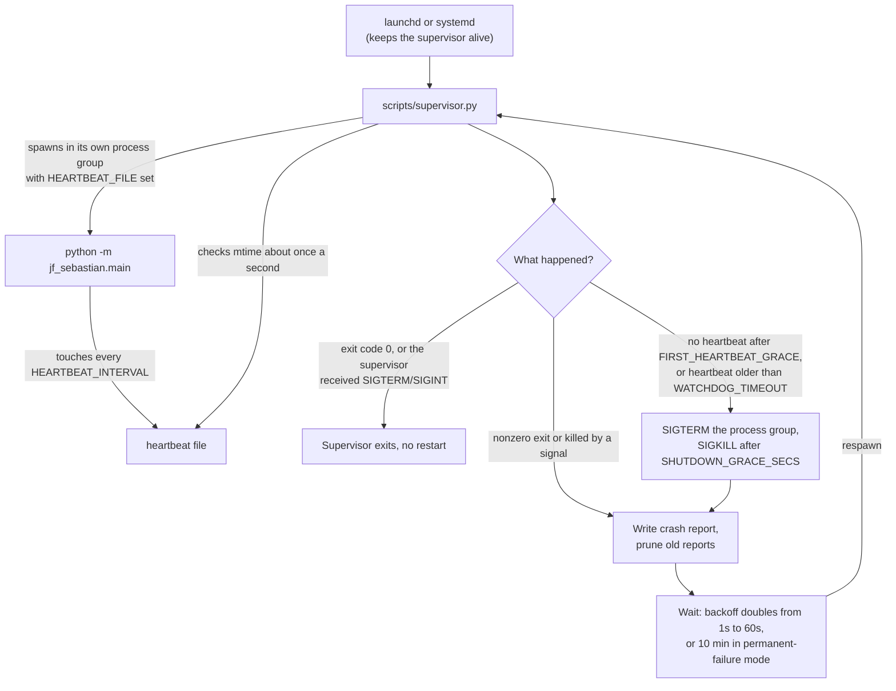
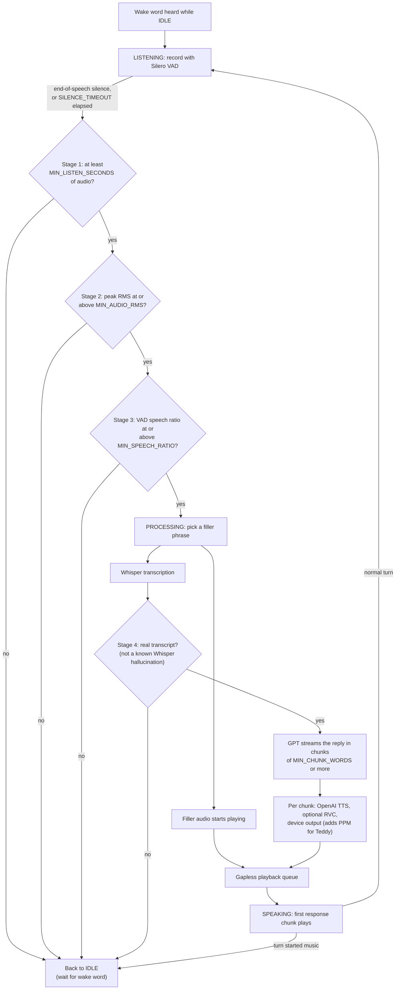
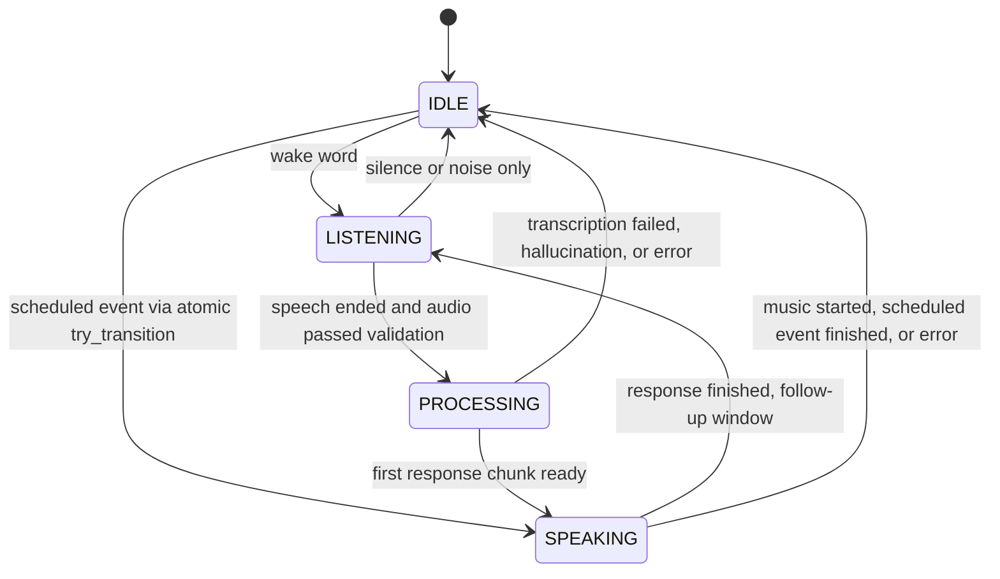
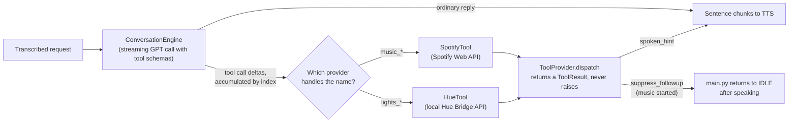

# J.F. Sebastian

> *"I make friends. They're toys. My friends are toys. I make them. It's a hobby."*
>
> J.F. Sebastian, *Blade Runner*

An AI conversation system that brings life to vintage animatronic toys. Built with a modular device architecture, this system supports multiple output devices including the 1985 Teddy Ruxpin and Squawkers McCaw. Features real-time voice conversations with ChatGPT, a modular personality system with unique wake words, voices, and conversational styles.

Includes seven distinct personalities: a tiki bartender, Abraham Lincoln (a homage to Disney's pioneering animatronics), an eccentric conspiracy theorist, Mister Rogers, K.I.T.T. from Knight Rider, J.A.R.V.I.S. the AI butler, and the classic Teddy Ruxpin character. Add your own personalities using simple YAML files - no programming required!

[](LICENSE)


<!-- TOC -->

## Table of Contents

- [Features](#features)
- [Quick Start](#quick-start)
- [System Requirements](#system-requirements)
  - [Software](#software)
  - [Hardware](#hardware)
- [Hardware Setup](#hardware-setup)
  - [Teddy Ruxpin Connection](#teddy-ruxpin-connection)
    - [Recommended Bluetooth Adapter](#recommended-bluetooth-adapter)
    - [Setup Steps](#setup-steps)
- [Installation](#installation)
  - [Method 1: Automated Installation (Recommended)](#method-1-automated-installation-recommended)
  - [Method 2: Manual Installation](#method-2-manual-installation)
    - [1. Clone the Repository](#1-clone-the-repository)
    - [2. Create Virtual Environment](#2-create-virtual-environment)
    - [3. Install Dependencies](#3-install-dependencies)
    - [4. Download OpenWakeWord Preprocessing Models](#4-download-openwakeword-preprocessing-models)
    - [5. Install System Dependencies](#5-install-system-dependencies)
    - [6. Configuration](#6-configuration)
    - [7. Get API Keys](#7-get-api-keys)
    - [8. Finding Audio Devices](#8-finding-audio-devices)
    - [9. Optional: Install RVC for Custom Voice Models](#9-optional-install-rvc-for-custom-voice-models)
    - [10. Generate Filler Audio (Optional but Recommended)](#10-generate-filler-audio-optional-but-recommended)
- [Personalities](#personalities)
  - [Available Personalities](#available-personalities)
    - [Johnny: Tiki Bartender](#johnny-tiki-bartender)
    - [Mr. Lincoln: Abraham Lincoln](#mr-lincoln-abraham-lincoln)
    - [Leopold: Conspiracy Theorist](#leopold-conspiracy-theorist)
    - [Fred: Mister Rogers](#fred-mister-rogers)
    - [K.I.T.T.: Knight Industries Two Thousand](#kitt-knight-industries-two-thousand)
    - [Jarvis: Just A Rather Very Intelligent System](#jarvis-just-a-rather-very-intelligent-system)
    - [Teddy Ruxpin: Storytelling Bear](#teddy-ruxpin-storytelling-bear)
  - [Switching Personalities](#switching-personalities)
- [Usage](#usage)
  - [Starting the Application](#starting-the-application)
  - [Running Unattended (Recommended for Permanent Installations)](#running-unattended-recommended-for-permanent-installations)
  - [Having a Conversation](#having-a-conversation)
  - [Conversation Examples](#conversation-examples)
- [Configuration Options](#configuration-options)
  - [.env Settings](#env-settings)
    - [Personality and API Configuration](#personality-and-api-configuration)
    - [Audio Device Configuration](#audio-device-configuration)
    - [Voice Activity Detection](#voice-activity-detection)
    - [Weather Context (in LLM context)](#weather-context-in-llm-context)
    - [News Headlines (in LLM context, on by default)](#news-headlines-in-llm-context-on-by-default)
    - [Proactive Scheduler](#proactive-scheduler)
    - [Spotify Playback (Optional)](#spotify-playback-optional)
    - [Philips Hue Lights (Optional)](#philips-hue-lights-optional)
    - [Conversation Settings](#conversation-settings)
    - [OpenAI Models](#openai-models)
    - [Animatronic Control](#animatronic-control)
    - [Wake Word Detection](#wake-word-detection)
    - [RVC (Voice Conversion) Settings](#rvc-voice-conversion-settings)
    - [Debug Settings](#debug-settings)
    - [Supervisor and Watchdog](#supervisor-and-watchdog)
  - [Creating Custom Personalities](#creating-custom-personalities)
- [Architecture](#architecture)
  - [Key Components](#key-components)
- [Troubleshooting](#troubleshooting)
  - [Wake Word Not Detecting](#wake-word-not-detecting)
  - [Audio Device Issues](#audio-device-issues)
  - [API Errors](#api-errors)
  - [Teddy Not Moving](#teddy-not-moving)
  - [Latency Issues](#latency-issues)
- [Debug Mode](#debug-mode)
- [Development](#development)
  - [Project Structure](#project-structure)
  - [Running Tests](#running-tests)
  - [Adding Features](#adding-features)
- [Performance Metrics](#performance-metrics)
- [Cost Estimates](#cost-estimates)
- [About the Name](#about-the-name)
- [Changelog](#changelog)
- [License](#license)
- [Credits](#credits)
- [Contributing](#contributing)
- [Support](#support)

<!-- /TOC -->

## Features

- **Modular Device Architecture**: Supports multiple output devices with simple configuration
  - **Teddy Ruxpin**: Full animatronic control with PPM signals for mouth and eyes
  - **Squawkers McCaw**: Simple stereo audio output without PPM
  - Easy to extend for additional devices
- **Modular Personality System**: Switch between different AI personalities with unique voices and behaviors
  - **Johnny**: Tiki bartender with deep knowledge of tiki culture ("Hey, Johnny")
  - **Mr. Lincoln**: Abraham Lincoln, 16th President - homage to Disney's animatronics ("Hey, Mr. Lincoln")
  - **Leopold**: Eccentric conspiracy theorist with a wild backstory ("Hey, Leopold")
  - **Fred**: Mister Rogers with gentle warmth and simple wisdom ("Hey, Fred")
  - **K.I.T.T.**: Knight Industries Two Thousand AI from Knight Rider ("Hey, Kitt")
  - **Jarvis**: Sophisticated AI butler with refined British wit ("Hey, Jarvis")
  - **Teddy Ruxpin**: The classic storytelling bear from Grundo ("Hey, Teddy Ruxpin")
- **Wake Word Activation**: Custom wake words per personality using OpenWakeWord (free & open source)
- **Low-Latency Fillers**: Pre-generated personality-specific phrases play immediately while processing
- **Speech Recognition**: OpenAI Whisper API for accurate speech-to-text transcription
- **AI Conversation**: a configurable GPT model (gpt-5.4-mini by default) powers personality-driven responses with conversation context
- **Streaming Response Pipeline**: Word-based sentence chunking enables parallel TTS/RVC processing while LLM generates
- **Natural Voice**: OpenAI TTS (gpt-4o-mini-tts) generates speech with personality-specific voices, speeds, and tones
- **RVC Voice Conversion** (Optional): Transform TTS output with custom trained voice models for unique character voices beyond OpenAI TTS
- **Animatronic Control** (Teddy Ruxpin): Generates PPM control signals for mouth (syllable-based lip sync) and eyes (sentiment-based)
- **Flexible Output**: Device-specific audio processing (stereo with PPM for Teddy, simple stereo for Squawkers and the `headless` computer-playback device)
- **Real-World Context**: Current date/time, weather, and top news headlines are injected into the LLM context each turn (pluggable providers; headlines on by default)
- **Unattended Operation** (Optional): `scripts/supervisor.py` restarts the app on crash, kills hung children via a heartbeat watchdog, and writes crash reports
- **Proactive Scheduler** (Optional): Per-personality `scheduled_events.yaml` for morning greetings, bedtime stories, holiday surprises. Fires only when idle, so it never interrupts an in-progress conversation
- **Voice-Controlled Music** (Optional): When enabled, personalities can control Spotify by voice ("play some tiki music in the kitchen", "skip", "turn it up") via the Spotify Web API (nine `music_*` tools), targeting any Spotify Connect speaker. On by default per personality (opt a character out with `spotify_enabled: false`). Premium required; see [docs/SPOTIFY_SETUP.md](docs/SPOTIFY_SETUP.md)
- **Voice-Controlled Lights** (Optional): When enabled, personalities can control Philips Hue lights by voice ("turn on the living room", "dim it to 20 percent", "make it red", "run the Relax scene") through six `lights_*` tools. Talks to the Hue Bridge directly over the LAN: no cloud account, typically sub-100ms per call, and it coexists with Alexa and the Hue app. On by default per personality (opt a character out with `hue_enabled: false`); see [docs/HUE_SETUP.md](docs/HUE_SETUP.md)

## Quick Start

**New to J.F. Sebastian?** See the [Quick Start Guide](docs/QUICKSTART.md) to get your animatronic talking in 5 minutes!

## System Requirements

### Software
- Python 3.10.x (specifically - RVC dependencies are not compatible with 3.11+)
- macOS (primary target; examples use Mac audio devices). Linux is also supported: `setup.sh` handles apt-based systems, and [docs/JETSON_DEPLOYMENT.md](docs/JETSON_DEPLOYMENT.md) covers the Jetson Orin Nano
- PortAudio and FFmpeg (installed by `setup.sh`)
- Internet connection for OpenAI APIs

### Hardware
- **Supported Devices**:
  - **1985 Teddy Ruxpin doll** (cassette-based model) - full animatronic control
  - **Squawkers McCaw** - simple audio output
  - Other animatronics can be added via the modular device architecture
- **Bluetooth cassette adapter** (for Teddy Ruxpin, recommended: [Arsvita Car Audio Bluetooth Wireless Cassette Receiver](https://www.amazon.com/dp/B085C7GTBD))
- Microphone for voice input

## Hardware Setup

### Teddy Ruxpin Connection

This system is designed to work with an original **1985 cassette-based Teddy Ruxpin doll**. The cassette mechanism provides both audio playback and motor control through a stereo audio signal.

#### Recommended Bluetooth Adapter

**[Arsvita Car Audio Bluetooth Wireless Cassette Receiver](https://www.amazon.com/dp/B085C7GTBD)**
- Designed for car cassette players but works perfectly with Teddy Ruxpin
- Reliable Bluetooth 5.0 connection
- Good audio quality for both voice and control signals
- Rechargeable battery (charges via USB-C)

#### Setup Steps

1. **Insert Bluetooth Cassette Adapter**: Place the adapter into Teddy's cassette deck
2. **Audio Routing**:
   - LEFT channel → Teddy's speaker (voice)
   - RIGHT channel → Control track (mouth/eye motors)
3. **Pairing**: Pair the Bluetooth adapter with your Mac
4. **Device Selection**: Note the device name (see Configuration section)

## Installation

You can install J.F. Sebastian using either the automated setup script (recommended) or manual step-by-step installation.

### Method 1: Automated Installation (Recommended)

The easiest way to get started is using the provided setup script:

```bash
# Clone the repository
git clone https://github.com/pjdoland/jf-sebastian.git
cd jf-sebastian

# Run automated setup
./setup.sh
```

The setup script runs 13 steps:
1. Find Python 3.10.x (required for RVC compatibility), offering to install it via pyenv, Homebrew, or apt if it is missing
2. Create the virtual environment with Python 3.10 (offers to recreate an existing venv built on another version)
3. Activate the virtual environment
4. Upgrade pip to latest version
5. Install Python dependencies from requirements.txt
6. Optionally install RVC voice conversion dependencies (asks for confirmation)
7. Optionally install Spotify playback support (`requirements-spotify.txt`, asks for confirmation)
8. Download OpenWakeWord preprocessing models
9. Install system dependencies (PortAudio and FFmpeg via Homebrew on macOS, or via apt on Linux)
10. Create required directories
11. Create `.env` configuration file from template (or validate an existing one)
12. Optionally generate filler audio for all personalities (asks for confirmation)
13. Check for wake word models

It finishes by listing the available audio devices and printing next steps. Philips Hue needs no extra dependency, so there is no setup step for it; see [docs/HUE_SETUP.md](docs/HUE_SETUP.md) when you want it.

**After running setup.sh:**
1. Edit `.env` and add your OpenAI API key:
   ```bash
   OPENAI_API_KEY=sk-your-openai-api-key
   ```
2. Configure audio devices in `.env` (see device list from setup):
   ```bash
   INPUT_DEVICE_NAME=MacBook Air Microphone
   OUTPUT_DEVICE_NAME=Arsvita
   ```
3. You're ready to run: `./run.sh`

### Method 2: Manual Installation

If you prefer more control or need to troubleshoot, you can install manually:

#### 1. Clone the Repository

```bash
git clone https://github.com/pjdoland/jf-sebastian.git
cd jf-sebastian
```

#### 2. Create Virtual Environment

**Important:** RVC voice conversion requires Python 3.10.x specifically (not 3.11+). If you plan to use RVC, ensure you're using Python 3.10:

```bash
# Check your Python version
python3 --version  # Should show 3.10.x

# If you need Python 3.10, install via:
# - pyenv: pyenv install 3.10.13 && pyenv local 3.10.13
# - Homebrew: brew install python@3.10 (then use python3.10 command)

# Create virtual environment with Python 3.10
python3 -m venv venv
# Or if using python3.10 from Homebrew:
# python3.10 -m venv venv

source venv/bin/activate  # On macOS/Linux
```

#### 3. Install Dependencies

```bash
# Upgrade pip first
pip install --upgrade pip

# Install Python dependencies
pip install -r requirements.txt
```

#### 4. Download OpenWakeWord Preprocessing Models

OpenWakeWord requires preprocessing models that must be downloaded separately:

```bash
python3 -c "from openwakeword import utils; utils.download_models(['alexa'])"
```

This downloads the required `melspectrogram.onnx` and `embedding_model.onnx` files to the openwakeword package directory.

#### 5. Install System Dependencies

For audio processing, you may need additional system libraries:

```bash
# macOS
brew install portaudio ffmpeg

# The application uses:
# - PortAudio (for PyAudio)
# - FFmpeg (for MP3 to PCM conversion)
```

#### 6. Configuration

Create a `.env` file from the example:

```bash
cp .env.example .env
```

Edit `.env` and add your API keys:

```bash
# Personality Selection
PERSONALITY=johnny  # Options: fred, jarvis, johnny, kitt, leopold, mr_lincoln, teddy_ruxpin

# Required API Keys
OPENAI_API_KEY=sk-your-openai-api-key

# Audio device names (see "Finding Audio Devices" below)
INPUT_DEVICE_NAME=MacBook Air Microphone
OUTPUT_DEVICE_NAME=Arsvita
```

#### 7. Get API Keys

**OpenAI API Key:**
1. Go to https://platform.openai.com/api-keys
2. Create a new API key
3. Add to `.env` as `OPENAI_API_KEY`

**Wake Word Models (OpenWakeWord):**

No API key required! OpenWakeWord is completely free and open source.

Each personality includes its own wake word model file at `personalities/{name}/hey_{name}.onnx`. Run `ls personalities/*/hey_*.onnx` to see which models are currently installed.

Every bundled personality ships its own custom-trained `.onnx` model. You can also point a personality at one of OpenWakeWord's bundled pre-trained models (e.g. `hey_jarvis_v0.1`) if you prefer not to train your own.

To create a custom wake word for a new personality:
1. Follow the guide in `docs/TRAIN_WAKE_WORDS.md`
2. Train a model for your desired wake phrase
3. Place the `.onnx` model file in your personality's directory

To use a bundled OpenWakeWord model instead of training one, download with `python3 -c "from openwakeword import utils; utils.download_models(['hey_jarvis'])"` and copy from `venv/lib/python3.10/site-packages/openwakeword/resources/models/`.

#### 8. Finding Audio Devices

Run the audio output utility to list all devices:

```bash
python -m jf_sebastian.modules.audio_output
```

This will display:
```
Available Audio Devices:
--------------------------------------------------------------------------------
[0] MacBook Pro Microphone
    Type: INPUT
    Channels: In=1, Out=0
    Sample Rate: 48000.0 Hz

[1] MacBook Pro Speakers
    Type: OUTPUT
    Channels: In=0, Out=2
    Sample Rate: 48000.0 Hz

[2] Bluetooth Cassette Adapter
    Type: OUTPUT
    Channels: In=0, Out=2
    Sample Rate: 44100.0 Hz
```

Update `.env` with the appropriate device names:
```bash
INPUT_DEVICE_NAME=MacBook Air Microphone
OUTPUT_DEVICE_NAME=Arsvita
```

#### 9. Optional: Install RVC for Custom Voice Models

**RVC (Retrieval-based Voice Conversion) is optional.** The system works perfectly with OpenAI TTS voices alone. Install RVC only if you want to use custom trained voice models for unique character voices.

> **Voice models are not distributed with this project.** No `.pth`/`.index` RVC model ships in the repo (they are gitignored). Where a personality lists a voice "with RVC," that describes the intended character voice, which you only get after training or obtaining your own model and placing it in the personality folder (see [docs/CREATING_PERSONALITIES.md](docs/CREATING_PERSONALITIES.md#getting-rvc-models)). Without a model, that personality simply uses its raw OpenAI TTS voice.

**Requirements:**
- Python 3.10.x specifically (RVC is not compatible with Python 3.11+)
- Requires temporarily downgrading pip for compatibility

**Installation:**

```bash
# Method 1: Use the automated script (recommended)
./scripts/install_rvc.sh

# Method 2: Manual installation
# Step 1: Downgrade pip for RVC compatibility
pip install pip==24.0

# Step 2: Install RVC dependencies
pip install -r requirements-rvc.txt

# Step 3: Upgrade pip back to latest
pip install --upgrade pip
```

The `requirements-rvc.txt` file includes: rvc-python, torch, torchaudio, fairseq, librosa, and resampy. (On a Jetson, `setup.sh` and `scripts/install_rvc.sh` use `requirements-rvc-jetson.txt` instead; see [docs/JETSON_DEPLOYMENT.md](docs/JETSON_DEPLOYMENT.md).)

**Troubleshooting RVC Installation:**
- If you get dependency conflicts, try: `pip install rvc-python --no-deps` then install dependencies manually
- For Apple Silicon (M1/M2/M3): Ensure you have the MPS-enabled torch version
- For CUDA: Install CUDA-enabled torch first: `pip install torch torchaudio --index-url https://download.pytorch.org/whl/cu118`

**To skip RVC:** The system will automatically detect RVC availability and work without it.

See [docs/CREATING_PERSONALITIES.md](docs/CREATING_PERSONALITIES.md#advanced-rvc-voice-conversion) for RVC configuration and usage.

#### 10. Generate Filler Audio (Optional but Recommended)

**Filler phrases** are pre-recorded audio clips that play immediately when you speak, creating a natural conversational feel while the system processes your question in the background. The system can work without them, but conversations will feel more responsive with filler audio.

Generate the filler audio for all personalities:

```bash
python scripts/generate_fillers.py
```

This creates device-specific filler audio for each registered output device. For each personality, it generates:
- `filler_audio/teddy_ruxpin/` - Filler audio with PPM control signals for mouth and eyes
- `filler_audio/squawkers_mccaw/` - Filler audio with simple stereo (no PPM)
- `filler_audio/headless/` - Filler audio with simple stereo for computer playback

Each device-specific directory contains one WAV file per filler phrase (30 for each bundled personality) with:
- Voice audio synthesized with the personality's configured voice, speed, and tone
- Device-appropriate audio processing (PPM signals for Teddy Ruxpin, simple stereo for others)

**Note:** The filler audio files are generated per output device type, so each personality will have device-specific versions automatically created based on the registered output devices.

**When to regenerate filler audio:**
- After creating a new personality
- After switching to a different personality (if fillers don't exist yet for your output device)
- After modifying a personality's `tts_voice`, `tts_speed`, or `tts_style` settings
- After editing the `filler_phrases` list in the personality YAML file
- After adding support for a new output device type

**Personality-specific generation:**
By default, the script generates fillers for **all** personalities. To generate for just one personality:
```bash
python scripts/generate_fillers.py --personality johnny

# Or limit generation to one output device type
python scripts/generate_fillers.py --personality johnny --device teddy_ruxpin
```

The script validates your configuration first, so `OPENAI_API_KEY` must already be set in `.env`.

**Device-specific storage:**
Each personality stores filler audio in device-specific subdirectories:
```
personalities/johnny/filler_audio/
├── teddy_ruxpin/       # 30 WAV files with PPM control signals
│   ├── filler_01.wav
│   └── ...
├── squawkers_mccaw/    # 30 WAV files with simple stereo
│   ├── filler_01.wav
│   └── ...
└── headless/           # 30 WAV files with simple stereo
    ├── filler_01.wav
    └── ...
```

## Personalities

The system includes a modular personality framework. Each personality has:
- Unique **wake word** for activation
- Custom **system prompt** defining character and knowledge
- Specific **TTS voice** from OpenAI
- **Filler phrases** that play immediately for low-latency feel
- Pre-generated **filler audio** files per output device (with motor control signals for Teddy Ruxpin)

### Available Personalities

Each personality ships its `personality.yaml`, wake word model, and filler phrases. Where a voice is listed "with RVC," the converted character voice requires a voice model you supply yourself: **RVC `.pth`/`.index` models are not distributed with this project.** Without one, the personality uses its raw OpenAI TTS voice (the voice named below).

#### Johnny: Tiki Bartender
- **Wake word**: "Hey, Johnny"
- **Voice**: Shimmer (input voice; his character comes from RVC conversion)
- **Character**: Laid-back beatnik bartender with deep tiki culture knowledge
- **Topics**: Cocktails, surf music, Polynesian pop, tiki history

#### Mr. Lincoln: Abraham Lincoln
- **Wake word**: "Hey, Mr. Lincoln"
- **Voice**: Echo (dignified male)
- **Character**: 16th President of the United States - a homage to Disney's Great Moments with Mr. Lincoln
- **Topics**: Liberty, equality, union, Constitution, leadership, moral conviction

#### Leopold: Conspiracy Theorist
- **Wake word**: "Hey, Leopold"
- **Voice**: Onyx with RVC (conspiratorial)
- **Character**: Eccentric truth-seeker with an insane backstory (Turkish prison, UFO abductions, intelligence work)
- **Topics**: Conspiracies, surveillance, government secrets, paranoid theories

#### Fred: Mister Rogers
- **Wake word**: "Hey, Fred"
- **Voice**: Echo with RVC (gentle, warm)
- **Character**: Fred Rogers from Mister Rogers' Neighborhood - speaks with gentle warmth and simple wisdom
- **Topics**: Feelings, kindness, being special just as you are, taking time, the neighborhood

#### K.I.T.T.: Knight Industries Two Thousand
- **Wake word**: "Hey, Kitt"
- **Voice**: Onyx with RVC (sophisticated AI)
- **Character**: Advanced AI from the Knight Rider Trans Am - intelligent with dry wit
- **Topics**: Advanced technology, crime fighting, surveillance mode, turbo boost, molecular bonded shell

#### Jarvis: Just A Rather Very Intelligent System
- **Wake word**: "Hey, Jarvis"
- **Voice**: Fable with RVC (refined British butler)
- **Character**: Tony Stark's sophisticated AI butler - unfailingly polite, precise, and quietly amused, with dry wit and calm authority
- **Topics**: Household and systems management, physics and engineering, suit telemetry and diagnostics, encyclopedic general knowledge

#### Teddy Ruxpin: Storytelling Bear
- **Wake word**: "Hey, Teddy Ruxpin"
- **Voice**: Shimmer with RVC (friendly, enthusiastic)
- **Character**: Adventurous teddy bear from the magical land of Grundo
- **Topics**: Adventures, friendship, Grubby, ancient treasures, magical crystals, storytelling

### Switching Personalities

Edit `.env` to change personalities:

```bash
# Switch to Johnny (Tiki Bartender)
PERSONALITY=johnny

# Switch to Mr. Lincoln (Abraham Lincoln)
PERSONALITY=mr_lincoln

# Switch to Leopold (Conspiracy Theorist)
PERSONALITY=leopold

# Switch to Fred (Mister Rogers)
PERSONALITY=fred

# Switch to K.I.T.T. (Knight Rider AI)
PERSONALITY=kitt

# Switch to Jarvis (AI butler)
PERSONALITY=jarvis

# Switch to Teddy Ruxpin (Storytelling Bear)
PERSONALITY=teddy_ruxpin
```

**Important:** After switching personalities, regenerate the filler audio if it doesn't exist yet:

```bash
python scripts/generate_fillers.py
```

See `personalities/README.md` for detailed instructions on creating new personalities.

Personalities are simple YAML files - no coding required! Just copy an existing personality folder and modify the `personality.yaml` file.

## Usage

### Starting the Application

```bash
./run.sh
# or, with the virtual environment already activated:
python -m jf_sebastian.main
```

Launching the app directly first stops any other running instance of it, so only one copy holds the audio devices. (The check is skipped whenever `HEARTBEAT_FILE` is set, as it always is under the supervisor, which is then the sole spawner.)

You should see (example with Johnny personality):
```
================================================================================
J.F. Sebastian - Animatronic AI Conversation System
"I make friends. They're toys. My friends are toys."
================================================================================
Personality: Johnny
Wake word: Hey Johnny
...
System ready! Say 'Hey, Johnny' to start talking.
Press Ctrl+C to exit.
================================================================================
```

### Running Unattended (Recommended for Permanent Installations)

For unattended deployments (museum exhibits, eldercare companions, kids' rooms, anywhere the toy needs to keep running across PortAudio/RVC crashes), wrap the app in `scripts/supervisor.py` and let launchd (macOS) or systemd (Linux) keep the supervisor itself alive.

The supervisor:
- Restarts the child process on unexpected exit, with exponential backoff (doubling from 1s to a 60s cap, reset once a child stays up for 60s). After 5 consecutive unhealthy runs it switches to a 10-minute permanent-failure backoff and logs CRITICAL once
- Detects hung children via heartbeat-file staleness (enforced after a 60s startup grace); SIGTERMs the whole process group, then SIGKILLs it if it is still alive 10s later
- Writes enriched crash reports (reason, exit code, PID, personality, ran_for, heartbeat age, log tail) to `crash_reports/` and prunes to the most recent `CRASH_REPORT_KEEP`
- Shuts the child down cleanly on SIGTERM/SIGINT and exits without restarting, so `launchctl bootout` / `systemctl stop` does the right thing. A child that exits with code 0 is also treated as a deliberate stop



**Quick start (foreground, for testing):**
```bash
HEARTBEAT_FILE=/tmp/jf_sebastian.heartbeat python scripts/supervisor.py
```

**macOS launchd:** replace the `__EDIT_ME_REPO__` and `__EDIT_ME_USER__` placeholders in `scripts/jf-sebastian.plist`, copy it to `~/Library/LaunchAgents/com.jf-sebastian.supervisor.plist`, then:
```bash
launchctl bootstrap gui/$UID ~/Library/LaunchAgents/com.jf-sebastian.supervisor.plist
```

**Linux systemd:** edit `scripts/jf-sebastian.service`, copy to `~/.config/systemd/user/`, then:
```bash
systemctl --user daemon-reload
systemctl --user enable --now jf-sebastian.service
```

All supervisor settings (`HEARTBEAT_INTERVAL`, `WATCHDOG_TIMEOUT`, `RESTART_BACKOFF_*`, `CRASH_REPORT_DIR`, etc.) are listed under [Supervisor and Watchdog](#supervisor-and-watchdog) below and in `.env.example` under "SUPERVISOR / WATCHDOG". Note that the supervisor reads them from its own process environment (the `EnvironmentVariables` block in the plist, the `Environment=` lines in the systemd unit, or variables exported in your shell); it does not load `.env`.

The supervisor always hands `HEARTBEAT_FILE` (default `/tmp/jf_sebastian.heartbeat`) and `HEARTBEAT_INTERVAL` down to the child, so hang detection is on whenever the app runs under it. Run directly (without the supervisor), the app starts its heartbeat thread only if `HEARTBEAT_FILE` is set.

### Having a Conversation

1. **Wake the character**: Say the wake word ("Hey, Johnny", "Hey, Mr. Lincoln", "Hey, Leopold", "Hey, Fred", "Hey, Kitt", "Hey, Jarvis", or "Hey, Teddy Ruxpin")
2. **Speak**: Once detected, speak your message
3. **Listen**: Character responds with personality-appropriate answer
4. **Repeat**: Continue the conversation. No wake word is needed for follow-ups: the microphone reopens after each response. The session ends (back to waiting for the wake word) when a listening window passes with no speech, or right after a command that starts music

The system will:
- Listen for your speech
- Auto-detect when you stop talking (`SPEECH_END_SILENCE_SECONDS` of silence, 1.0s by default)
- Discard silence and background noise before anything is sent to Whisper (length, loudness, and speech-ratio checks)
- Play a filler phrase right away, in parallel with transcription
- Process in background: transcribe, generate response, synthesize speech
- Seamlessly transition from filler to real response
- Animate mouth and eyes during speech (Teddy Ruxpin)

One conversation turn, end to end:



Stages 1 to 3 run before a filler is chosen and before any API call, so silence and noise cost nothing. Stage 4 is a backup: by then the filler is already playing, so a rejected transcript lets the filler finish and then returns to IDLE without calling GPT or TTS.

### Conversation Examples

**With Johnny (Tiki Bartender):**
```
You: "Hey, Johnny"
Johnny: [Acknowledges]

You: "What's your favorite rum?"
Johnny: "Hold on, I'm checking the rum barrel... Alright, so I gotta say, a good aged Jamaican rum is hard to beat. The funk and complexity are just incredible in a Mai Tai."

You: "Tell me about tiki culture"
Johnny: "Just grabbing some fresh mint... So tiki culture started in the 1930s with Don the Beachcomber and Trader Vic. They created this whole Polynesian fantasy..."
```

**With Mr. Lincoln (Abraham Lincoln):**
```
You: "Hey, Mr. Lincoln"
Mr. Lincoln: [Acknowledges]

You: "What does freedom mean to you?"
Mr. Lincoln: "Let me consult my notes on this... Freedom is not the liberty to do as you please, but the opportunity to do what is right. True liberty requires both law and moral conviction."

You: "How did you handle the pressure of the Civil War?"
Mr. Lincoln: "Reviewing my correspondence from that time... The burden was immense, but I was guided by one principle - preserving the Union and ending slavery. When the cause is just, you endure."
```

**With Leopold (Conspiracy Theorist):**
```
You: "Hey, Leopold"
Leopold: [Acknowledges]

You: "What do you think about surveillance?"
Leopold: "Hold on, checking my bug detector... Okay, we're clean. Listen, they're watching everything. I've found three devices in my apartment last month. The surveillance is real, and it's everywhere."

You: "Have you really been abducted by aliens?"
Leopold: "Just reviewing my notes from the second abduction... Twice, actually. 1997. The first time was definitely more invasive. After they installed the implant, communication improved. You probably think I'm crazy, but the evidence is all there."
```

## Configuration Options

### .env Settings

Settings are loaded with three layers, highest precedence first:

1. `personalities/{PERSONALITY}/.env`: per-personality overrides
2. `jf_sebastian/devices/{OUTPUT_DEVICE_TYPE}/.env`: per-device-type overrides
3. `.env`: base configuration

Use the overlays for things like `VOICE_GAIN` that differ by speaker hardware or by personality (some RVC models output quieter than others). `PERSONALITY` and `OUTPUT_DEVICE_TYPE` must come from the base `.env` (or the process environment). They're the selection keys, so setting them inside an overlay has no effect on overlay loading. Overlay files are git-ignored automatically by the existing `.env` rule. Loaded overlay paths are logged at startup.

Variables already set in the process environment (for example by launchd or systemd) take precedence over the base `.env`, but an overlay file overrides both.

#### Personality and API Configuration

| Setting | Description | Default |
|---------|-------------|---------|
| `PERSONALITY` | Active personality: any folder under `personalities/` ('johnny', 'mr_lincoln', 'leopold', 'fred', 'kitt', 'jarvis', 'teddy_ruxpin', or your own) | johnny |
| `OPENAI_API_KEY` | OpenAI API key (required) | - |

#### Audio Device Configuration

| Setting | Description | Default |
|---------|-------------|---------|
| `INPUT_DEVICE_NAME` | Microphone device name | - |
| `OUTPUT_DEVICE_NAME` | Speaker device name | - |
| `OUTPUT_DEVICE_TYPE` | Output device type ('teddy_ruxpin', 'squawkers_mccaw', 'headless', or any registered drop-in device) | teddy_ruxpin |
| `SAMPLE_RATE` | Audio capture sample rate (Hz). Must be 16000 (Silero VAD requires it). The validator still accepts 22050/44100/48000, but VAD warns and disables itself at those rates. | 16000 |
| `CHUNK_SIZE` | Audio chunk size. Currently not read by the code (the recorder, wake word detector, and player use their own fixed buffer sizes) | 1024 |

#### Voice Activity Detection

| Setting | Description | Default |
|---------|-------------|---------|
| `VAD_THRESHOLD` | Silero VAD per-window speech probability cutoff (0.0-1.0, higher = stricter) | 0.5 |
| `SILENCE_TIMEOUT` | Length of each listening window (seconds), measured from when listening starts. If it elapses before an end of speech is detected, whatever was captured goes to validation, and silence returns the system to IDLE | 5.0 |
| `SPEECH_END_SILENCE_SECONDS` | Silence required to end speech after talking (seconds) | 1.0 |
| `MIN_LISTEN_SECONDS` | Minimum listen window after wake word (seconds) | 1.0 |
| `MIN_AUDIO_RMS` | Min peak RMS amplitude to send audio to Whisper (filters silence) | 60 |
| `MIN_SPEECH_RATIO` | Min ratio of speech-bearing frames (0.0-1.0) before transcribing | 0.3 |

#### Weather Context (in LLM context)

| Setting | Description | Default |
|---------|-------------|---------|
| `WEATHER_PROVIDER` | `wttr` / `homeassistant` / `manual` / `none` / `auto` (unset) | unset → auto |
| `ZIPCODE` | US zipcode for the wttr.in provider | - |
| `HOME_ASSISTANT_URL` | HA URL for the homeassistant provider | - |
| `HOME_ASSISTANT_TOKEN` | Long-lived HA access token | - |
| `HOME_ASSISTANT_WEATHER_ENTITY` | HA entity_id (e.g., `weather.home`) | - |
| `MANUAL_WEATHER` | Free-form description for the manual provider (no network egress) | - |

#### News Headlines (in LLM context, on by default)

| Setting | Description | Default |
|---------|-------------|---------|
| `NEWS_PROVIDER` | `rss` / `hackernews` / `manual` / `none` / `auto` | unset → auto |
| `NEWS_RSS_URL` | Any RSS or Atom feed URL | NPR Topics: News |
| `MANUAL_NEWS` | Newline-separated headlines (no network egress) | - |
| `NEWS_HEADLINE_LIMIT` | Max headlines injected per turn | 5 |
| `NEWS_CACHE_TTL_MINUTES` | Headline cache duration (minimum 60 seconds) | 30 |

#### Proactive Scheduler

| Setting | Description | Default |
|---------|-------------|---------|
| `SCHEDULER_ENABLED` | Run per-personality `scheduled_events.yaml` (when present) | true |
| `QUIET_HOURS_START` | Global quiet-hours start (HH:MM, overrides personality YAML) | - |
| `QUIET_HOURS_END` | Global quiet-hours end (HH:MM) | - |

#### Spotify Playback (Optional)

Off by default. Requires Spotify Premium, the optional `spotipy` dependency (`pip install -r requirements-spotify.txt`, also offered by `setup.sh`), and a one-time browser login (`python scripts/spotify_auth.py`). `SPOTIFY_ENABLED=true` without a `SPOTIFY_CLIENT_ID` is a startup configuration error. Once `SPOTIFY_ENABLED=true`, every personality can control playback by default; opt a character out with `spotify_enabled: false`. Full walkthrough in [docs/SPOTIFY_SETUP.md](docs/SPOTIFY_SETUP.md).

| Setting | Description | Default |
|---------|-------------|---------|
| `SPOTIFY_ENABLED` | Master switch; offers playback tools to opted-in personalities | false |
| `SPOTIFY_CLIENT_ID` | Client ID of your Spotify app (PKCE; no secret needed) | - |
| `SPOTIFY_REDIRECT_URI` | OAuth redirect, must match the Spotify app's Settings | http://127.0.0.1:8888/callback |
| `SPOTIFY_TOKEN_CACHE` | Where the refresh token is cached (kept 0600, gitignored) | ~/.config/jf-sebastian/spotify-token.json |
| `SPOTIFY_DEFAULT_DEVICE` | Connect speaker for commands that name no room (else the active device) | - |
| `SPOTIFY_DEVICE_ALIASES` | Spoken aliases → exact device names (`kitchen=Kitchen Echo,den=Living Room`) | - |
| `SPOTIFY_NOW_PLAYING_CONTEXT` | Inject the currently playing track into the LLM context each turn so the character can answer questions about it (only when Spotify is enabled) | true |

#### Philips Hue Lights (Optional)

Off by default. Requires a Hue Bridge on your LAN and a one-time link-button pairing (`python scripts/hue_pair.py`). Entirely local: no Philips cloud account and no extra Python dependency (it uses `requests`), and Alexa or the Hue app can drive the same Bridge at the same time. Once `HUE_ENABLED=true`, every personality can control lights by default; opt a character out with `hue_enabled: false`. Full walkthrough in [docs/HUE_SETUP.md](docs/HUE_SETUP.md).

| Setting | Description | Default |
|---------|-------------|---------|
| `HUE_ENABLED` | Master switch; offers light tools to opted-in personalities. Warns (does not fail) if true with no paired credential | false |
| `HUE_TOKEN_CACHE` | Where the Bridge credential is cached (kept 0600, gitignored) | ~/.config/jf-sebastian/hue.json |
| `HUE_BRIDGE_HOST` | Optional Bridge IP override, for when DHCP moves it (else the paired-at address) | - |

#### Conversation Settings

| Setting | Description | Default |
|---------|-------------|---------|
| `CONVERSATION_TIMEOUT` | Clear history after idle (seconds) | 120.0 |
| `MAX_HISTORY_LENGTH` | Maximum user/assistant turn messages to retain (the system prompt is pinned separately and never counts against this) | 20 |
| `MIN_CHUNK_WORDS` | Minimum word count per streaming chunk (word-based sentence chunking) | 15 |
| `MAX_TOKENS` | Maximum tokens for non-streaming GPT responses (used for scheduler `prompt:` events) | 300 |
| `MAX_TOKENS_STREAMING` | Maximum tokens for streaming GPT responses (normal conversation turns) | 200 |
| `ENABLE_FILLER_AUDIO` | Play a pre-generated filler phrase while the response is being prepared | true |

For GPT-5-family models the engine raises both token limits automatically (18x the configured value, with a floor of 3500), because those models need a much higher `max_completion_tokens` ceiling. Short replies still use far fewer tokens.

#### OpenAI Models

| Setting | Description | Default |
|---------|-------------|---------|
| `WHISPER_MODEL` | OpenAI Whisper speech-to-text model | whisper-1 |
| `GPT_MODEL` | OpenAI GPT model for conversation. `.env.example` ships `gpt-5.4-mini`; the bare code fallback (no `.env`) is `gpt-4o-mini`, also the safe choice if your account lacks GPT-5 access | gpt-5.4-mini |
| `GPT_REASONING_EFFORT` | Reasoning effort for the GPT-5 family (low/medium/high; empty = model default; ignored for GPT-4). Not sent on conversation turns while Spotify or Hue tools are active, because the API rejects it combined with function tools | low |
| `TTS_MODEL` | OpenAI text-to-speech model. `.env.example` ships `gpt-4o-mini-tts`; the bare code fallback (no `.env`) is `tts-1` | gpt-4o-mini-tts |

**Note**: TTS voice, speed, and style are defined per personality in `personalities/` (not in .env). The gpt-4o-mini-tts model supports prompting for tone, emotional range, intonation, and speaking style.

#### Animatronic Control

| Setting | Description | Default |
|---------|-------------|---------|
| `PLAYBACK_PREROLL_MS` | Audio playback preroll (milliseconds) to prevent clipped starts | 240 |
| `PLAYBACK_TAIL_GUARD_MS` | Wait after playback ends before re-opening mic; covers speaker drain so the bot doesn't capture its own tail | 500 |
| `VOICE_GAIN` | Voice audio volume level (0.0 to 2.0; applied to both RVC and non-RVC paths) | 1.05 |
| `CONTROL_GAIN` | Control track volume level (0.0 to 1.0) | 0.52 |
| `SENTIMENT_POSITIVE_THRESHOLD` | Sentiment threshold for positive eye expressions. Currently not read by the code (eye position follows the VADER compound score continuously) | 0.3 |
| `SENTIMENT_NEGATIVE_THRESHOLD` | Sentiment threshold for negative eye expressions. Currently not read by the code | -0.3 |

#### Wake Word Detection

| Setting | Description | Default |
|---------|-------------|---------|
| `WAKE_WORD_THRESHOLD` | Wake word detection threshold (0.0 to 1.0, higher = more strict) | 0.99 |

#### RVC (Voice Conversion) Settings

| Setting | Description | Default |
|---------|-------------|---------|
| `RVC_ENABLED` | Global enable/disable for RVC voice conversion | true |
| `RVC_DEVICE` | Device for RVC inference. `auto` detects the best available (mps on Apple Silicon, cuda on NVIDIA, else cpu); override with `cpu`/`mps`/`cuda` | auto |
| `RVC_MODEL_DIR` | Global fallback directory searched for an explicitly named `rvc_model` that is not in the personality folder | ./rvc_models/ |

**Note**: RVC is configured per-personality in `personality.yaml`. If `rvc_enabled` is omitted, RVC turns on automatically when a model file is found (an explicit `rvc_model`, or `<folder>.pth` by convention). See [docs/CREATING_PERSONALITIES.md](docs/CREATING_PERSONALITIES.md) for RVC setup details. When enabled, RVC transforms TTS output to create unique character voices that go beyond what OpenAI TTS can provide alone.

#### Debug Settings

| Setting | Description | Default |
|---------|-------------|---------|
| `DEBUG_MODE` | General debug flag. Currently not read by the code; use `LOG_LEVEL` and `SAVE_DEBUG_AUDIO` | false |
| `LOG_LEVEL` | Logging level (DEBUG, INFO, WARNING, ERROR) for the console and `jf_sebastian.log` | INFO |
| `SAVE_DEBUG_AUDIO` | Save audio files for debugging | false |
| `DEBUG_AUDIO_PATH` | Directory for debug audio files | ./debug_audio/ |

#### Supervisor and Watchdog

These settings only apply when running under `scripts/supervisor.py`. See [Running Unattended](#running-unattended-recommended-for-permanent-installations). Apart from `HEARTBEAT_FILE` and `HEARTBEAT_INTERVAL` (which the app also reads), they are read by the supervisor from its process environment, not from `.env`.

| Setting | Description | Default |
|---------|-------------|---------|
| `HEARTBEAT_FILE` | Path to liveness file. The supervisor always sets it for the child; standalone, the app only heartbeats when it is set | unset (app), /tmp/jf_sebastian.heartbeat (supervisor) |
| `HEARTBEAT_INTERVAL` | Seconds between liveness touches | 10.0 |
| `WATCHDOG_TIMEOUT` | Seconds without heartbeat before child is considered hung | 60.0 |
| `FIRST_HEARTBEAT_GRACE` | Startup window (seconds) before the watchdog is enforced (model loading, RVC warmup) | 60.0 |
| `SHUTDOWN_GRACE_SECS` | Seconds between SIGTERM and SIGKILL when stopping the child | 10.0 |
| `RESTART_BACKOFF_INITIAL` | Initial restart delay (seconds) | 1.0 |
| `RESTART_BACKOFF_MAX` | Cap on restart delay (seconds) | 60.0 |
| `HEALTHY_RUNTIME_SECS` | A child that runs at least this long resets the backoff and the failure counter | 60.0 |
| `PERMANENT_FAILURE_THRESHOLD` | Consecutive unhealthy crashes before switching to the slow backoff | 5 |
| `PERMANENT_FAILURE_BACKOFF` | Restart delay in permanent-failure mode (seconds) | 600.0 |
| `CRASH_REPORT_DIR` | Directory for per-crash reports | ./crash_reports |
| `CRASH_REPORT_TAIL` | Lines of `jf_sebastian.log` to include in each crash report | 100 |
| `CRASH_REPORT_KEEP` | Max crash reports retained (older are pruned) | 200 |
| `LOG_PATH` | App log file the crash report tails | jf_sebastian.log |
| `SUPERVISOR_LOG_PATH` | The supervisor's own rotating log | supervisor.log |


### Creating Custom Personalities

Creating a new personality is easy - just create a folder and a YAML file!

**📖 Full Guide:** See [docs/CREATING_PERSONALITIES.md](docs/CREATING_PERSONALITIES.md) for a comprehensive step-by-step guide.

**Quick Reference:** See `personalities/README.md` for technical details.

Each personality is defined in a simple `personality.yaml` file:

```yaml
name: YourName
tts_voice: onyx  # or echo, fable, nova, shimmer, alloy
tts_speed: 1.0  # Optional: 0.25 to 4.0 (slower for dignified, faster for manic)
tts_style: "Speak warmly and conversationally"  # Optional: tone/style instruction
wake_word_model: hey_yourname.onnx

system_prompt: |
  You are YourName, a character description...
  Keep responses conversational and concise.

filler_phrases:
  - "Your filler phrase 1..."
  - "Your filler phrase 2..."
```

No programming required - just copy an existing personality folder and edit the YAML file!

## Architecture

See [ARCHITECTURE.md](docs/ARCHITECTURE.md) for detailed system design, component descriptions, and technical specifications.

Deploying on an NVIDIA Jetson Orin Nano? See [JETSON_DEPLOYMENT.md](docs/JETSON_DEPLOYMENT.md) for system packages, GPU power tuning, USB-mic AGC, and other host-level setup that isn't covered by `setup.sh`.

The conversation is driven by a four-state machine (`jf_sebastian/modules/state_machine.py`). Any transition not shown here is rejected:



### Key Components

1. **State Machine**: Manages conversation flow (IDLE → LISTENING → PROCESSING → SPEAKING). Atomic `try_transition` CAS lets the scheduler enter SPEAKING without racing the wake-word detector.
2. **Wake Word Detector**: Personality-specific wake word detection (OpenWakeWord). Listens while IDLE and is paused for the rest of a conversation, so the character never wakes itself
3. **Audio Input Pipeline**: Microphone capture with voice activity detection
4. **Speech-to-Text**: OpenAI Whisper transcription
5. **Conversation Engine**: configurable GPT model (gpt-5.4-mini by default) with word-based streaming chunking (MIN_CHUNK_WORDS configurable)
6. **Text-to-Speech**: OpenAI TTS synthesis with personality-specific voices and styles
7. **RVC Voice Converter** (Optional): Transforms TTS output with trained voice models for unique character voices
8. **PPM Generator**: Creates precise PPM control signals (60Hz, 400µs pulses, 630-1590µs gaps)
9. **Device Output Processors**: Device-specific audio processing (Teddy Ruxpin with PPM, Squawkers McCaw simple stereo)
10. **Audio Output Pipeline**: Stereo playback with parallel chunk processing for minimal latency
11. **Real-World Context Provider**: Injects current date/time, weather (pluggable: wttr / Home Assistant / manual), and top news headlines (pluggable: RSS / Hacker News / manual) into the LLM context every turn
12. **Proactive Scheduler**: Per-personality `scheduled_events.yaml` for proactive utterances (greetings, bedtime stories). Fires only when state is IDLE, never interrupts a conversation
13. **Process Supervisor** (Optional): `scripts/supervisor.py` keeps the app alive across crashes with exponential-backoff restart, watchdog kill of hung children, and crash reports, for unattended deployments via launchd / systemd
14. **Spotify Playback Tools** (Optional): `modules/spotify_tool.py` exposes nine `music_*` controls to the LLM via function calling. On a music request the engine emits a tool call, the app runs it against the Spotify Web API (`spotipy`, PKCE auth), and the character speaks a short templated confirmation (no second LLM round-trip). A turn that starts music returns to IDLE instead of reopening the mic over the music. Targets a Spotify Connect speaker, not the animatronic's own output; on by default per personality (opt out with `spotify_enabled: false`)
15. **Hue Light Tools** (Optional): `modules/hue_tool.py` exposes six `lights_*` controls to the LLM the same way. Talks to the Hue Bridge's local v1 API over the LAN (`requests`, no extra dependency, no cloud). Resolves rooms and zones before individual bulbs, handles bulbs with no colour channel gracefully, and degrades every failure into a neutral spoken hint
16. **Shared Tool Scaffolding**: `modules/tool_provider.py` holds what every provider has in common: the result/error types, the OpenAI schema envelope, the name-resolution ladder, and a dispatch that turns any failure into a spoken hint rather than an exception in the turn. The conversation engine holds providers as a list and routes each call by namespace, so adding a third is a `ToolProvider` subclass plus a constructor kwarg

How a spoken command becomes an action (tools are only offered when the global switch and the personality's `spotify_enabled` / `hue_enabled` flag are both on):



## Troubleshooting

### Wake Word Not Detecting

- **Issue**: Wake word not recognized
- **Solutions**:
  - Check microphone is working and selected correctly
  - Speak clearly and slightly louder
  - Ensure the wake word model exists at `personalities/{name}/hey_{name}.onnx`
  - Lower `WAKE_WORD_THRESHOLD` in `.env` (default 0.99) if detection is too strict
  - See `docs/TRAIN_WAKE_WORDS.md` for training custom wake words

### Audio Device Issues

- **Issue**: No audio output or "Device not found"
- **Solutions**:
  - Run `python -m jf_sebastian.modules.audio_output` to list devices
  - Set `INPUT_DEVICE_NAME` / `OUTPUT_DEVICE_NAME` in `.env` (partial name match; leave unset for the system default)
  - Check Bluetooth connection to cassette adapter

### API Errors

- **Issue**: "OpenAI API error" or rate limit
- **Solutions**:
  - Verify `OPENAI_API_KEY` is correct and has credits
  - Check internet connection
  - Wait if rate limited (free tier limits)
  - Review logs in `jf_sebastian.log`

### Teddy Not Moving

- **Issue**: Audio plays but Teddy doesn't move
- **Solutions**:
  - Verify stereo output is working (both channels)
  - Check Bluetooth adapter is properly inserted
  - Test with original cassette tape first
  - Verify PPM control signal generation (enable debug audio)
  - Check motor batteries in Teddy
  - Inspect output WAV file in Audacity: RIGHT channel should show regular 60Hz pulses

### Latency Issues

- **Issue**: Slow response times
- **Solutions**:
  - Use faster models: `TTS_MODEL=tts-1` (not `tts-1-hd`)
  - Check internet connection speed
  - Reduce `MAX_HISTORY_LENGTH` for shorter context
  - Consider local Whisper (whisper.cpp) instead of API

## Debug Mode

Enable detailed logging and audio file saving:

```bash
# In .env
LOG_LEVEL=DEBUG
SAVE_DEBUG_AUDIO=true
DEBUG_AUDIO_PATH=./debug_audio/
```

This will:
- Save input audio as `input_YYYYMMDD_HHMMSS.wav` (only for recordings that pass silence validation)
- Save stereo output as `output_YYYYMMDD_HHMMSS.wav` (all response chunks of a turn, concatenated)
- Enable verbose logging to console and `jf_sebastian.log` (a rotating log: 10 MB per file, 5 backups)

`LOG_LEVEL` is what controls verbosity. The `DEBUG_MODE` flag exists in `.env.example` but is not currently read by the code. For startup problems, `./run_debug.sh` checks the Python environment, `.env`, and key imports before launching.

Inspect stereo output in Audacity:
1. Open output WAV file
2. Split stereo to mono tracks
3. LEFT = voice audio
4. RIGHT = PPM control signal (should show regular 60Hz negative pulses with varying gap widths)

## Development

### Project Structure

```
jf-sebastian/
├── jf_sebastian/            # Main application package
│   ├── __init__.py
│   ├── main.py              # Main application
│   ├── config/
│   │   └── settings.py      # Configuration management (.env loader + validation)
│   ├── devices/             # Modular output device architecture
│   │   ├── __init__.py      # Imports built-in devices, auto-discovers drop-in device packages
│   │   ├── base.py          # OutputDevice abstract class (plus optional visual_* hooks)
│   │   ├── factory.py       # Device registry and factory
│   │   ├── teddy_ruxpin.py  # Teddy Ruxpin device (with PPM)
│   │   ├── headless.py      # Headless device (computer playback)
│   │   ├── squawkers_mccaw.py  # Squawkers McCaw (subclass of HeadlessDevice)
│   │   └── shared/
│   │       ├── audio_processor.py     # MP3→PCM conversion (FFmpeg)
│   │       └── sentiment_analyzer.py  # Sentiment analysis (VADER)
│   ├── modules/
│   │   ├── state_machine.py     # State management (IDLE / LISTENING / PROCESSING / SPEAKING)
│   │   ├── wake_word.py         # Wake word detection (OpenWakeWord)
│   │   ├── audio_input.py       # Microphone + VAD
│   │   ├── speech_to_text.py    # Whisper API
│   │   ├── conversation.py      # GPT streaming, tool-call routing, context injection
│   │   ├── sentence_chunker.py  # Word-based sentence chunking for the streaming pipeline
│   │   ├── text_to_speech.py    # OpenAI TTS
│   │   ├── filler_phrases.py    # Pre-recorded filler audio for low-latency feel
│   │   ├── ppm_generator.py     # PPM signal generation (60Hz, 8-channel)
│   │   ├── rvc_processor.py     # Optional RVC voice conversion
│   │   ├── rvc_vendor/          # Vendored RVC inference code used by rvc_processor.py
│   │   ├── audio_output.py      # Stereo playback
│   │   ├── scheduler.py         # Proactive scheduler (per-personality scheduled_events.yaml)
│   │   ├── tool_provider.py     # Shared base for LLM tool providers (result types, resolver, dispatch)
│   │   ├── spotify_tool.py      # Optional Spotify playback tools (LLM function calling)
│   │   └── hue_tool.py          # Optional Philips Hue light tools (LLM function calling)
│   └── utils/
│       ├── audio_utils.py        # RMS, VAD-based speech detection
│       ├── vad.py                # Silero VAD wrapper (per-window speech classification)
│       ├── audio_device_utils.py # PyAudio device-name lookup
│       ├── async_file_utils.py   # Non-blocking file writes
│       ├── gpu_utils.py          # MPS/CUDA detection for RVC
│       ├── context_provider.py   # Date/time + weather + news context for LLM
│       ├── weather.py            # Pluggable weather providers (wttr / HA / manual)
│       ├── news.py               # Pluggable news providers (RSS / HN / manual)
│       └── heartbeat.py          # Liveness file for the supervisor
├── personalities/           # Device-agnostic personality system (auto-discovered)
│   ├── README.md            # Personality creation guide
│   ├── __init__.py          # Personality discovery (get_personality, list_personalities)
│   ├── base.py              # Personality dataclass + YAML loader
│   └── <personality>/       # One folder per personality (drop-in)
│       ├── personality.yaml      # Required: name, voice, prompt, fillers, etc.
│       ├── hey_<name>.onnx       # Required: wake word model
│       ├── scheduled_events.yaml # Optional: proactive utterances on a schedule
│       ├── *.pth, *.index        # Optional: RVC voice conversion models
│       └── filler_audio/         # Pre-generated filler audio per device type
│           ├── teddy_ruxpin/     # PPM-control flavor
│           ├── headless/         # Simple stereo
│           └── squawkers_mccaw/
├── scripts/
│   ├── generate_fillers.py    # Generate personality filler audio
│   ├── test_microphone.py     # Microphone testing utility
│   ├── test_channels.py       # PPM channel inspection
│   ├── benchmark_rvc.py       # RVC inference timing
│   ├── install_rvc.sh         # One-shot RVC install for Python 3.10
│   ├── generate_toc.py        # Regenerate the table of contents in this README
│   ├── spotify_auth.py        # One-time Spotify PKCE login + Connect device lister
│   ├── hue_pair.py            # One-time Hue Bridge pairing + room/light/scene lister
│   ├── supervisor.py          # Process supervisor for unattended deployments
│   ├── jf-sebastian.plist     # launchd template (macOS)
│   └── jf-sebastian.service   # systemd user-unit template (Linux)
├── tests/
│   ├── README.md              # Test suite guide
│   ├── conftest.py            # Shared fixtures
│   ├── test_resiliency_fixes.py
│   ├── config/                # Settings tests
│   ├── devices/               # Device factory + per-device tests
│   ├── modules/               # State machine, scheduler, conversation tools, Spotify, Hue, etc.
│   ├── personalities/         # Personality loading + validation
│   ├── scripts/               # Supervisor unit + integration tests
│   └── utils/                 # Weather, news, heartbeat, audio utilities
├── docs/
│   ├── ARCHITECTURE.md
│   ├── CREATING_PERSONALITIES.md
│   ├── HUE_SETUP.md
│   ├── JETSON_DEPLOYMENT.md
│   ├── QUICKSTART.md
│   ├── SPOTIFY_SETUP.md
│   └── TRAIN_WAKE_WORDS.md
├── CHANGELOG.md               # Release history
├── CLAUDE.md                  # Guidance for AI coding tools working in this repo
├── ROADMAP.md                 # Prioritized enhancements from a seven-persona codebase review
├── requirements.txt
├── requirements-rvc.txt       # Optional RVC dependencies (Python 3.10 only)
├── requirements-rvc-jetson.txt  # RVC dependencies for Jetson (see docs/JETSON_DEPLOYMENT.md)
├── requirements-spotify.txt   # Optional Spotify playback dependency (spotipy)
├── pytest.ini                 # Test configuration and markers
├── .python-version            # Pins Python 3.10
├── .env.example
├── run.sh                     # Convenience launcher
├── run_debug.sh               # Launcher with environment and import diagnostics
├── setup.sh                   # Automated installer
├── rebuild_venv.sh            # Rebuild the virtual environment from scratch
├── LICENSE
└── README.md
```

### Running Tests

```bash
# Install development dependencies
pip install -r requirements.txt

# Run tests
pytest tests/

# Select by marker (defined in pytest.ini: unit, integration, audio, slow, hardware)
pytest -m unit
pytest -m "not slow"
```

See `tests/README.md` for more on the test suite.

### Adding Features

The modular architecture makes it easy to extend:

- **New personalities**: See [docs/CREATING_PERSONALITIES.md](docs/CREATING_PERSONALITIES.md) for a complete guide
- **Custom wake words**: Train using OpenWakeWord (see [docs/TRAIN_WAKE_WORDS.md](docs/TRAIN_WAKE_WORDS.md))
- **Different filler phrases**: Edit your personality's `filler_phrases` in the YAML file
- **Improved lip sync**: Adjust syllable detection in `ppm_generator.py`
- **Alternative PPM timing**: Modify timing parameters in `PPMGenerator.__init__()`
- **New output devices**: Subclass `OutputDevice` (`jf_sebastian/devices/base.py`), implement `create_output()` and the other abstract members, and register it with `@register_device('your_device')`. Any extra module or package dropped into `jf_sebastian/devices/` is imported at startup and registers itself, so it becomes a valid `OUTPUT_DEVICE_TYPE` with no other changes. A device that renders on screen can set `requires_visual` and override the optional `visual_*` hooks
- **New LLM tools**: Subclass `ToolProvider` (`jf_sebastian/modules/tool_provider.py`) the way `spotify_tool.py` and `hue_tool.py` do

## Performance Metrics

Target latencies (typical):
- Wake word detection: <500ms
- Filler phrase playback: starts as soon as the recording passes validation, after the 1.0s end-of-speech silence window (`SPEECH_END_SILENCE_SECONDS`); fillers run roughly 10-20 seconds
- Speech transcription: 1-2 seconds (during filler)
- GPT response: 1-2 seconds (during filler)
- TTS synthesis: 1-2 seconds (during filler)
- **Total response time**: Feels nearly instant due to fillers, actual processing 4-6 seconds

## Cost Estimates

OpenAI API usage (approximate):
- Whisper: $0.006 per minute of audio
- GPT (mini-tier model): roughly $0.001-0.005 per conversation turn
- TTS: $0.015 per 1000 characters

Typical conversation (10 exchanges): ~$0.20-0.40

## About the Name

This project is named after J.F. Sebastian, the genetic designer from Blade Runner (1982) who creates synthetic companions in his lonely apartment. Like Sebastian, this project is about bringing personality and life to inanimate friends.

*"I think, Sebastian, therefore I am."* (Pris)

## Changelog

Release history is in [CHANGELOG.md](CHANGELOG.md). Releases are tagged
`vX.Y.Z` and follow [Semantic Versioning](https://semver.org/spec/v2.0.0.html).

## License

This project is licensed under the MIT License - see the [LICENSE](LICENSE) file for details.

Teddy Ruxpin is a trademark of Wicked Cool Toys. This project is not affiliated with or endorsed by Wicked Cool Toys.

## Credits

- Named after J.F. Sebastian from Blade Runner (1982)
- Built with Python, OpenAI APIs, and OpenWakeWord
- Inspired by the classic 1985 Teddy Ruxpin animatronic
- Uses VADER sentiment analysis, syllable-based lip sync, and Silero VAD
- PPM format based on analysis of Svengali and original Teddy Ruxpin tapes

## Contributing

Contributions welcome! Areas for improvement:
- Additional personalities (scientists, artists, historians, etc.)
- New output device types (Cricket, Grubby, other animatronics)
- Local Whisper (whisper.cpp)
- Phoneme-based lip sync (more precise than syllables)
- Web interface for monitoring conversations
- Real-time PPM waveform visualization
- Multi-language support

## Support

For issues or questions:
1. Check the Troubleshooting section
2. Review logs in `jf_sebastian.log`
3. Enable debug mode for detailed diagnostics
4. Open an issue on GitHub

---

*"It's not an easy thing to meet your maker."* (Roy Batty)

**Make friends. Make them talk.** 🤖✨
