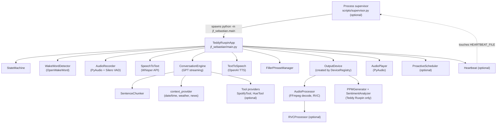
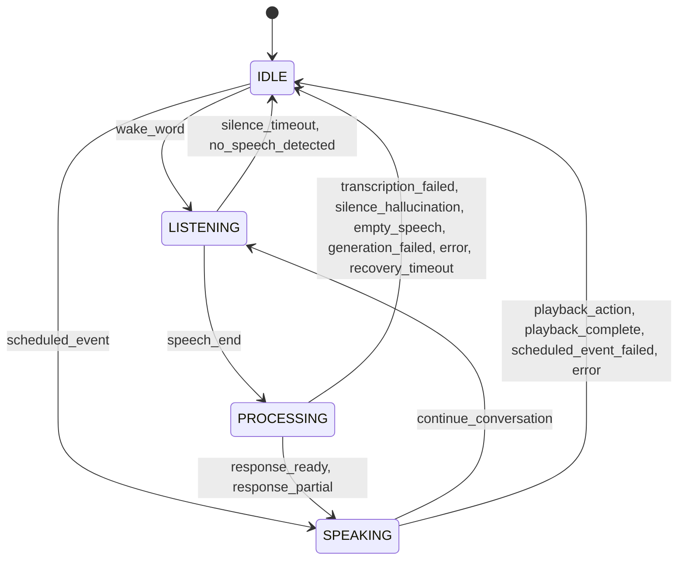
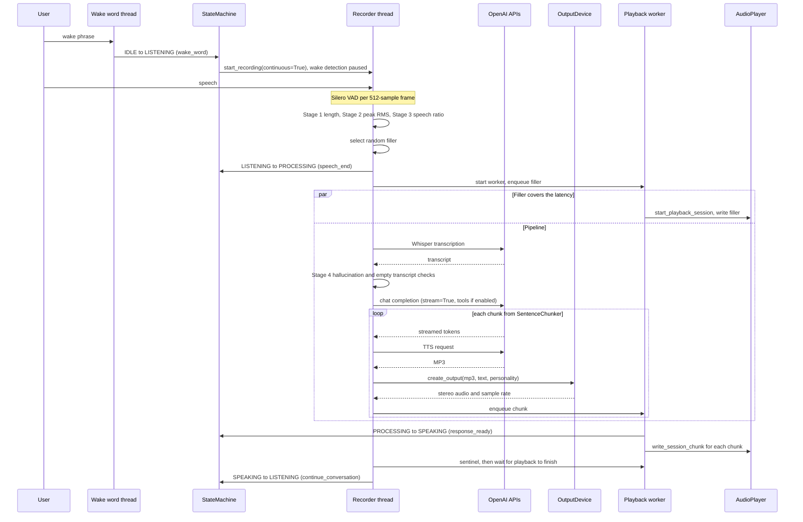
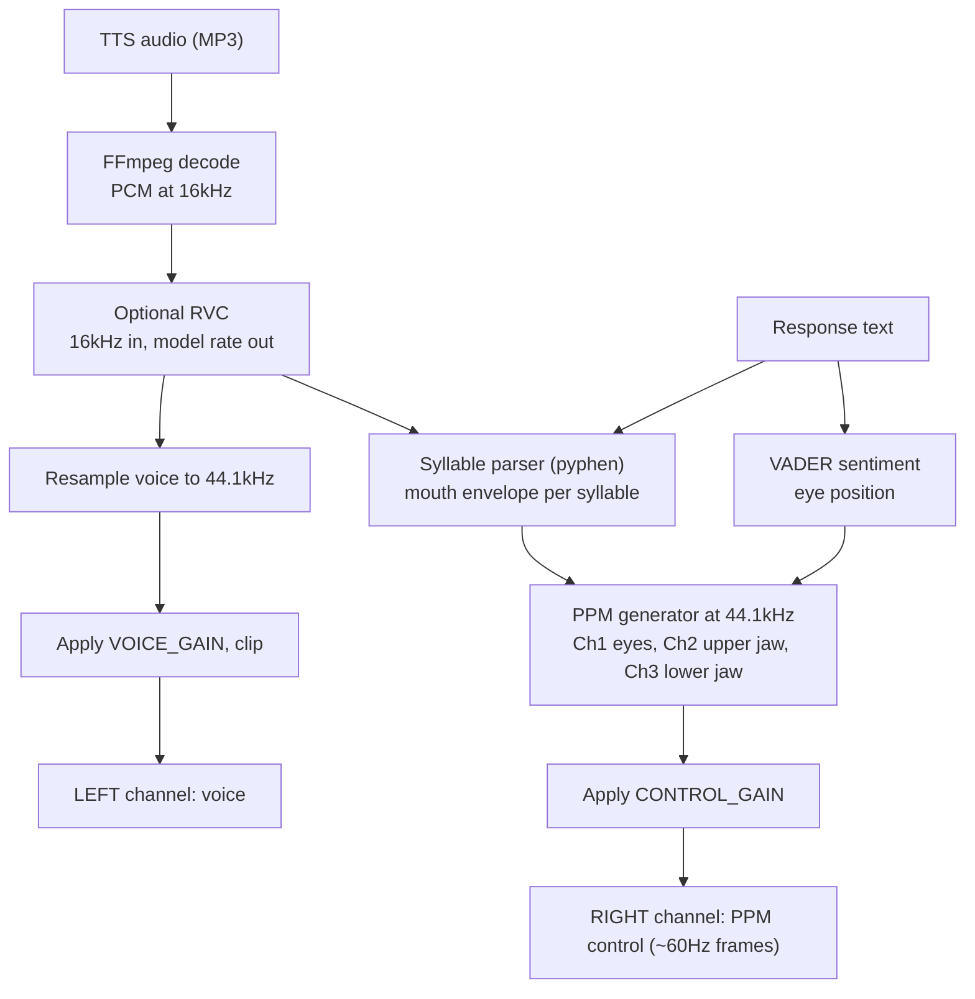
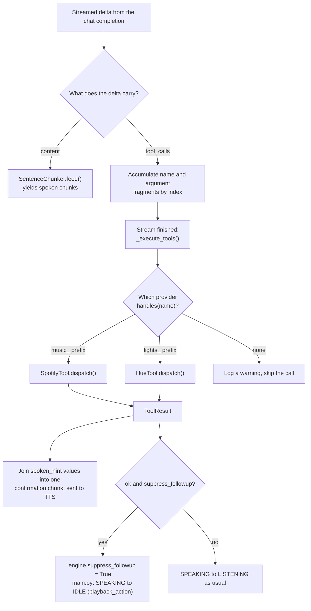
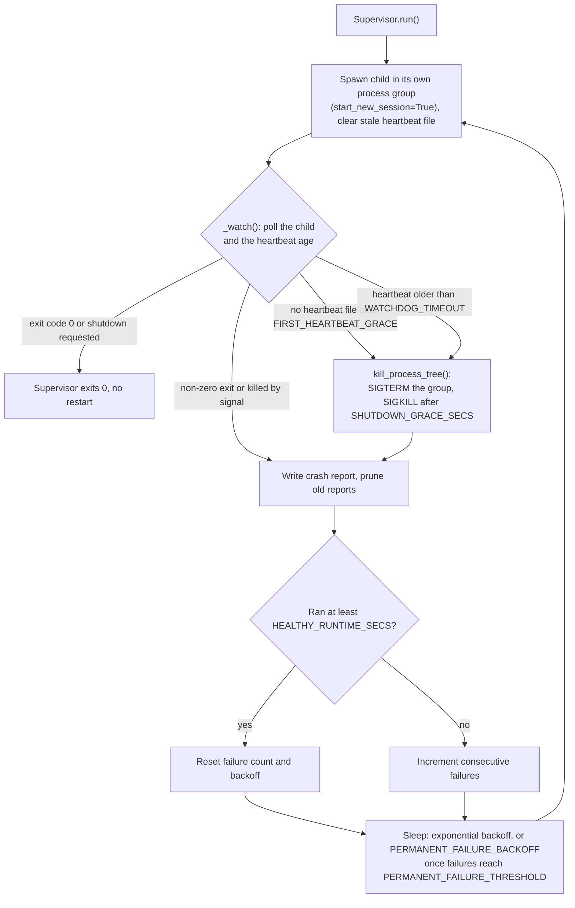
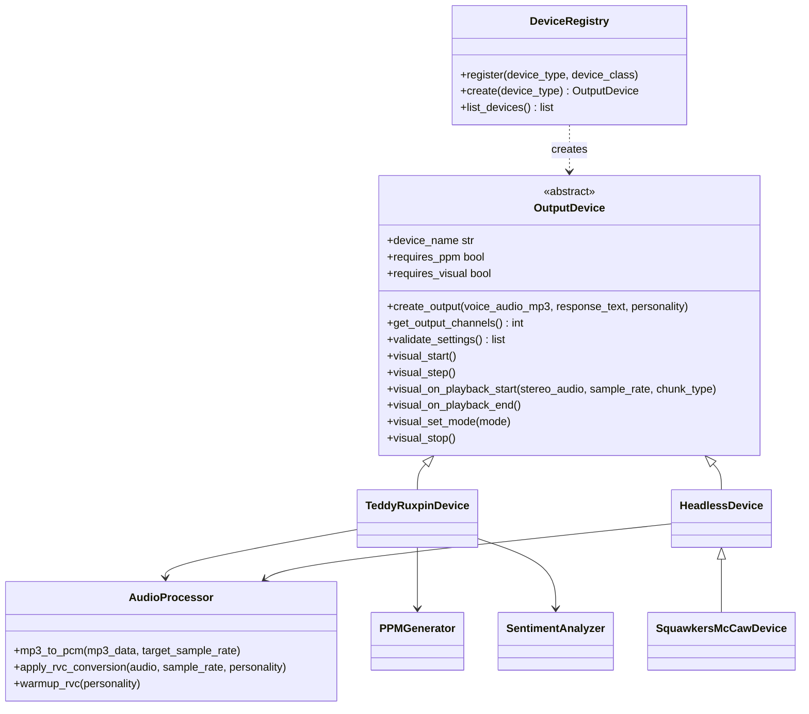

# J.F. Sebastian AI Conversation System - Architecture

## System Overview

This application enables real-time voice conversations with ChatGPT through vintage animatronic toys using wake word activation. Built with a modular device architecture, it supports multiple output devices including the 1985 Teddy Ruxpin (with full PPM motor control), Squawkers McCaw (simple audio output), and a headless mode for plain computer playback.

## Component Architecture

Component notes:

- **Process supervisor** (`scripts/supervisor.py`, optional)
  - Restarts the child on crash with exponential backoff
  - Watchdog kill of hung children via heartbeat staleness
  - Crash reports and permanent-failure detection
  - Run via launchd (macOS) or systemd (Linux). See [Supervisor and Heartbeat](#supervisor-and-heartbeat).
- **Main application** (`TeddyRuxpinApp` in `jf_sebastian/main.py`)
  - Owns the state machine and wires every module together through callbacks
  - Starts the heartbeat thread (`utils/heartbeat.py`) only when `HEARTBEAT_FILE` is set. The thread touches the file every `HEARTBEAT_INTERVAL` seconds (default 10) so the supervisor can tell a live process from a wedged one.
  - Runs a recovery check every 5 seconds (see [Error Handling Strategy](#error-handling-strategy))
- **Wake Word Detector** (OpenWakeWord, `modules/wake_word.py`)
  - Always-on listening in IDLE, in 80 ms chunks (1280 samples at 16 kHz), using streaming `predict()` inference
  - Personality-specific wake phrases ("Hey, Johnny" / "Hey, Mr. Lincoln" / "Hey, Leopold"), one ONNX model per personality
  - Detection threshold `WAKE_WORD_THRESHOLD` (default 0.99) and a 2 second debounce between detections
  - Triggers state transition: IDLE → LISTENING. Paused for the rest of the interaction so the character cannot wake itself.
- **Proactive Scheduler** (optional, `modules/scheduler.py`). See [Proactive Scheduler](#proactive-scheduler).
- **Audio Input Pipeline** (`modules/audio_input.py`)
  - Microphone capture via PyAudio
  - Voice Activity Detection with Silero VAD on 512-sample frames (32 ms at 16 kHz)
  - Continuous recording session across the turns of one conversation; the input stream is stopped (not just ignored) while the character is speaking
- **Speech-to-Text Module** (`modules/speech_to_text.py`)
  - OpenAI Whisper API (`WHISPER_MODEL`, default `whisper-1`), 30 second client timeout
  - Up to 3 attempts per transcription
- **Conversation Engine** (`modules/conversation.py`)
  - OpenAI chat completions with streaming. The model is `GPT_MODEL`: the code default is `gpt-4o-mini`, and the shipped `.env.example` sets `gpt-5.4-mini`. GPT-5 family models get `max_completion_tokens`, no custom temperature, and `GPT_REASONING_EFFORT` (default `low`).
  - Word-based sentence chunking (`MIN_CHUNK_WORDS`) via `modules/sentence_chunker.py`
  - The system prompt is pinned outside the bounded turn history (`MAX_HISTORY_LENGTH` turns), so it is never evicted
  - Real-world context injection (date/time, weather, news) as a transient system message that is not stored in history
  - Optional tool providers (function calling) for Spotify playback and Philips Hue lights. See [Tool Provider Layer](#tool-provider-layer).
- **Text-to-Speech Module** (`modules/text_to_speech.py`)
  - OpenAI TTS API (`TTS_MODEL`: code default `tts-1`, `.env.example` sets `gpt-4o-mini-tts`), MP3 output
  - Per-personality voice, speed, and style instruction
  - Up to 3 attempts per chunk
- **RVC Voice Converter** (optional, `modules/rvc_processor.py`)
  - Retrieval-based Voice Conversion with custom trained voice models
  - 16kHz input → the model's native output rate (typically 48kHz)
  - Per-personality configuration. `rvc_enabled` is tri-state: `true`, `false`, or omitted (auto-enabled when a model file resolves).
  - Up to 3 attempts per conversion with 0.5 s / 1.5 s backoff; on failure the raw TTS audio is used
- **Output Device** (modular architecture, `jf_sebastian/devices/`). See [Device Registry and Visual Seam](#device-registry-and-visual-seam).
  - Device selection via `OUTPUT_DEVICE_TYPE` (default `teddy_ruxpin`)
  - **Teddy Ruxpin**: PPM generator (~60Hz, 8-channel, 44.1kHz), syllable-based lip sync, sentiment-based eye control, stereo LEFT=voice, RIGHT=PPM
  - **Headless**: simple stereo output at 48kHz, no PPM, LEFT=voice, RIGHT=voice (duplicate)
  - **Squawkers McCaw**: subclass of Headless; identical behavior with a different device name
  - Shared components (`devices/shared/`): MP3→PCM conversion (FFmpeg), RVC application and warmup, sentiment analysis (VADER)
- **Audio Output Pipeline** (`modules/audio_output.py`)
  - Stereo playback via PyAudio
  - Gapless playback session per turn (filler and response chunks are written to one open stream)
  - Audio is resampled when its rate differs from the output device's default rate

## State Machine

Labels are the `trigger` strings that `main.py` passes to `StateMachine.transition_to()`. The allowed edges are defined in `StateMachine.VALID_TRANSITIONS` (`modules/state_machine.py`); anything else is rejected with a warning.

Two transitions exist beyond the core loop:
- **IDLE → SPEAKING**: the proactive scheduler fires a scheduled event, entering SPEAKING directly via an atomic `try_transition(IDLE, SPEAKING)` (it never interrupts an active conversation).
- **SPEAKING → LISTENING**: after a response finishes, the system reopens the mic to continue the conversation rather than returning to IDLE. The exception is a turn in which a tool set `suppress_followup` (Spotify started or moved music): that turn goes SPEAKING → IDLE with trigger `playback_action`, so the mic does not listen over the music.

### State Descriptions

**IDLE**
- Only wake word detection active
- Minimal CPU usage
- No audio recording beyond the wake word stream
- Conversation history cleared on entering IDLE once `CONVERSATION_TIMEOUT` (default 120 s) has passed since the last interaction

**LISTENING**
- Microphone actively recording
- VAD monitoring for speech end: `SPEECH_END_SILENCE_SECONDS` (default 1.0 s) of silence after speech, and at least `MIN_LISTEN_SECONDS` (default 1.0 s) of listening
- Audio buffered for transcription
- `SILENCE_TIMEOUT` (default 5.0 s) caps each listening window, measured from the moment the window opens. When it expires, whatever was captured goes through the same validation; silence returns the system to IDLE.

**PROCESSING**
- Filler phrase playing while the pipeline works
- Transcribing speech via Whisper
- Sending to the GPT model
- Generating TTS audio
- Creating control signals

**SPEAKING**
- Playing stereo audio output
- LEFT: Voice audio to speaker
- RIGHT: Control signals to motors (Teddy Ruxpin)
- Recorder paused so the character does not capture its own voice
- On completion, waits `PLAYBACK_TAIL_GUARD_MS` (default 500 ms), then returns to LISTENING for a follow-up (or IDLE after a music action or a scheduled event)

## Conversation Turn

One complete turn, from wake word to the follow-up listening window. The whole pipeline (validation, Whisper, LLM stream, TTS, device processing) runs on the recorder thread inside the `_on_speech_end` callback; only playback runs on a separate per-turn worker thread, fed through a queue.

Notes:
- Stages 1 to 3 run before the filler is selected and before any API call. A failure returns to IDLE (`silence_timeout` or `no_speech_detected`) without calling Whisper.
- The filler text is passed to the LLM as extra context so the response continues the filler's sentence naturally.
- If Stage 4 rejects the transcript, the filler is allowed to finish (the worker is joined for up to 15 s) and the system returns to IDLE.
- The playback worker performs the PROCESSING → SPEAKING transition when it dequeues the first real response chunk, that is, after the filler has finished.
- Chunks are produced one at a time (LLM tokens, then TTS, then device processing). The overlap that hides latency is between producing chunk N+1 and playing chunk N.
- A chunk whose TTS or device processing fails is skipped. After 3 failed chunks with nothing played yet, the state is forced to SPEAKING (`response_partial`).

## Audio Signal Architecture

### Streaming Response Pipeline

`SentenceChunker` (`modules/sentence_chunker.py`) turns the token stream into speakable chunks:
- A chunk is one or more complete sentences totalling at least `MIN_CHUNK_WORDS` words (default 15). The final chunk is flushed regardless of length.
- Sentence boundaries are `.`, `!`, or `?` followed by whitespace, so decimals such as "3.5" are not split. Common abbreviations ("Dr.", "e.g.", "a.m.") do not end a sentence.
- Soft cap: once pending text reaches twice `MIN_CHUNK_WORDS`, the chunker flushes at the earliest clause comma that reaches the minimum (or flushes everything if there is no comma), so a run-on response still streams.

Each chunk then goes through TTS, optional RVC, and device processing, and is queued for playback while the next chunk is being produced.

### Stereo Channel Design (Teddy Ruxpin)

### Control Signal Generation - PPM Format

**PPM (Pulse Position Modulation) Format**
- Frame period: 16.6ms (~60Hz)
- 8 channel slots per frame. Channel numbers below are the zero-based column indices used in `ppm_generator.py` (`channel_values[:, n]`):
  - Channel 0: unused
  - Channel 1: Eyes
  - Channel 2: Upper jaw
  - Channel 3: Lower jaw (primary mouth control)
  - Channels 4-7: unused

**PPM Timing (per channel)**
- Pulse: 400µs at -30% amplitude (negative-going)
- Gap: 630µs to 1590µs (DC center, 0.0)
- Gap duration encodes motor position (0-255 maps to min-max gap)
- The remainder of each 16.6ms frame is a sync gap at DC center
- Generated at 44.1kHz for precise pulse timing
- Low-pass filtered at 5kHz (2nd order Butterworth, zero-phase) for smooth edges
- The finished control track is scaled by `CONTROL_GAIN` (default 0.52)

**Mouth Control (Syllable-Based)**
- Split the response text into syllables with `pyphen` (the `syllables` library is the fallback estimator)
- Divide the audio waveform into equal-length syllable segments
- Calculate one mouth opening value per syllable:
  - Peak amplitude: `max(abs(syllable_audio))`
  - RMS amplitude: `sqrt(mean(syllable_audio²))`
  - Blended: `0.7 * peak + 0.3 * rms`
  - Scaled and clipped: `clip(amplitude * 12.0, 0, 1)`
- Each syllable becomes a closed → open → closed envelope (three points), which produces a natural chewing motion
- Apply smooth transitions between frames:
  - Fast attack (0.15): Syllable onset
  - Slower release (0.35): Between syllables
- Encode to PPM: Ch3 (lower jaw) = mouth_value * 255, Ch2 (upper jaw) = 70% of Ch3

**Eye Control (Sentiment-Based)**
- Analyze GPT response sentiment using VADER (compound score)
- Map sentiment (-1 to 1) to eye position (0 to 1):
  - Base position: 0.9 (eyes start open)
  - Sentiment modulation: a subtle ±3% (`base + sentiment * 0.03`), smoothed with an exponential moving average (0.92)
  - Clipped to valid range [0, 1], with a floor that keeps the eyes mostly open when not blinking
  - The first and last 3 frames of every clip are held at the base position so each utterance starts and ends in a known state
- Add occasional blinks: ~0.4% chance per frame (~once per 4 seconds at 60Hz). A blink is animated over 8 closing frames, 3 closed frames, and 8 opening frames.
- Encode to PPM: Ch1 = (1.0 - eye_position) * 255 (the command is inverted; a higher value closes the lids)

### 1985 Teddy Ruxpin Technical Specs

The original mechanism uses:
- Cassette tape stereo channels
- LEFT: Audio playback
- RIGHT: PPM control track with pulse-position-encoded servo positions
- Sampling rate: 44.1kHz for modern digital playback (preserves PPM timing)
- Motor response time: ~50-100ms (one PPM frame = 16.6ms)
- Mouth: Controlled by Ch2 (upper jaw) and Ch3 (lower jaw) PPM values
- Eyes: Controlled by Ch1 PPM value

### Sample Rate Architecture

- **Processing**: 16kHz (Silero VAD requirement, OpenWakeWord requirement, efficient Whisper input, RVC input)
- **RVC Conversion**: 16kHz → the RVC model's native rate, typically 48kHz (when RVC enabled)
- **PPM Generation**: 44.1kHz (precise pulse timing, no resampling artifacts)
- **Voice Resampling**: Voice audio resampled to the device's output rate:
  - With RVC: model rate → 44.1kHz (Teddy) or 48kHz (Headless, Squawkers)
  - Without RVC: 16kHz → 44.1kHz or 48kHz (device dependent)
- **Output**: Device-specific sample rate (Teddy: 44.1kHz, Headless and Squawkers: 48kHz)
- **Playback**: `AudioPlayer` resamples once more only if the sound card's default rate differs from the device output rate

`SAMPLE_RATE` must stay at 16000 in practice. The settings validator accepts 22050/44100/48000, but Silero VAD only supports 16 kHz (or 8 kHz) and rejects other rates with a warning.

**Why resample voice and not PPM?**
- PPM pulses are 400µs (17.6 samples at 44.1kHz)
- FFT resampling introduces ringing around sharp edges
- Resampling voice audio preserves PPM signal integrity

**RVC Integration:**
- RVC processes at 16kHz input for efficiency
- Outputs at the RVC model's native rate (typically 48kHz)
- Device-specific resampling handles final output rate
- When RVC disabled, audio stays at source rate until device processing
- `VOICE_GAIN` (default 1.05) is applied to both the RVC-converted and the raw TTS path, then clipped to [-1, 1]

## Tool Provider Layer

The conversation engine can offer the LLM function-calling tools. Two providers ship today, both optional and both built on the shared base in `modules/tool_provider.py`:

| Provider | Module | Namespace | Tools | Backend |
|----------|--------|-----------|-------|---------|
| `SpotifyTool` | `modules/spotify_tool.py` | `music_` | 9 (`music_play`, `music_pause`, `music_resume`, `music_skip`, `music_previous`, `music_set_volume`, `music_transfer`, `music_now_playing`, `music_list_devices`) | Spotify Web API via `spotipy`, PKCE auth, 5 s request timeout |
| `HueTool` | `modules/hue_tool.py` | `lights_` | 6 (`lights_on`, `lights_off`, `lights_brightness`, `lights_color`, `lights_scene`, `lights_list`) | Philips Hue Bridge local v1 API via `requests`, 4 s request timeout, no cloud account |

**Enabling.** A provider is built only when its global flag is on (`SPOTIFY_ENABLED`, `HUE_ENABLED`, both default `false`) and the personality has not opted out (`spotify_enabled` / `hue_enabled` in `personality.yaml`, both default `true`). A provider that fails to construct is simply left out; it never blocks startup. At construction the engine also verifies each provider's contract (`handles()`, `dispatch()`, `handlers()`, and that it claims and handles every tool name it advertises) and refuses to register one that fails, so the model is never offered a tool that cannot run.

**Shared base (`tool_provider.py`).**
- `ToolResult` (`ok`, `spoken_hint`, `kind`, `suppress_followup`, `data`) and `ToolError` (`kind`, `spoken_hint`, `data`): the only types the engine reads.
- `tool_schema()`: builds the OpenAI function-tool envelope (deep-copies shared property dicts).
- `fold()` and `resolve_by_name()`: name normalization and an exact → containment → fuzzy ladder over ordered tiers. Earlier tiers win, and an ambiguous tier is resolved within itself rather than falling through. Hue passes rooms/zones as the first tier and bulbs as the second; Spotify passes a single tier of Connect devices, after applying its alias map and default device.
- `ToolProvider`: `handles(name)` claims a tool name by namespace prefix, and `dispatch(name, args)` runs the handler inside a guard that converts every failure into a `ToolResult`. A `ToolError` keeps its own spoken hint; any other exception is mapped through `classify()` to a taxonomy `kind` and then to a phrase from `error_hints` (or `fallback_hint`). The raw exception is never logged, because transport errors can carry tokens.

Behavior worth knowing:
- Tools are attached only on the streaming path (`generate_response_streaming`). Scheduled `prompt:` events use the non-streaming path and cannot call tools.
- The confirmation is templated from the tools' `spoken_hint` strings. There is no second LLM round-trip.
- Only a clean spoken summary (any preamble plus the confirmation) is stored in history; tool-call scaffolding is not persisted.
- `suppress_followup` is owned by the tool, not the engine. Spotify sets it on `play`, `resume`, and `transfer`; Hue never sets it. It is reset at the start of every streaming turn.
- On tool-enabled turns `reasoning_effort` is omitted, because GPT-5 family models reject it in combination with function tools on the chat completions endpoint.
- When Spotify is enabled and `SPOTIFY_NOW_PLAYING_CONTEXT` is true (default), a "now playing" line is added to the per-turn context. It is fetched live with a 5 second coalescing cache.
- Hue caches its inventory (names, ids, capabilities) for 60 seconds and never caches on/off state. Pairing is checked lazily per call, so an unpaired Bridge yields a spoken "not set up yet" and re-pairing takes effect without a restart.

Setup guides: [SPOTIFY_SETUP.md](SPOTIFY_SETUP.md) and [HUE_SETUP.md](HUE_SETUP.md).

## Proactive Scheduler

`modules/scheduler.py` lets a personality start talking on its own (greet at 7am, bedtime story at 9pm, holiday surprises).

- Events live in `personalities/<name>/scheduled_events.yaml` (working example: `personalities/johnny/scheduled_events.yaml`). `SCHEDULER_ENABLED` (default `true`) is the global switch; no scheduler is created if the file has no events.
- Tiny schedule syntax: `"HH:MM"` (daily), `"HH:MM weekdays"`, `"HH:MM weekends"`, `"HH:MM mon,wed,fri"`, and `"HH:MM YYYY-MM-DD"` (one-shot).
- Each event has either `say:` (verbatim TTS, no LLM) or `prompt:` (sent to the LLM as if the user said it, answered in character, and added to the conversation history).
- A daemon thread ticks every 30 seconds and matches at minute granularity; each event fires at most once per scheduled minute. Events run serially on that thread.
- Quiet hours are a half-open window `[start, end)` that may wrap midnight. Events whose minute falls inside it are suppressed, and the loader warns about them at startup. If either `QUIET_HOURS_START` or `QUIET_HOURS_END` is set in the environment, both values come from the environment; otherwise both come from the YAML.
- An event fires only when the state is IDLE. The handler prepares everything first (LLM text, RVC re-warm, TTS, device processing) and only then attempts the atomic `try_transition(IDLE, SPEAKING)`, so a wake word that arrives during preparation wins and the event is dropped. Playback is non-blocking; `_on_playback_complete` returns the state to IDLE.
- Limitations: naive local time (no DST handling), no catch-up after a clock jump or sleep, and no live reload of the YAML.

## Real-World Context

`utils/context_provider.py` builds the transient system message that precedes each user turn: current date and time, weather, and news headlines.

- **Weather** (`utils/weather.py`): `WeatherProvider` ABC with three adapters, selected by `WEATHER_PROVIDER` (`wttr`, `homeassistant`, `manual`, `none`, or `auto`/unset).
  - `WttrWeatherProvider`: wttr.in, public, no API key, keyed by `ZIPCODE`
  - `HomeAssistantWeatherProvider`: a local Home Assistant weather entity (`HOME_ASSISTANT_URL`, `HOME_ASSISTANT_TOKEN`, `HOME_ASSISTANT_WEATHER_ENTITY`). Plain HTTP is refused for non-private hosts to protect the bearer token.
  - `ManualWeatherProvider`: free-form `MANUAL_WEATHER` text, no network egress
  - Auto-selection picks the first configured provider in the order homeassistant, wttr, manual.
- **News** (`utils/news.py`): `NewsProvider` ABC with three adapters, selected by `NEWS_PROVIDER`.
  - `RssNewsProvider`: any RSS/Atom feed via `feedparser`; defaults to NPR Topics: News when `NEWS_RSS_URL` is unset, so headlines are on out of the box
  - `HackerNewsProvider`: tech-only, excluded from auto-selection (opt in explicitly)
  - `ManualNewsProvider`: newline-separated `MANUAL_NEWS`, no network
  - `NEWS_HEADLINE_LIMIT` (default 5) headlines; `NEWS_PROVIDER=none` disables news.
- **Caching**: weather is cached for 30 minutes; news for `NEWS_CACHE_TTL_MINUTES` (default 30). Both caches are pre-warmed in background threads at startup. A stale cache is served immediately while a single background refresh runs; a cold miss fetches synchronously. Failed fetches are negative-cached for 60 seconds. HTTP calls use a 5 second timeout and run outside the cache lock.

## Supervisor and Heartbeat

For unattended deployments, `scripts/supervisor.py` wraps `python -m jf_sebastian.main`. Templates for running the supervisor itself live in `scripts/jf-sebastian.plist` (launchd, macOS) and `scripts/jf-sebastian.service` (systemd user unit, Linux).

- **Heartbeat side** (`utils/heartbeat.py`): a daemon thread touches `HEARTBEAT_FILE` every `HEARTBEAT_INTERVAL` seconds (default 10). It starts in `TeddyRuxpinApp.__init__` only when `HEARTBEAT_FILE` is set, and it is stopped early in `stop()` (right after the scheduler, before the audio teardown) so a hung shutdown also surfaces as a stale heartbeat. The supervisor sets `HEARTBEAT_FILE` in the child's environment (default `/tmp/jf_sebastian.heartbeat`).
- **Watchdog**: the watchdog is not enforced during the first `FIRST_HEARTBEAT_GRACE` seconds (default 60) to allow for model loading and RVC warmup. After that, a missing heartbeat file or one older than `WATCHDOG_TIMEOUT` (default 60) gets the child's whole process group terminated (`os.killpg`), with SIGKILL after `SHUTDOWN_GRACE_SECS` (default 10).
- **Restart policy**: backoff starts at `RESTART_BACKOFF_INITIAL` (1 s), doubles per crash, and is capped at `RESTART_BACKOFF_MAX` (60 s). A run of at least `HEALTHY_RUNTIME_SECS` (60 s) resets it. After `PERMANENT_FAILURE_THRESHOLD` (5) consecutive unhealthy runs, the supervisor logs CRITICAL once and waits `PERMANENT_FAILURE_BACKOFF` (600 s) between attempts. A clean exit (code 0) is not restarted.
- **Crash reports**: written to `CRASH_REPORT_DIR` (default `./crash_reports`) with the last `CRASH_REPORT_TAIL` (100) lines of `jf_sebastian.log`; only the newest `CRASH_REPORT_KEEP` (200) are retained.
- **Single spawner**: when `HEARTBEAT_FILE` is set, `main()` skips `kill_existing_instances()`, because the supervisor is then the only process that starts children.
- **Signals**: the child handles SIGINT/SIGTERM cooperatively by clearing its run flag so the main loop's `finally` block performs cleanup.

## Device Registry and Visual Seam

- A device subclasses `OutputDevice`, implements `create_output()` (MP3 in, `(audio_array, sample_rate)` out, or `None` on error), and registers itself with `@register_device('name')`. `DeviceRegistry.create(settings.OUTPUT_DEVICE_TYPE)` instantiates it, and `validate_settings()` errors abort startup.
- `devices/__init__.py` imports the three built-in devices explicitly (a failure there is loud), then imports every other module or subpackage found in `devices/` on a best-effort basis. A drop-in device package cloned or symlinked into `jf_sebastian/devices/<name>/` therefore self-registers; if it fails to import, a warning is logged and the built-in devices keep working.
- **Visual seam.** `OutputDevice` defines `requires_visual` (default `False`) and six no-op hooks: `visual_start`, `visual_step`, `visual_on_playback_start`, `visual_on_playback_end`, `visual_set_mode`, `visual_stop`. Audio-only devices inherit the no-ops. For a device that drives an on-screen renderer, `main.py` calls `visual_start()` on the main thread, pumps `visual_step()` once per main-loop iteration instead of sleeping (renderers must own the main thread), forwards state changes through `visual_set_mode("idle" | "listening" | "processing" | "speaking")`, publishes each chunk's audio from the playback worker via `visual_on_playback_start()`, and calls `visual_stop()` on the main thread during teardown. If `visual_start()` raises, the app logs the error and continues audio-only.

## Latency Targets

- Wake word → Listening: immediate (there is no acknowledgment sound; recording starts on detection)
- Speech end detection: `SPEECH_END_SILENCE_SECONDS` of silence (default 1.0 s)
- Speech end → Filler playback: well under 1 second (local validation only; the filler starts in parallel with the Whisper call)
- First chunk processing:
  - LLM first chunk (15+ words): 1-2 seconds
  - TTS chunk 1: 1-2 seconds
  - RVC chunk 1 (if enabled): 0.5-1 second
- Subsequent chunks: Processed while earlier audio is playing (zero perceived latency)
- Total: User stops speaking → filler audio almost immediately, then seamless continuation into the real response

## Error Handling Strategy

1. **API Failures**
   - Whisper and TTS calls are attempted up to 3 times
   - A streaming LLM failure yields an in-character fallback line ("Oh dear, I got a bit confused. Could you say that again?") and removes the partial user turn from history; the non-streaming path used by scheduled events retries up to 3 times with a 1 second delay
   - A response chunk whose TTS or device processing fails is skipped rather than aborting the turn
   - Errors are logged to `jf_sebastian.log` (rotating, 10 MB x 5)

2. **Audio Device Issues**
   - Graceful device enumeration (`python -m jf_sebastian.modules.audio_output`)
   - If `INPUT_DEVICE_NAME` / `OUTPUT_DEVICE_NAME` is not found, a warning is logged and the default device is used
   - Output streams are opened with a 3 second timeout, and blocking playback has a watchdog at 4x the expected duration

3. **Wake Word False Positives**
   - High detection threshold (`WAKE_WORD_THRESHOLD`, default 0.99) and a 2 second debounce
   - Near-miss scores (0.5 and above) are logged, rate-limited, to help tune the threshold
   - Wake words are ignored outside IDLE, and detection is paused during an interaction
   - Silence and noise after a false wake are filtered by the multi-stage validation before any API call

4. **Network Issues**
   - Timeout handling on every external call (Whisper client 30 s, weather and news 5 s, Spotify 5 s, Hue 4 s)
   - Weather and news failures are negative-cached for 60 seconds and simply omitted from the context
   - Tool failures become a short spoken hint instead of an exception

5. **Stuck State Recovery** (`_validate_and_recover_state`, every 5 seconds)
   - Wake detector still paused while IDLE: resumed
   - Audio playing while IDLE (outside a playback session): stopped
   - In PROCESSING for more than 30 seconds with no playback session active: forced back to IDLE (`recovery_timeout`)

6. **Process-Level Failures**
   - Crashes and hangs are handled by the optional supervisor (see [Supervisor and Heartbeat](#supervisor-and-heartbeat))

## Configuration Management

Using `.env` file for:
- OpenAI API key
- Audio device names
- Timing thresholds
- Model selections
- Weather provider selection and per-provider settings (WEATHER_PROVIDER, ZIPCODE, HOME_ASSISTANT_*, MANUAL_WEATHER)
- News provider settings (NEWS_PROVIDER, NEWS_RSS_URL, MANUAL_NEWS, NEWS_HEADLINE_LIMIT, NEWS_CACHE_TTL_MINUTES)
- Optional tool providers (SPOTIFY_*, HUE_*)
- Scheduler switches (SCHEDULER_ENABLED, QUIET_HOURS_START, QUIET_HOURS_END)
- Supervisor and heartbeat settings (HEARTBEAT_FILE, HEARTBEAT_INTERVAL, plus the supervisor's own variables)
- Debug flags

All values are read once at import by the `Settings` class in `jf_sebastian/config/settings.py`; `Settings.validate()` runs at startup and aborts on errors. Character-specific settings (voice, prompt, wake word model, fillers, RVC tuning) live in `personalities/<name>/personality.yaml`.

**Layered env overlays.** Three files are merged, highest precedence first:

1. `personalities/{PERSONALITY}/.env`
2. `jf_sebastian/devices/{OUTPUT_DEVICE_TYPE}/.env`
3. `.env` (base)

The base file is loaded first, then the device overlay and the personality overlay are applied with override. `PERSONALITY` and `OUTPUT_DEVICE_TYPE` are the selection keys, so they must come from the base `.env` or the process environment, never from an overlay. The overlays that were applied are exposed as `settings.LOADED_ENV_OVERLAYS` and logged at startup. Settings used by exactly one drop-in device live in that device's own package rather than in `Settings`.

## Dependencies

Core libraries:
- `openwakeword` - Wake word detection (free & open source)
- `onnxruntime` - ONNX model inference for wake word detection
- `pyaudio` - Audio I/O (capture and playback)
- `silero-vad` - Voice activity detection (neural)
- `openai` - Whisper, GPT, TTS APIs
- `numpy` - Audio signal processing
- `scipy` - Signal filtering, resampling, and PPM waveform generation
- `soundfile` - WAV reading and writing (filler audio, debug audio)
- `syllables` - Syllable count estimation (fallback for lip sync timing)
- `pyphen` - Syllable splitting for lip sync timing
- `vaderSentiment` - Sentiment analysis for eye control
- `python-dotenv` - Configuration management
- `pyyaml` - Personality and scheduled-event files
- `requests` - HTTP client (weather providers, Hacker News, Hue Bridge)
- `feedparser` - RSS/Atom parsing for news headlines
- `psutil` - Detecting and stopping other running instances at startup
- `threading` / `queue` - Concurrent processing (standard library)
- FFmpeg (system binary) - MP3→PCM decoding

RVC (Optional - for voice conversion, `requirements-rvc.txt`):
- `rvc-python` - RVC voice conversion library
- `torch` / `torchaudio` - PyTorch for RVC model inference
- `fairseq` - Required by RVC models
- `librosa` - Audio processing for RVC (also used by `AudioPlayer` when playback needs resampling)
- `resampy` - High-quality resampling for RVC

Spotify (Optional - for voice-controlled playback, `requirements-spotify.txt`):
- `spotipy` - Spotify Web API client (PKCE auth, no client secret on device)

Hue light control needs no extra dependency; it uses `requests` against the Bridge's local API.

## Threading Model

All worker threads are daemon threads. Callbacks run on the thread that raised the event, which is why the conversation pipeline executes on the recorder thread.

| Thread | Started by | Responsibility |
|--------|-----------|----------------|
| Main | `main()` | App loop: sleeps 100 ms per iteration (or pumps `visual_step()` for a visual device), runs the recovery check every 5 s, handles SIGINT/SIGTERM, performs shutdown |
| Wake word | `WakeWordDetector.start()` | Reads 80 ms chunks and runs inference; keeps draining the stream while paused; invokes `_on_wake_word`, which performs IDLE → LISTENING and its callbacks |
| Recorder | `AudioRecorder.start_recording()` | VAD loop for the whole conversation (continuous mode); invokes `_on_speech_end`, so validation, Whisper, the LLM stream, TTS, and device processing all run here |
| Playback worker | `_process_and_speak()` (one per turn) | Drains the turn's playback queue (filler, then chunks) into a gapless session; performs PROCESSING → SPEAKING |
| AudioPlayer playback | `AudioPlayer.play_stereo(blocking=False)` | Single-shot playback for scheduled events; `_on_playback_complete` returns to IDLE |
| Scheduler (`scheduler`) | `ProactiveScheduler.start()` | 30 s tick; runs scheduled events serially |
| Heartbeat (`heartbeat`) | `Heartbeat.start()` | Touches the heartbeat file |
| Context refresh | `context_provider` | Short-lived threads for cache warmup and stale refresh of weather and news |
| Debug writer | `utils/async_file_utils.py` | One long-lived thread with a bounded queue (16) for `SAVE_DEBUG_AUDIO` writes; overflow is dropped |

Queue and lock communication:
- Wake word event → state machine (`StateMachine` guards its state with a lock and runs callbacks outside it)
- Response chunks → per-turn `queue.Queue` → playback worker, with `None` as the end sentinel
- Scheduler vs. wake word: resolved by the atomic `try_transition(IDLE, SPEAKING)`
- RVC conversions are serialized by a lock inside `RVCProcessor`

## Testing Strategy

The automated suite lives in `tests/` and runs with `pytest tests/`. It mirrors the package layout (`tests/config`, `tests/modules`, `tests/devices`, `tests/personalities`, `tests/utils`, `tests/scripts`) and uses the markers `unit`, `integration`, `audio`, `slow`, and `hardware` (declared in `pytest.ini` with `--strict-markers`).

Phase 1: Individual modules
- Wake word detection accuracy
- Speech-to-text quality
- GPT response appropriateness
- TTS audio quality

Phase 2: Control signal generation
- PPM signal format validation (~60Hz frame rate, correct pulse/gap timing)
- Syllable-based mouth sync accuracy
- Eye sentiment mapping
- Signal integrity (no resampling artifacts)

Phase 3: Integration testing
- End-to-end conversation flow
- Latency measurements
- Error recovery
- Sustained operation

Phase 4: Hardware validation
- Teddy Ruxpin physical response
- Audio quality through cassette adapter
- Motor synchronization
- Real-world conversation testing
