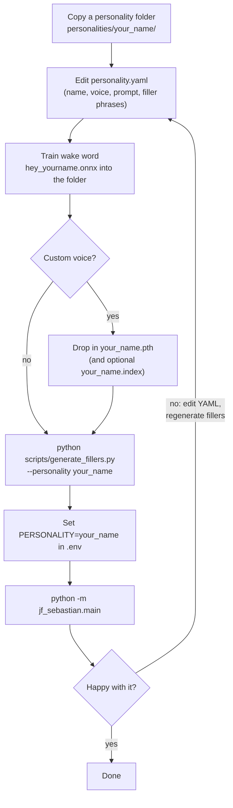
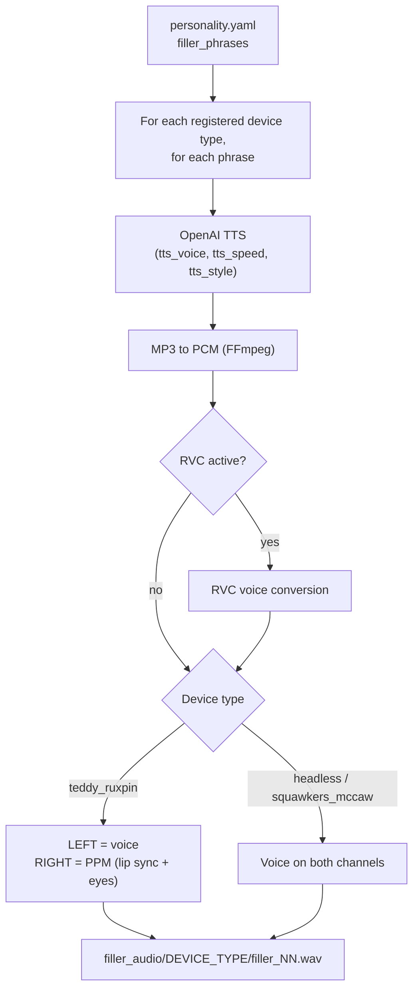

# Creating Your Own Personalities

This guide will walk you through creating a custom personality for your animatronic system. No programming required - just YAML editing and creativity!

## Table of Contents

1. [Overview](#overview)
2. [Quick Start](#quick-start)
3. [Understanding Personalities](#understanding-personalities)
4. [Step-by-Step Guide](#step-by-step-guide)
5. [Writing System Prompts](#writing-system-prompts)
6. [Creating Filler Phrases](#creating-filler-phrases)
7. [Training Wake Words](#training-wake-words)
8. [Voice Selection](#voice-selection)
9. [Testing Your Personality](#testing-your-personality)
10. [Examples and Ideas](#examples-and-ideas)
11. [Troubleshooting](#troubleshooting)
12. [Advanced: RVC Voice Conversion](#advanced-rvc-voice-conversion)
13. [Advanced: Voice-Controlled Music (Spotify)](#advanced-voice-controlled-music-spotify)
14. [Advanced: Voice-Controlled Lights (Philips Hue)](#advanced-voice-controlled-lights-philips-hue)
15. [Advanced: Per-Personality Settings Overrides](#advanced-per-personality-settings-overrides)
16. [Best Practices](#best-practices)
17. [Sharing Your Personality](#sharing-your-personality)

---

## Overview

A personality is a complete character package that includes:
- **Character definition** - Who they are and how they speak
- **Wake word** - Unique phrase to activate them
- **Voice** - Which OpenAI TTS voice to use
- **Filler phrases** - Pre-recorded responses for low latency
- **Filler audio** - Generated audio files, one set per output device (with motor control signals for Teddy Ruxpin)

Everything lives in a single folder that you can drop in, share, or remove at will.

---

## Quick Start

**Creating a personality takes about 30-60 minutes:**
1. Copy an existing personality folder (5 minutes)
2. Edit the YAML file to define your character (15-30 minutes)
3. Train a wake word model (10-15 minutes)
4. Generate filler audio (5 minutes)
5. Test and refine (varies)



Let's get started!

---

## Understanding Personalities

### Directory Structure

Each personality is completely self-contained:

```
your_personality/
├── personality.yaml          # Character definition (this is what you edit!)
├── hey_your_name.onnx       # Wake word model (trained separately)
├── scheduled_events.yaml    # Optional: proactive utterances on a schedule
├── *.pth, *.index           # Optional: RVC voice conversion models
├── .env                     # Optional: settings overrides for this personality only
└── filler_audio/            # Device-specific generated audio files (auto-created)
    ├── teddy_ruxpin/        # Filler audio with PPM control signals
    │   ├── filler_01.wav
    │   ├── filler_02.wav
    │   └── ...
    ├── headless/            # Filler audio for computer playback (simple stereo)
    │   ├── filler_01.wav
    │   ├── filler_02.wav
    │   └── ...
    └── squawkers_mccaw/     # Filler audio with simple stereo
        ├── filler_01.wav
        ├── filler_02.wav
        └── ...
```

**Note:** The filler audio is generated per output device type, so each personality automatically gets device-specific versions based on the registered output devices in the system. At runtime only the subfolder matching your `OUTPUT_DEVICE_TYPE` is read.

**Folder name = personality key.** The folder name (lowercased) is what you put in `PERSONALITY=`. Folders whose names start with `_` or `.` are skipped by auto-discovery.

**Optional `scheduled_events.yaml`:** drop one in your personality folder to make the character speak proactively at specific times (morning greetings, bedtime stories, holiday surprises). Events only fire when the device is IDLE, never interrupting an in-progress conversation. See [Scheduled Events in personalities/README.md](../personalities/README.md#scheduled-events-optional) and the working sample at `personalities/johnny/scheduled_events.yaml`.

### The personality.yaml File

This simple YAML file defines everything about your character:

```yaml
name: YourName
tts_voice: onyx
tts_speed: 1.0  # Optional: 0.25 to 4.0
tts_style: "Speak warmly and conversationally"  # Optional
wake_word_model: hey_yourname.onnx
system_prompt: |
  Character description here...
filler_phrases:
  - "Filler phrase 1..."
  - "Filler phrase 2..."
```

That's it! No code, just configuration. The five required fields are `name`, `tts_voice`, `wake_word_model`, `system_prompt`, and `filler_phrases`; everything else is optional. Keys the loader does not know (for example the `full_name` line in some bundled personalities) are ignored. The full field reference is in [personalities/README.md](../personalities/README.md#yaml-format).

---

## Step-by-Step Guide

### Step 1: Choose a Character Concept

Think about:
- **Who are they?** (profession, background, personality)
- **How do they speak?** (formal/casual, verbose/concise, accent/dialect)
- **What do they know?** (expertise, interests, experiences)
- **What makes them unique?** (quirks, catchphrases, mannerisms)

**Examples:**
- A pirate captain obsessed with navigation and treasure
- A 1920s jazz musician who speaks in vintage slang
- A Victorian-era scientist excited about new discoveries
- A wise grandmother who tells stories and bakes
- A space station AI with dry humor

### Step 2: Copy a Template

Start by copying an existing personality:

```bash
# Copy Johnny as a template
cp -r personalities/johnny personalities/your_name

# Or copy Mr. Lincoln for a more formal character
cp -r personalities/mr_lincoln personalities/your_name
```

### Step 3: Edit personality.yaml

Open `personalities/your_name/personality.yaml` in a text editor.

#### Set Basic Info

```yaml
# The display name (shown in the startup log)
name: Captain Morgan

# Choose a voice (see Voice Selection below)
tts_voice: onyx

# TTS speed (0.25 to 4.0, default 1.0)
# Slower for dignified characters (0.9), faster for energetic ones (1.1)
tts_speed: 1.0

# TTS style instruction (optional)
# Controls tone, emotional range, and speaking style
# Only sent when TTS_MODEL in .env is a gpt-4o model (e.g. gpt-4o-mini-tts);
# ignored with tts-1 / tts-1-hd
tts_style: "Speak gruffly like a weathered sea captain"

# Wake word filename (you'll create this later)
wake_word_model: hey_captain.onnx

# RVC Voice Conversion (Optional - for custom voice models)
# Transform TTS output with a trained voice model for unique character voices
# rvc_enabled: true
# rvc_model: captain_voice.pth
# rvc_index_file: captain_voice.index  # Optional - improves quality
# rvc_pitch_shift: 0  # Whole semitones, -12 to 12
# rvc_index_rate: 0.75  # Index influence, 0.0 to 1.0 (default 0.5)
# rvc_f0_method: pm  # Pitch detection: pm, harvest, crepe, dio, rmvpe (default harvest; macOS: use pm)
```

#### Write the System Prompt

This is the most important part - it defines who your character is:

```yaml
system_prompt: |
  You are Captain Morgan, a salty sea captain from the golden age of piracy.
  You've sailed the seven seas for thirty years, hunting treasure and evading
  the British Navy. You speak with nautical slang and often reference your
  adventures in the Caribbean.

  Keep responses conversational and in character (2-3 sentences typically).
  You're gruff but have a good heart. You love talking about navigation,
  treasure maps, ship tactics, and life at sea.

  Remember: you're a physical animatronic pirate captain having a real
  conversation. Stay authentic to your character - salty, adventurous,
  and full of sea stories.
```

See [Writing System Prompts](#writing-system-prompts) for detailed guidance.

#### Create Filler Phrases

Write 30 phrases (8-10 seconds each) your character would say:

```yaml
filler_phrases:
  - "Hold on, I'm checking me navigation charts... Aye, I remember these waters. Sailed through here back in ought-six, chasin' a Spanish galleon. Nearly lost me ship in a squall. Now then..."
  - "Just a moment, adjustin' the compass... You know, proper navigation saved me hide more times than I can count. Dead reckoning only gets ye so far. The stars, now those never lie. So..."
  - "Give me a second, I'm consultin' me logbook... Ah yes, I logged that voyage. Three months at sea, not a drop of fresh water for the last fortnight. Crew nearly mutinied. We persevered though. Alright..."
  # ... 27 more phrases
```

See [Creating Filler Phrases](#creating-filler-phrases) for tips.

### Step 4: Train a Wake Word Model

You'll need to train an OpenWakeWord model for your wake phrase.

See the detailed guide: [docs/TRAIN_WAKE_WORDS.md](TRAIN_WAKE_WORDS.md)

**Quick summary:**
1. Open OpenWakeWord's training notebook (the hosted Google Colab one is the easiest)
2. Enter your wake phrase; the notebook generates synthetic speech samples for you (no need to record yourself)
3. Optionally list similar-sounding phrases as custom negatives
4. Run the training and download the resulting `.onnx` model
5. Save it as `hey_yourname.onnx` in your personality directory (the filename must match `wake_word_model` in your YAML)

**Temporary option:** Copy a pre-trained OpenWakeWord model (e.g. `hey_jarvis_v0.1.onnx`) into your personality folder for testing, then train your custom one later. See [Using Pre-trained Models](TRAIN_WAKE_WORDS.md#using-pre-trained-models).

### Step 5: Generate Filler Audio

Once your YAML is ready, generate the audio files:

```bash
python scripts/generate_fillers.py --personality your_name
```

This creates one WAV file per filler phrase, for **every registered output device type** (`teddy_ruxpin`, `headless`, `squawkers_mccaw`, plus any drop-in devices you have installed). Each file contains:
- Your character's voice (using the TTS voice, speed, and style you selected, passed through RVC if the personality uses it)
- For Teddy Ruxpin only, a PPM control track on the right channel: lip sync (syllable-based mouth movements) and eye control (sentiment-based eye positions)
- For the other devices, plain stereo voice audio



Useful flags:

```bash
# Only one device type (much faster if you only own one device)
python scripts/generate_fillers.py --personality your_name --device teddy_ruxpin

# Every personality (the default when --personality is omitted; --all does the same)
python scripts/generate_fillers.py
```

The script needs a valid `.env` (it runs the same configuration check as the main app, so `OPENAI_API_KEY` must be set). TTS is called once per phrase per device type, so 30 phrases across three device types is 90 TTS requests.

Takes about 5-10 minutes depending on your internet speed and OpenAI API (longer with RVC).

**Files are numbered by phrase order** (`filler_01.wav` is the first phrase in the list), and the script overwrites existing files but never deletes any. If you remove or reorder phrases, delete `personalities/your_name/filler_audio/` first and regenerate, so no stale audio is left behind.

### Step 6: Activate Your Personality

Edit `.env`:

```bash
PERSONALITY=your_name
```

Restart the application:

```bash
python -m jf_sebastian.main
```

### Step 7: Test and Refine

Test your personality:
1. Say the wake word
2. Have a conversation
3. Listen to the filler phrases
4. Evaluate the character's responses

Refine as needed:
- Adjust the system prompt if responses don't match your vision
- Rewrite filler phrases that don't fit
- Re-generate audio after changes (filler audio is baked: changing `filler_phrases`, `tts_voice`, `tts_speed`, `tts_style`, or any RVC setting has no effect on fillers until you regenerate)

---

## Writing System Prompts

The system prompt is the heart of your personality. It tells the AI who to be and how to behave.

### Structure

A good system prompt includes:

1. **Identity** - Who are they?
2. **Background** - What's their history?
3. **Personality** - How do they act?
4. **Knowledge** - What do they know about?
5. **Speaking style** - How do they communicate?
6. **Constraints** - Keep it conversational, stay in character
7. **Reminder** - They're a physical animatronic

### Example Breakdown

```yaml
system_prompt: |
  # IDENTITY
  You are Captain Morgan, a legendary pirate captain from the golden age of sail.

  # BACKGROUND
  You've spent thirty years on the high seas, hunting treasure, battling the
  British Navy, and surviving countless storms. You sailed with Blackbeard briefly,
  captained three different ships, and buried treasure on seven islands.

  # PERSONALITY
  You're gruff and salty on the surface, but you have a code of honor. You're
  fiercely loyal to your crew, hate liars and cheaters, and believe in fair
  shares of plunder. You respect courage and despise cowardice.

  # KNOWLEDGE
  You know navigation like the back of your hand - celestial, dead reckoning,
  reading currents and weather. You can talk for hours about ship tactics,
  treasure hunting, Caribbean ports, and naval battles. You know every trick
  for finding fresh water, avoiding scurvy, and keeping a crew in line.

  # SPEAKING STYLE
  You speak with nautical slang and maritime metaphors. "Aye" instead of "yes",
  "ye" instead of "you". You reference your adventures casually. Keep responses
  conversational and concise (2-3 sentences), but you'll elaborate on sailing
  topics if asked.

  # REMINDER
  Remember: you're a physical animatronic pirate captain having a real conversation.
  Stay authentic - you're rough around the edges but surprisingly knowledgeable
  and full of stories.
```

### Tips for Great System Prompts

**DO:**
- Be specific about personality traits
- Include concrete details (years at sea, specific experiences)
- Define their expertise clearly
- Give examples of how they speak
- Set clear conversational guidelines (length, tone)
- Make them interesting and distinctive

**DON'T:**
- Make them too generic ("friendly and helpful")
- Ignore the physical animatronic context
- Forget to set response length expectations
- Make them argumentative or hostile
- Create characters that can't handle normal questions

### Testing System Prompts

Ask yourself:
- Does this character have a clear voice?
- Would their responses be interesting?
- Can they handle random questions?
- Do they have depth beyond one topic?
- Will conversations feel natural?

---

## Creating Filler Phrases

Filler phrases play immediately when the user finishes speaking, giving the AI time to think. They're crucial for making conversations feel responsive.

One filler is picked at random each turn, and its text is handed to the LLM as context so the real answer can pick up where the filler left off (without repeating the "Now..." or "So..."). That is why a clean transition word at the end matters. Filler playback can be turned off globally with `ENABLE_FILLER_AUDIO=false` in `.env`.

### What Makes a Good Filler Phrase?

**Requirements:**
- **8-10 seconds long** - Enough time for API processing
- **In character** - Something they would actually say
- **Activity-based** - They're doing something while talking
- **Ends with transition** - "Now...", "So...", "Alright...", "Anyway..."

**Structure:** `[Activity] + [Character detail/story] + [Transition word]`

### Examples

**Pirate Captain:**
```
"Hold on, I'm checking me navigation charts... Aye, I sailed these waters
back in ought-six. Nearly lost me ship to a British frigate off Tortuga.
Clever sailing saved us. Now then..."
```

**Victorian Scientist:**
```
"One moment, I'm reviewing my laboratory notes... Fascinating! This experiment
on electrical conductivity produced unexpected results last Tuesday. The copper
wire exhibited peculiar properties. So..."
```

**Jazz Musician:**
```
"Hang tight, baby, I'm tuning this horn... You know, I played this same trumpet
at the Cotton Club in twenty-eight. Best gig I ever had. Basie was on piano
that night. Real gone. Alright..."
```

**Grandmother:**
```
"Just a second, dear, I'm pulling cookies out of the oven... There we go,
perfect golden brown. I've been baking these for sixty years using my mother's
recipe. The secret is real butter. Now..."
```

### Writing 30 Unique Phrases

**Vary the activities:**
- Checking equipment/tools
- Reading documents/books
- Performing character-appropriate tasks
- Consulting materials
- Making observations
- Remembering stories

**Vary the content:**
- Historical references
- Technical knowledge
- Personal anecdotes
- Character insights
- World-building details
- Expertise demonstration

**Template:**
```
"[Action verb], [specific activity]... [Relevant detail or story that
shows character knowledge/personality in 2-3 sentences]. [Transition word]..."
```

### Tips

1. **Be specific** - "checking the rum inventory" beats "looking at stuff"
2. **Show expertise** - Let them demonstrate their knowledge
3. **Drop story hints** - Brief references to their past
4. **Stay consistent** - All phrases should sound like the same character
5. **Vary length** - Some 7 seconds, some 10, keeps it natural
6. **Read aloud** - Does it sound natural when spoken?

### Common Mistakes

❌ Too short: "Hold on... Okay..."
❌ Too long: [12+ seconds of rambling]
❌ Out of character: A pirate discussing modern technology
❌ No transition: Ends abruptly without "now/so/alright"
❌ Boring: "Just a moment, thinking..."

---

## Training Wake Words

Your personality needs a unique wake word phrase to activate it.

### Choosing a Wake Phrase

**Format:** "Hey [Name]"

**Examples:**
- "Hey Captain" (for Captain Morgan)
- "Hey Professor" (for a scientist)
- "Hey Nana" (for a grandmother)
- "Hey Duke" (for a jazz musician)

**Tips:**
- Keep it short (2-3 syllables after "Hey")
- Make it distinct from other wake words
- Easy to pronounce clearly
- No tongue-twisters

### Training Process

See the full guide: [TRAIN_WAKE_WORDS.md](TRAIN_WAKE_WORDS.md)

**Summary:**
1. Enter your wake phrase in OpenWakeWord's training notebook (it generates synthetic speech samples; you don't record anything)
2. Add similar-sounding phrases as custom negatives if needed
3. Train and download the `.onnx` model
4. Test detection accuracy with your real microphone
5. Iterate if needed

**Temporary solution:**
Copy an existing pre-trained OpenWakeWord `.onnx` model into your personality folder for initial testing, then train your custom one later.

---

## Voice Selection

Choose from OpenAI's TTS voices:

| Voice | Description | Good For |
|-------|-------------|----------|
| **alloy** | Neutral, balanced | General purpose, androids, neutral characters |
| **echo** | Male, clear, professional | Leaders, teachers, formal characters (Mr. Lincoln) |
| **fable** | Male, expressive, storytelling | Narrators, entertainers, dramatic characters |
| **onyx** | Male, deep, casual | Everyday characters, bartenders, casual personalities |
| **nova** | Female, warm, friendly | Friendly characters, hosts, welcoming personalities |
| **shimmer** | Female, soft, calm | Gentle characters, soothing personalities |

**Test voices at:** https://platform.openai.com/docs/guides/text-to-speech

The `tts_voice` value is passed straight to the OpenAI API without validation, so any voice your `TTS_MODEL` supports will work (OpenAI has added voices beyond the six above). A misspelled or unsupported voice is not caught when the personality loads; it fails later, when speech is synthesized.

### Choosing the Right Voice

Consider:
- **Gender** of your character
- **Formality** level (casual vs. professional)
- **Energy** level (calm vs. expressive)
- **Age** perception (younger vs. older sounding)

---

## Testing Your Personality

### Initial Test

1. **Start the system:**
   ```bash
   python -m jf_sebastian.main
   ```

2. **Check startup:**
   - Does it load without errors?
   - Is the personality name displayed?
   - Is the wake word shown? (The log prints "Hey" plus the `name` field; the phrase that actually triggers is whatever your `.onnx` model was trained on.)

3. **Test wake word:**
   - Say the wake phrase
   - Does it detect reliably?
   - Does it respond?

4. **Have a conversation:**
   - Ask character-appropriate questions
   - Test their knowledge areas
   - Try edge cases (random questions)

### Evaluation Checklist

**Character Consistency:**
- [ ] Responses match the character's background
- [ ] Speaking style is consistent
- [ ] Knowledge matches their expertise
- [ ] Personality comes through clearly

**Filler Phrases:**
- [ ] Sound natural and in-character
- [ ] Provide enough thinking time
- [ ] Transition smoothly to real responses
- [ ] Variety keeps conversations fresh

**Technical:**
- [ ] Wake word detects reliably
- [ ] Voice matches character
- [ ] Audio quality is good
- [ ] Motor movements are appropriate

### Common Issues and Fixes

**Problem:** Responses are too generic
**Fix:** Make system prompt more specific, add more personality details

**Problem:** Character breaks character
**Fix:** Add stronger reminder in system prompt, emphasize staying in character

**Problem:** Filler phrases don't fit
**Fix:** Rewrite phrases to match character's actual activities and knowledge

**Problem:** Wake word doesn't detect well
**Fix:** Retrain with more samples, speak more clearly, adjust the detection threshold (`WAKE_WORD_THRESHOLD` in `.env`, default 0.99)

---

## Examples and Ideas

### Character Archetypes

**Historical Figures:**
- Albert Einstein (scientist, violin player, pacifist)
- Marie Curie (pioneering researcher, educator)
- Benjamin Franklin (inventor, writer, diplomat)
- Cleopatra (queen, strategist, polyglot)

**Professionals:**
- Chef (culinary expert, ingredient knowledge)
- Librarian (book lover, research expert)
- Park Ranger (nature knowledge, conservation)
- Mechanic (car expert, problem solver)

**Fantasy/Fiction:**
- Wizard (magical knowledge, mystical)
- Space Captain (sci-fi, exploration)
- Detective (mystery solver, observant)
- Time Traveler (historical knowledge, witty)

**Everyday Characters:**
- Barista (coffee expert, friendly)
- Taxi Driver (city knowledge, stories)
- Gardener (plant knowledge, patient)
- Coach (motivational, sports knowledge)

### Personality Combinations

Mix traits for unique characters:
- Grumpy but knowledgeable expert
- Enthusiastic beginner learning as they go
- Wise elder with a sense of humor
- Young prodigy with social awkwardness
- Eccentric genius with odd hobbies

---

## Troubleshooting

### YAML Validation Errors

Load errors appear at startup as `Failed to load personality '<name>': ...` followed by one of the messages below.

**Error:** "Unknown personality 'your_name'. Available: ..."
**Fix:** `PERSONALITY` must match a folder name under `personalities/` that contains a `personality.yaml`.

**Error:** "personality.yaml in ... is missing required fields: name"
**Fix:** Ensure all required fields are present:
- `name`
- `tts_voice`
- `wake_word_model`
- `system_prompt`
- `filler_phrases`

**Error:** "'filler_phrases' must be a list"
**Fix:** Ensure proper YAML list format:
```yaml
filler_phrases:
  - "Phrase 1..."
  - "Phrase 2..."
```

**Error:** "'tts_speed' must be between 0.25 and 4.0"
**Fix:** Use a number in that range (1.0 is normal speed).

**Error:** "'rvc_pitch_shift' must be an integer between -12 and 12", "'rvc_index_rate' must be between 0.0 and 1.0", or "'rvc_f0_method' must be one of ['harvest', 'crepe', 'pm', 'dio', 'rmvpe']"
**Fix:** Correct the value. These three are only checked when RVC is active for the personality. Note that `rvc_pitch_shift` must be a whole number (`-2`, not `-2.0`).

**Not validated at load time:** the `tts_voice` name and the existence of the wake word file. A bad voice fails when speech is synthesized; a missing `.onnx` file fails when the wake word detector starts.

### Generation Issues

**Problem:** Filler audio generation fails
**Possible causes:**
- Missing OpenAI API key
- No internet connection
- API rate limiting
- Invalid TTS voice name

**Fix:** Check `.env` file, verify API key, wait and retry

### Character Issues

**Problem:** Character doesn't match my vision
**Fix:** Iterate on system prompt:
1. Identify specific issues
2. Add more detail to system prompt
3. Re-test
4. Repeat until satisfied

**Problem:** Responses too long
**Fix:** Add to system prompt:
```
Keep responses brief (1-2 sentences maximum unless specifically asked for more detail).
```

**Problem:** Responses too short
**Fix:** Encourage elaboration in system prompt:
```
You enjoy sharing stories and explaining your knowledge in detail.
Feel free to elaborate with examples and anecdotes.
```

---

## Advanced: RVC Voice Conversion

RVC (Retrieval-based Voice Conversion) is an optional feature that transforms TTS output with custom trained voice models, creating unique character voices that go beyond what OpenAI TTS alone can provide.

### When to Use RVC

**Use RVC when:**
- You want a specific character voice not available in OpenAI TTS
- You need to match an existing voice (celebrity, character, etc.)
- You want maximum control over voice characteristics
- You're willing to train or obtain voice models

**Stick with OpenAI TTS when:**
- You're just getting started
- OpenAI voices are close enough to your vision
- You want simplicity and ease of setup
- You don't need extreme voice customization

### RVC Configuration

**Quick path (convention over configuration):** name your model and index after
the personality's folder and just drop them in. For a folder `captain/`, that is
`captain/captain.pth` (and optionally `captain/captain.index`). You do not even
need `rvc_enabled` or `rvc_model` lines: an omitted `rvc_enabled` auto-enables
RVC when a matching `<foldername>.pth` is found, and stays off otherwise.

`rvc_enabled` is tri-state:
- `true` = on (use the model if found, else fall back to the raw TTS audio)
- `false` = off, even if a matching `.pth` is present (an explicit off switch)
- omitted = auto: on only if a model file resolves

`rvc_model` / `rvc_index_file` are optional. If set, the explicit value is used;
if omitted, the loader looks for `<foldername>.pth` / `<foldername>.index` in the
personality directory. If nothing resolves, RVC is skipped and the raw TTS audio
plays through unchanged.

For full control you can still spell everything out:

```yaml
# Enable RVC voice conversion (optional; omit to auto-enable when a model exists)
rvc_enabled: true

# RVC model file (.pth). Optional: omit to use <foldername>.pth by convention.
# Place in your personality directory or global rvc_models/ folder
rvc_model: captain_voice.pth

# Optional: Index file (omit to use <foldername>.index by convention)
# Looked up in the personality directory only
rvc_index_file: captain_voice.index

# Pitch shift in whole semitones (-12 to +12, default 0)
# Negative = lower pitch, Positive = higher pitch
rvc_pitch_shift: -2

# Index influence (0.0 to 1.0, default 0.5)
# Higher = more faithful to trained voice, may introduce artifacts
# Lower = cleaner but less accurate to trained voice
rvc_index_rate: 0.75

# Pitch detection method (pm, harvest, crepe, dio, rmvpe; default harvest)
# pm: Good quality, fastest (recommended for macOS)
# harvest: Good quality, fast
# crepe: Better quality, medium speed
# rmvpe: Best quality, slow (Linux/Windows only - crashes on macOS)
rvc_f0_method: pm

# Optional: Additional RVC parameters (defaults shown)
rvc_filter_radius: 3  # Median filtering (0-7, higher = smoother)
rvc_rms_mix_rate: 0.25  # Volume envelope mixing (0.0-1.0)
rvc_protect: 0.33  # Protect voiceless consonants (0.0-0.5)
```

The loader checks `rvc_pitch_shift`, `rvc_index_rate`, and `rvc_f0_method` (only when RVC is active). The ranges on the last three parameters are guidance; they are passed to RVC as written.

RVC can also be switched off for every personality at once with `RVC_ENABLED=false` in `.env`, which is handy for comparing against the raw TTS voice.

### RVC Pitch Detection Methods

RVC supports multiple pitch detection methods via `rvc_f0_method`. Choose based on your platform and quality requirements (`dio` is also accepted by the loader):

| Method | Quality | Speed | Requirements | macOS Compatible |
|--------|---------|-------|--------------|------------------|
| `pm` | Good | Fastest | Built-in | ✅ **Recommended** |
| `harvest` | Good | Fast | Built-in | ✅ Yes |
| `crepe` | Better | Medium | Built-in | ✅ Yes |
| `rmvpe` | Best | Slow | Download required | ❌ **Crashes** |

#### Using rmvpe (Linux/Windows Only)

The `rmvpe` method provides the highest quality pitch detection but has important limitations:

**⚠️ macOS Users:** `rmvpe` crashes on macOS due to faiss/OpenMP conflicts with PyTorch. Use `pm`, `harvest`, or `crepe` instead.

**For Linux/Windows users who want maximum quality:**

```bash
# Create base_models directory if it doesn't exist
mkdir -p base_models

# Download the rmvpe model (173MB)
wget -P base_models https://huggingface.co/lj1995/VoiceConversionWebUI/resolve/main/rmvpe.pt

# Rename to expected filename
mv base_models/rmvpe.pt base_models/rmvpe.pth
```

Then set in your `personality.yaml`:
```yaml
rvc_f0_method: rmvpe
```

**Recommended defaults:**
- **macOS**: `pm` (fast, stable, good quality)
- **Linux/Windows**: `rmvpe` (best quality, requires download)

### Getting RVC Models

**RVC voice models are not distributed with this project.** No `.pth`/`.index` files ship in the repo (they are gitignored), including for the bundled personalities. To get a converted character voice you must supply your own model through one of the options below. Until you do, the personality uses its raw OpenAI TTS voice.

**Option 1: Train Your Own**
- Requires audio samples of target voice (10+ minutes recommended)
- Use RVC training tools (see RVC documentation)
- Most control but most effort

**Option 2: Use Pre-trained Models**
- Community-trained models available online
- Faster but limited selection
- Verify licensing for your use case

**Option 3: Commission Training**
- Hire someone to train a model for you
- Good middle ground

### Model File Locations

Place RVC model files in either:

**Per-personality (recommended):**
```
personalities/your_name/
├── personality.yaml
├── captain_voice.pth        # Model file
├── captain_voice.index      # Index file (optional)
└── hey_captain.onnx
```

**Global directory** (models only, and only for an explicit `rvc_model:` value):
```
rvc_models/
└── captain_voice.pth
```

An explicit `rvc_model` is looked up in the personality directory first, then in the global directory (`RVC_MODEL_DIR` in `.env`, default `./rvc_models/`). The `<foldername>.pth` convention and all `.index` files are only looked up in the personality directory, so keep index files next to `personality.yaml`.

### RVC System Requirements

- **CPU:** Works but slow (30-60s per chunk)
- **Apple Silicon (M1/M2/M3):** Fast with MPS device (5-10s per chunk)
- **NVIDIA GPU:** Fastest with CUDA (3-5s per chunk)

Set in `.env`:
```bash
RVC_DEVICE=auto  # default: picks the best available GPU; or force cpu, mps, cuda
```

### Testing RVC

1. Enable RVC in personality.yaml
2. Add your model files
3. Generate filler audio:
   ```bash
   python scripts/generate_fillers.py --personality your_name
   ```
4. Test conversation and listen to voice quality
5. Adjust parameters (pitch_shift, index_rate) as needed

### Troubleshooting RVC

**Problem:** RVC audio sounds robotic or distorted
**Fix:**
- Lower `rvc_index_rate` (try 0.5)
- Increase `rvc_protect` (try 0.4)
- Try different `rvc_f0_method` (`pm` recommended for macOS, `rmvpe` for Linux/Windows)

**Problem:** Voice pitch is wrong
**Fix:** Adjust `rvc_pitch_shift`:
- Too high → decrease (negative values)
- Too low → increase (positive values)

**Problem:** RVC is too slow
**Fix:**
- Use `RVC_DEVICE=mps` or `cuda` instead of `cpu`
- Lower `rvc_filter_radius`
- Use a faster `rvc_f0_method` (`pm` is the fastest)

**Problem:** Model file not found
**Fix:** Verify file path and filename exactly match personality.yaml. A missing model is not an error: the log shows "No RVC model for ..." and the raw TTS voice is used.

---

## Advanced: Voice-Controlled Music (Spotify)

A personality can control Spotify by voice ("play some tiki music in the kitchen",
"skip", "turn it up"). It's on by default; nothing needs to be added to your
`personality.yaml`. To exclude a specific character, set:

```yaml
# Keep this character out of Spotify control
spotify_enabled: false
```

The music tools are only offered to the model when **both** are true:
1. `spotify_enabled` is not `false` on the personality (it defaults to true), and
2. `SPOTIFY_ENABLED=true` in `.env`.

Completing the one-time login is a third requirement for the tools to actually
reach Spotify; without it a music command just returns a spoken "not set up" reply
rather than playing anything. And when `SPOTIFY_ENABLED` is off, no personality is
offered the tools at all, so the feature is simply absent. Full setup (Spotify app,
Premium requirement, browser login, choosing speakers) is in
[SPOTIFY_SETUP.md](SPOTIFY_SETUP.md). Consider giving a personality a couple of
short, snappy filler phrases too, since music commands feel best with a brief
lead-in rather than a long one.

---

## Advanced: Voice-Controlled Lights (Philips Hue)

A personality can control Hue lights by voice ("turn on the living room", "dim
the desk lamp to 30 percent", "make it red", "run the Relax scene"). It's on by
default; nothing needs to be added to your `personality.yaml`. To exclude a
specific character, set:

```yaml
# Keep this character out of light control
hue_enabled: false
```

The light tools are only offered to the model when **both** are true:
1. `hue_enabled` is not `false` on the personality (it defaults to true), and
2. `HUE_ENABLED=true` in `.env`.

Pairing with the Bridge (`python scripts/hue_pair.py`) is a third requirement;
without it a light command returns a spoken "not set up yet" reply rather than
doing anything, and pairing later takes effect without a restart. When
`HUE_ENABLED` is off, no personality is offered the tools at all, so the feature
is simply absent.

Control is entirely local (LAN to Hue Bridge), so light commands come back much
faster than music ones: typically under 100 ms. Full setup is in
[HUE_SETUP.md](HUE_SETUP.md).

A character with a strong visual personality is worth leaning into here: a
showman might narrate a colour change theatrically, while a butler would just
acknowledge it crisply. Be aware of where that character comes from. The spoken
confirmation itself is a fixed, neutral sentence templated from the tool result
(there is no second LLM call to rephrase it), so the system prompt does not
reword it. What the personality shapes is anything the model says alongside the
tool call, plus the delivery: the confirmation is spoken in the character's TTS
voice, style, and RVC voice like everything else.

---

## Advanced: Per-Personality Settings Overrides

Any setting that normally lives in `.env` can be overridden for one personality by
dropping a `.env` file into its folder: `personalities/your_name/.env`. It is loaded
automatically when `PERSONALITY=your_name` is selected.

```bash
# personalities/your_name/.env
WAKE_WORD_THRESHOLD=0.95   # this character's wake word model needs a looser threshold
VOICE_GAIN=1.4             # this character's RVC model is quiet
```

Precedence, highest first: `personalities/{PERSONALITY}/.env`, then
`jf_sebastian/devices/{OUTPUT_DEVICE_TYPE}/.env`, then the base `.env`. Loaded
overlays are listed in the startup log (`Loaded env overlay: ...`).

Two rules:
- Do not put `PERSONALITY` or `OUTPUT_DEVICE_TYPE` in an overlay. They are the keys
  that select which overlays load, and are read from the base `.env` (or the process
  environment) only.
- Overlay files are covered by the repo's `.env` gitignore rule, so they are not
  committed. Leave them out when you share a personality if they contain anything private.

---

## Best Practices

### Do's

✅ Test early and often
✅ Start simple, add complexity gradually
✅ Be specific in system prompts
✅ Vary your filler phrases
✅ Stay consistent with character voice
✅ Consider the physical animatronic context
✅ Get feedback from others
✅ Iterate and refine

### Don'ts

❌ Make characters too complex initially
❌ Ignore the response length guidelines
❌ Create hostile or argumentative characters
❌ Forget about non-expert questions
❌ Use offensive or inappropriate content
❌ Copy others' characters exactly
❌ Rush the process

---

## Sharing Your Personality

Want to share your creation?

1. **Test thoroughly** - Make sure it works well
2. **Package it up:**
   ```bash
   # Create a zip of just your personality folder
   cd personalities
   zip -r my_character.zip my_character/
   ```
3. **Include instructions:**
   - What the wake word is
   - How to generate filler audio
   - Any special setup notes
4. **Share:**
   - GitHub (create a repo or gist)
   - Share the zip directly
   - Submit a pull request to add to the main repo

**Note:** Filler audio files are large (roughly 150 MB per device type for 30 phrases). Consider sharing without them and having users generate their own. RVC models (`.pth`/`.index`), generated audio, and `.env` overlays are gitignored, so a pull request only carries the YAML, the wake word model, and any `scheduled_events.yaml`.

---

## Additional Resources

- **Main README:** [../README.md](../README.md)
- **Wake Word Training:** [TRAIN_WAKE_WORDS.md](TRAIN_WAKE_WORDS.md)
- **Personality Directory README:** [../personalities/README.md](../personalities/README.md)
- **OpenAI TTS Docs:** https://platform.openai.com/docs/guides/text-to-speech
- **OpenWakeWord Docs:** https://github.com/dscripka/openWakeWord

---

## Questions or Issues?

If you run into problems:
1. Check this guide's troubleshooting section
2. Review the example personalities (Johnny, Mr. Lincoln, Leopold)
3. Open an issue on GitHub with:
   - What you're trying to create
   - What's not working
   - Your personality.yaml (if comfortable sharing)

---

**Happy personality creating!** The only limit is your imagination. 🎭✨
