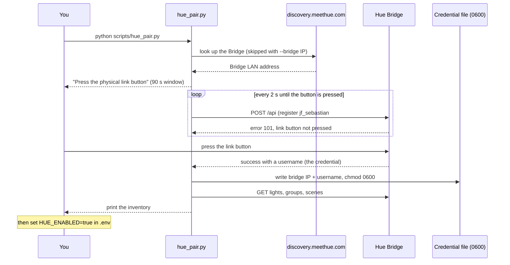
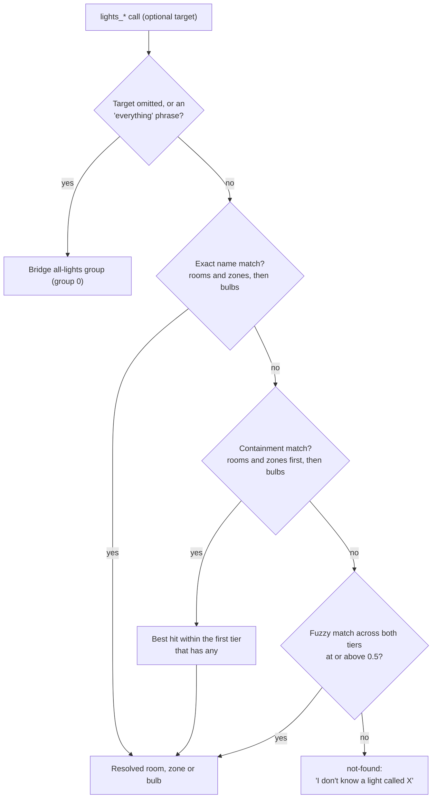
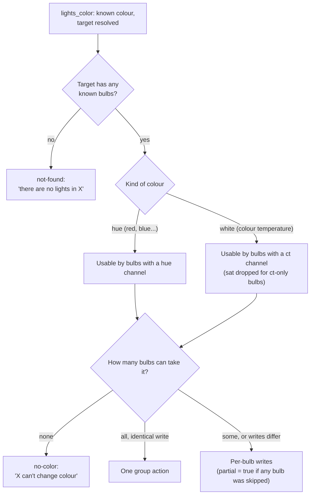

# Philips Hue Light Control

Let a personality control Philips Hue lights by voice ("Johnny, turn the living
room red", "dim the desk lamp to 30 percent", "run the Relax scene"). Optional
and off by default.

## How it works
- The LLM is given lighting **tools** (function calling). On a normal turn
  nothing changes; when you ask for lights it emits a tool call, the app runs it
  against the Hue Bridge, and the character speaks a short confirmation.
- Light control is **local**. The app talks to the Bridge on your LAN over the
  Hue v1 API. No Philips cloud account, no internet dependency, no per-command
  round-trip to a vendor. Typical latency is well under 100 ms. (The one
  exception is the optional auto-discovery step during pairing; see below.)
- Alexa, the Hue app, and J.F. Sebastian all keep working at once. They're
  three clients of the same Bridge, and state stays in sync across them.

## Requirements
- A **Philips Hue Bridge** (v2 square, or Bridge Pro) on the same network.
- Bulbs already paired to the Bridge via the Hue app.
- No extra Python dependency. The tool uses `requests`, which is already
  required by the base install.

> Bulbs paired to an Echo's built-in Zigbee radio instead of a Hue Bridge are
> **not** reachable this way. Factory-reset them and pair to the Bridge first.

## 1. Pair with the Bridge
```bash
python scripts/hue_pair.py
```
The script discovers the Bridge, asks you to press its physical link button
(you get 90 seconds), caches the credential, and prints an inventory of every
light, room, zone, and scene it found.

Auto-discovery asks Signify's discovery service (`discovery.meethue.com`) for
the Bridge's LAN address, so it is the one step that needs the internet. If
several Bridges come back, the first is used. If discovery fails (some networks
block the service), or you want to skip it, find the Bridge IP in the Hue app
under **Settings → My Hue System → tap the Bridge**:
```bash
python scripts/hue_pair.py --bridge 192.168.1.42
```

Re-print the inventory any time without re-pairing:
```bash
python scripts/hue_pair.py --list
```



## 2. Configure (.env)
```bash
HUE_ENABLED=true
# HUE_TOKEN_CACHE=~/.config/jf-sebastian/hue.json   # default (kept 0600)
# HUE_BRIDGE_HOST=192.168.1.42   # optional; overrides the paired-at IP
```
`scripts/hue_pair.py` honours `HUE_TOKEN_CACHE` and `HUE_BRIDGE_HOST` too, so the
script and the app always agree on where the credential lives.

With the master switch on, every personality can control lights by default.
To exclude a specific character, set this in its `personality.yaml`:
```yaml
hue_enabled: false
```

If `HUE_ENABLED=true` but no credential exists, startup logs a **warning** and
light commands report "the lights are not set up yet" in character. It is not a
hard error, because `validate()` gates every entrypoint: a missing light
credential shouldn't stop `scripts/generate_fillers.py` on a machine that has no
Bridge. Pairing is re-checked per call, so running the script takes effect
without a restart.

## 3. Try it
Restart the app, then say something like:
- "Turn on the living room"
- "Turn everything off"
- "Dim the kitchen to 20 percent"
- "Make the desk lamp blue"
- "Run the Relax scene in the bedroom"
- "What lights do you have?"

## The tools
| Tool | Arguments | Notes |
|---|---|---|
| `lights_on` | `target?` | Omit target for every light in the house |
| `lights_off` | `target?` | Omit target for every light |
| `lights_brightness` | `level` (0-100), `target?` | `0` turns the target off; 1-100 also turns it on |
| `lights_color` | `color`, `target?` | Named colours only; see below. Also turns the target on |
| `lights_scene` | `scene`, `target?` | Any scene stored on the Bridge |
| `lights_list` | none | Reports rooms, lights, and scenes |

Brightness is a spoken percentage mapped linearly onto Hue's `bri` range of
1-254. Levels above 100 are clamped to 100, and the spoken confirmation reports
the level actually applied.

### Target resolution
`target` accepts a room, a zone, or an individual bulb name. Resolution uses the
shared ladder in `jf_sebastian/modules/tool_provider.py`: exact match →
containment → fuzzy (with a similarity floor of 0.5), over **ordered tiers**. Hue
supplies rooms and zones as the first tier and bulbs as the second, so "the
bedroom" never loses to a bulb whose name contains the word. When several
rooms match an ambiguous word, the best room is chosen rather than falling
through to the bulbs. An omitted target, or a phrase like "everything" / "all
the lights", resolves to the Bridge's built-in all-lights group.



The "everything" phrases are matched whole: `all`, `everything`, `every light`,
`all lights`, `all the lights`, `the house`, `everywhere`.

Names are folded for case, whitespace, and curly apostrophes on **both** sides,
so a room stored as `Kid’s Room` (U+2019, which the Hue app writes) matches a
spoken `Kid's Room` with the straight apostrophe the model emits. The same
folding applies to scene names.

Containment is deliberately asymmetric. Naming *part* of a name works as a
plain substring ("living" finds "Living Room"), but a stored name found inside
a longer spoken phrase must match on word boundaries. Otherwise a short room
name like `Up` would answer "turn on the cupboard light". Rooms or bulbs with
a blank name are skipped entirely, since an empty name is contained in every
phrase and would otherwise answer everything.

### Colours
Recognised names: red, orange, amber, yellow, lime, green, teal, cyan,
turquoise, blue, indigo, violet, purple, magenta, pink, white, warm white,
cool white, daylight.

The hues are fixed Hue `hue`/`sat` values. The whites are colour temperatures:
warm white is 450 mireds, white is 300, and cool white and daylight are both 200
(Hue's `ct` range is 153-500).

Matching is **whole-word**, so "a nice warm white" resolves to `warm white`
(multi-word names win over single-word ones), while "ultraviolet" and
"greenish" are rejected rather than silently matching `violet` / `green`.

### Bulb capability
Three tiers matter, and each gets what it can actually do:

| Tier | Example | Hues (red, blue…) | Whites (warm/cool white) |
|---|---|---|---|
| White & Colour | LCA003, LCE001 | yes | yes |
| White Ambiance | LTW010 | no | **yes** (colour temperature) |
| White | LWB014 | no | no |

The tier is read from the state the Bridge reports for each bulb (whether it has
a `hue` channel, a `ct` channel, or neither), not from a list of model ids.

A request a bulb can't express returns a neutral spoken hint (*"the desk lamp
can't change colour"*) instead of a Bridge error. A **mixed** room applies to
only the bulbs that can and reports `partial` in its structured data. When every
member takes the identical write, it goes out as one group action instead of
per-bulb.

An empty or stale room reports *"there are no lights in X"* rather than claiming
its bulbs lack colour. Different problems, different messages.



## Errors
Every failure degrades into a short, neutral phrase the character voices in
its own style. Nothing raises into the conversation turn.

| `kind` | Spoken hint | Cause |
|---|---|---|
| `not-paired` | "the lights are not set up yet" | No credential. Also "I can't read the light settings" (unreadable credential file) and "I've lost my connection to the lights" (the Bridge revoked it) |
| `bridge-unreachable` | "I can't reach the lights right now" | Bridge offline, IP moved, or an HTTP error from the Bridge |
| `not-found` | "I don't know a light called X" | No room/bulb matched. Also an unknown scene, an empty room, or a scene not stored for the named room, each with its own phrase |
| `no-color` | "X can't change colour" | No bulb in the target can express that colour: a White bulb, or a White Ambiance bulb asked for a hue |
| `bad-args` | "how bright would you like it?" | Missing/unparseable argument. Also an unknown colour name, or a scene aimed at a single bulb |
| `network` | "the lights gave me a confusing answer" | Malformed Bridge response, or "the lights refused that" when the Bridge rejects a write |

Anything unexpected falls back to "I can't reach the lights right now".

## Operational notes

**If DHCP moves the Bridge**, the cached IP goes stale. Either set
`HUE_BRIDGE_HOST` to the new address (it overrides the cache), or give the
Bridge a DHCP reservation on your router. The latter is the durable fix.

**The credential is a secret.** `scripts/hue_pair.py` writes it `0600` under
`~/.config`, deliberately outside the repo and outside any synced personality
or device bundle. It grants full control of every light on the Bridge to
anyone on your LAN who holds it. Never commit it.

**Inventory is cached 60 seconds.** Names, ids, and capabilities are looked up
once per minute; on/off state is never cached. If you rename a room in the Hue
app, the new name is live within a minute.

**Calls time out after 4 seconds.** Every Bridge request has a hard per-call
timeout, and all of them share one keep-alive connection.

**Scene names** stored by the Hue app as bookkeeping are filtered out, so the
model only ever sees real scenes. Both spellings are matched, since app versions
differ (`storageScene` and `Scene storageScene `).

**Scenes belong to a room.** A scene is stored per-group, so naming a single
bulb is refused rather than quietly applying the scene to that bulb's whole
room. Asking for a scene in a room it isn't stored for is also refused instead
of writing another room's scene id. With no room named, the scene is applied to
the group it is stored for. Scene names match exactly first, then as a
substring; there is no fuzzy step.

**`lights_list` truncates.** Only `spoken_hint` reaches the user, so scenes are
included there, but long lists are capped at 8 names each (`_MAX_SPOKEN_NAMES`)
so a 30-bulb install isn't recited through TTS. The full lists stay in the
result's data.
