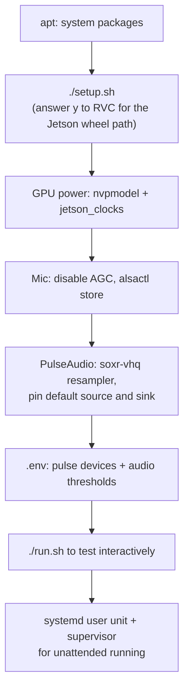
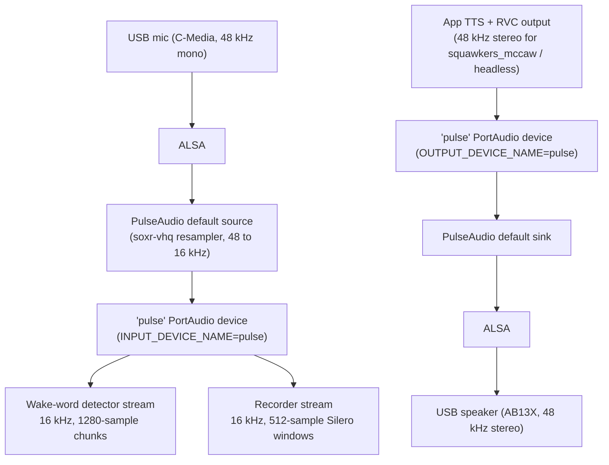
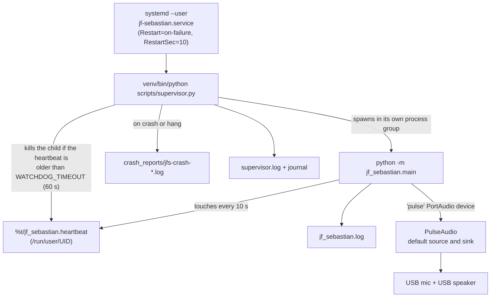

# Jetson Deployment Notes

These are the host-level pieces that aren't fully captured by `setup.sh` or
any file in the repo: system packages, GPU power tuning, PulseAudio
resampling and routing, running under systemd, and a few known-harmless
warnings. Tested on **NVIDIA Jetson
Orin Nano Super** (8 GB unified memory) running Ubuntu 22.04 (JetPack 6.x).
Most of it also applies to the non-Super Orin Nano with one footnote on
power mode.

Recommended order on a fresh Jetson:



## Reference hardware

The configuration values throughout this document were tuned against this
specific peripheral setup. Different mic / speaker hardware will need
different gain, RMS, and threshold values, but the structure of the setup
(disabling AGC, pinning PA defaults, upgrading the resampler) carries
over.

### USB microphone

**Generic USB PnP Sound Device (C-Media chipset)**: [Amazon B0CNVZ27YH](https://www.amazon.com/dp/B0CNVZ27YH)

| | |
|---|---|
| ALSA name | `alsa_input.usb-C-Media_Electronics_Inc._USB_PnP_Sound_Device-00.analog-mono` |
| USB vendor:product | `0d8c:` (C-Media Electronics) |
| Native rate | 48 kHz mono, 16-bit signed |
| Hardware AGC | Present + enabled by default (must be disabled; see Microphone tuning) |
| Connector | USB-A, plug-and-play, no driver needed on Ubuntu |
| Cost | ~$10 |

Notes: this is the kind of chipset that gets put in every cheap USB mic.
The audio quality is workable for wake-word + Whisper after the tuning
below, but it's a real downgrade from a MacBook's built-in mic with
Apple's DSP. Expect to tune `MIN_AUDIO_RMS` upward (noise floor sits
around 800-1200) and to upgrade the PulseAudio resampler.

### USB speaker

**Generic AB13X USB Audio**: [Amazon B09MPL4LRD](https://www.amazon.com/dp/B09MPL4LRD)

| | |
|---|---|
| ALSA name | `alsa_output.usb-Generic_AB13X_USB_Audio_20210726905926-00.analog-stereo` |
| Native rate | 48 kHz stereo, 16-bit signed |
| Connector | USB-A, plug-and-play |
| Cost | ~$15 |

Notes: outputs at 48 kHz natively, which matches the 48 kHz playback
session the app opens for the `squawkers_mccaw` and `headless` device types,
so there is no playback-side resampling. (`teddy_ruxpin` output is 44.1 kHz,
the PPM generator's rate, and would be resampled by PulseAudio.) Volume curve is fine; we drive at
100% via PulseAudio and let the per-device `VOICE_GAIN` overlay handle
voice loudness.

### Audio routing summary



`INPUT_DEVICE_NAME=pulse` and `OUTPUT_DEVICE_NAME=pulse` in `.env`; the
actual hardware selection happens via PulseAudio's defaults (pinned in
`~/.config/pulse/default.pa`; see "Pin the default source and sink"
below). The app matches these names as case-insensitive substrings of the
PortAudio device names, so `pulse` selects the first listed device whose
name contains "pulse".

## System packages

`setup.sh` does install PortAudio, FFmpeg, and the ALSA headers via `apt`
on Linux, but only in its "Checking system dependencies" step, which runs
after `pip install -r requirements.txt`. On a fresh Jetson the PyAudio
source build fails before the script ever reaches that step (the script
runs with `set -e`). It also installs `python3.10-venv` only when it finds
no Python 3.10 at all, which is not the case on Ubuntu 22.04. So install
these first:

```bash
sudo apt update
sudo apt install -y \
    python3.10-venv \
    portaudio19-dev libportaudio2 libasound2-dev \
    ffmpeg
```

Why each one matters:

- `python3.10-venv`: `python3 -m venv` fails to bootstrap pip without it.
- `portaudio19-dev`: PyAudio compiles from source on aarch64 (no wheel)
  and needs `portaudio.h`. Without it, `pip install pyaudio` errors mid-setup.
- `libportaudio2`: runtime shared library PyAudio links against.
- `libasound2-dev`: ALSA dev headers required by PyAudio's Linux backend.
- `ffmpeg`: used by the audio processor for MP3 → PCM conversion of
  OpenAI TTS output.

## GPU power tuning

The Orin Nano Super ships throttled by default. For sustained RVC
throughput you want the highest power profile plus locked clocks.

### List available power profiles

```bash
sudo nvpmodel -q
grep "POWER_MODEL" /etc/nvpmodel.conf
```

On the **Super** developer kit the modes are:

| ID | Name         | Notes                                       |
|----|--------------|---------------------------------------------|
| 0  | 15W          | Standard Orin Nano max                      |
| 1  | 25W          |                                             |
| 2  | `MAXN_SUPER` | **The Super-only unlocked profile**         |
| 3  | 7W           | Low-power                                   |

On the **non-Super** Orin Nano, mode 0 (`MAXN`) is the highest available
profile; there is no `MAXN_SUPER`.

### Apply the profile

```bash
sudo nvpmodel -m 2          # MAXN_SUPER (use -m 0 on non-Super)
sudo jetson_clocks          # lock CPU/GPU/EMC to the profile's ceiling
```

`nvpmodel` persists across reboots automatically. `jetson_clocks` does
**not**. See the next section for the systemd unit that re-applies it
at boot.

### Verify

```bash
sudo nvpmodel -q             # should print "MAXN_SUPER" (or your choice)
sudo jetson_clocks --show    # CPU/GPU/EMC MaxFreq == CurrentFreq
```

### Persist `jetson_clocks` across reboots

Install a one-shot systemd unit that runs after `nvpmodel.service`:

```bash
sudo tee /etc/systemd/system/jetson-clocks.service > /dev/null <<'EOF'
[Unit]
Description=Lock Jetson CPU/GPU/EMC clocks to the current nvpmodel ceiling
After=nvpmodel.service
Requires=nvpmodel.service

[Service]
Type=oneshot
ExecStart=/usr/bin/jetson_clocks
RemainAfterExit=yes

[Install]
WantedBy=multi-user.target
EOF

sudo systemctl daemon-reload
sudo systemctl enable --now jetson-clocks.service
```

The `After=nvpmodel.service` ordering matters: locking clocks before the
power profile is applied would clamp them to whatever profile was active
during boot rather than the persistent one.

To undo: `sudo systemctl disable --now jetson-clocks.service`.

## Microphone tuning

USB conference mics often ship with hardware Auto Gain Control enabled,
which pumps the level up between phrases and down during speech. That is bad
for both volume consistency and wake-word detection (the model expects
stable spectral content). Disable it via ALSA and persist:

```bash
# Find the card index for your mic
arecord -l | grep -i "your_mic_name_here"

# Disable AGC (replace 3 with your card index) and any other unwanted
# auto-processing the card exposes
amixer -c 3 set "Auto Gain Control" off

# Set capture volume to max (hardware mic gain, not PulseAudio mixer)
amixer -c 3 set "Mic Capture Volume" 100%

# Persist across reboots (alsa-restore.service reads this at boot)
sudo alsactl store
```

Also set the PulseAudio source volume to 100% so the app gets unattenuated
audio:

```bash
pactl set-source-volume alsa_input.usb-…analog-mono 100%
```

PulseAudio remembers the per-source volume across restarts via
`module-stream-restore`.

### PulseAudio resampler

The C-Media USB mic captures at 48 kHz; OpenWakeWord and Whisper both want
16 kHz, so every capture path goes through a 48 → 16 kHz resample. PA's
`auto` resampler default on Linux maps to **speex-float-1**, the cheapest
and lowest-fidelity option. On Mac the equivalent path goes through
CoreAudio's much higher-quality resampler, which is why a wake-word model
trained on Mac-captured audio scores noticeably worse when fed Jetson's
speex-float-1-resampled audio of the same speaker. Symptom: the user
reports "the wake word used to work much better on my Mac."

Fix: pin a high-quality resampler in the per-user PA config. Costs a few
percent CPU; negligible on Orin Nano. SoX-VHQ is the highest quality PA
supports.

```bash
mkdir -p ~/.config/pulse
cat > ~/.config/pulse/daemon.conf <<'EOF'
# Upgrade resampler from speex-float-1 (PA's Linux default) to soxr-vhq.
# Preserves the spectral content the wake-word model was trained against.
resample-method = soxr-vhq
EOF

# Restart PulseAudio so the new daemon.conf takes effect, then restart
# anything that was holding a stream open.
pulseaudio -k && sleep 2 && pulseaudio --start
systemctl --user restart jf-sebastian.service
```

Verify with:

```bash
pulseaudio --dump-conf | grep resample-method
# resample-method = soxr-vhq
```

Other usable options if `soxr-vhq` isn't compiled into your PA build (rare):
`speex-float-10` (close second), `soxr-hq` (slightly lighter, still much
better than the default).

### Pin the default source and sink

PulseAudio's "best device" heuristic can flip between USB mic / onboard
audio on every restart, especially if devices enumerate in different
orders. PortAudio sees PulseAudio as a single `pulse` device, so the only
way to control routing from PortAudio's side is to make the right devices
PulseAudio's defaults.

Add to `~/.config/pulse/default.pa` (create the file if needed; it
includes the system default automatically):

```
.include /etc/pulse/default.pa

# Hardcode the USB devices as the defaults. Keeps the wake-word and
# recorder talking to the right hardware across reboots and replug events.
set-default-source alsa_input.usb-C-Media_Electronics_Inc._USB_PnP_Sound_Device-00.analog-mono
set-default-sink   alsa_output.usb-Generic_AB13X_USB_Audio_20210726905926-00.analog-stereo
```

Replace the ALSA device names with whatever `pactl list short sources` and
`pactl list short sinks` show for your hardware.

### Echo cancellation: not needed

The app stops the recorder's PortAudio capture stream at the OS level
whenever it's about to play audio (`AudioRecorder.pause()` calls
`stop_stream()`). The wake-word detector is paused for playback too; its
`pause()` leaves the stream open but reads and discards every chunk without
scoring it. After playback the app also waits `PLAYBACK_TAIL_GUARD_MS`
before reopening the mic. No mic input is processed while the bot speaks,
so the OS-level AEC layer that macOS provides via CoreAudio's Voice
Processing IO isn't actually doing useful work on Mac either; it's just
been benign.

If you previously enabled `module-echo-cancel` on Linux, **remove it**:
the WebRTC AEC pipeline reshapes spectral content in ways that degrade
wake-word accuracy noticeably, and any noise suppression or AGC it
applies isn't worth its cost without a self-trigger problem to solve.

```bash
# Unload the running instance
pactl unload-module module-echo-cancel

# Restore raw devices as defaults (no virtual sources in the path)
pactl set-default-source alsa_input.usb-…analog-mono
pactl set-default-sink   alsa_output.usb-…analog-stereo
```

And remove or comment out the `load-module module-echo-cancel …` block
from `~/.config/pulse/default.pa` so it doesn't come back at next start.

## PyTorch CUDA allocator tuning

Long RVC sessions can fragment the CUDA caching allocator on Jetson and
trigger `NVML_SUCCESS == r INTERNAL ASSERT FAILED at
CUDACachingAllocator.cpp:1131` errors. The setting that fixes it is
already exported by `run.sh` and both supervisor unit templates:

```bash
PYTORCH_CUDA_ALLOC_CONF=expandable_segments:True
```

(Harmless on Mac: PyTorch silently ignores it when CUDA isn't
available.) `run.sh` only sets it when it is not already in the
environment, so you can override it. If you're starting Python any other
way, set this before the Python process starts.

`rvc_processor.py` adds two more layers of insurance. It runs
`gc.collect()` plus `torch.cuda.empty_cache()` after each successful
conversion, and it retries a failed conversion: up to 3 attempts, freeing
GPU memory and waiting 0.5 s before the second attempt and 1.5 s before the
third. If all attempts fail, that chunk falls back to the unconverted TTS
voice and the model is force-reloaded on the next call. The startup warmup
(and the re-warm before each scheduled event) uses a single attempt.

## Known harmless warnings

`onnxruntime` (used by OpenWakeWord) emits this on every start:

```
[W:onnxruntime:Default, device_discovery.cc:164 DiscoverDevicesForPlatform]
GPU device discovery failed: device_discovery.cc:89 ReadFileContents
Failed to open file: "/sys/class/drm/card1/device/vendor"
```

It's enumerating discrete PCIe GPUs the standard Linux way; the Jetson's
integrated Tegra GPU doesn't expose itself through `/sys/class/drm`. The
PyPI `onnxruntime` wheel is CPU-only anyway, and OpenWakeWord doesn't
need a GPU: its ONNX model is tiny and runs in microseconds on CPU.
Ignore the line.

## RVC install on Jetson

`setup.sh` and `scripts/install_rvc.sh` both detect the Jetson (`aarch64`
plus `/etc/nv_tegra_release`) and route the RVC install through the [Jetson
AI Lab wheel index](https://pypi.jetson-ai-lab.io/) so that
PyTorch/torchaudio land with CUDA support. The steps they run:

1. Build the index URL `https://pypi.jetson-ai-lab.io/jp6/<cuda tag>/` from
   `nvcc --version` (for example `cu126`); if `nvcc` is not on `PATH` they
   default to `cu126`.
2. Install `torch==2.8.0` and `torchaudio==2.8.0` from that index (falling
   back to torch alone if the torchaudio wheel is unavailable). The pin
   matters: newer torch wheels (≥ 2.9) require `libcudss`, which JetPack 6.1
   doesn't ship.
3. Downgrade pip to 24.0 (needed to resolve the RVC dependency metadata),
   install `requirements-rvc-jetson.txt` (`rvc-python`, `fairseq`,
   `librosa`, `resampy`, and `numpy<=1.23.5`, which downgrades the NumPy 2.x
   that `requirements.txt` installed), then upgrade pip back.
4. Import-test `rvc_python`.

Both scripts label RVC on Jetson as experimental. With the default
`RVC_DEVICE=auto` the app picks CUDA first, then MPS, then CPU
(`jf_sebastian/utils/gpu_utils.py`).

If you skipped RVC at first-run setup and want to add it later (the script
refuses to run outside an activated Python 3.10 venv):

```bash
source venv/bin/activate
./scripts/install_rvc.sh
```

The compile of `praat-parselmouth` (a transitive dep) takes 20-40 min
from source on aarch64. There's no prebuilt wheel and it bundles the
entire Praat C++ codebase. This is normal; let it cook.

## Running unattended (systemd + supervisor)

For a permanent install, run the app under `scripts/supervisor.py` from the
systemd user unit template `scripts/jf-sebastian.service`. (This is the
`jf-sebastian.service` that the PulseAudio section restarts.)



Install (the template assumes the repo lives at `~/jf-sebastian` with its
venv at `~/jf-sebastian/venv`; edit the `%h/jf-sebastian` paths otherwise):

```bash
mkdir -p ~/.config/systemd/user
cp scripts/jf-sebastian.service ~/.config/systemd/user/
systemctl --user daemon-reload
systemctl --user enable --now jf-sebastian.service
journalctl --user -u jf-sebastian.service -f     # follow the supervisor's output
```

What the template sets, and what the supervisor does with it:

| Unit setting | Value | Effect |
|---|---|---|
| `HEARTBEAT_FILE` | `%t/jf_sebastian.heartbeat` | Liveness file the app touches every `HEARTBEAT_INTERVAL` (10 s). The supervisor passes it to the child. Supervisor default when unset: `/tmp/jf_sebastian.heartbeat`. |
| `CRASH_REPORT_DIR` | `%h/jf-sebastian/crash_reports` | One `jfs-crash-<timestamp>.log` per crash or watchdog kill, with the last `CRASH_REPORT_TAIL` (100) lines of `LOG_PATH`. Pruned to the newest `CRASH_REPORT_KEEP` (200). |
| `LOG_PATH`, `SUPERVISOR_LOG_PATH` | `jf_sebastian.log`, `supervisor.log` in the repo | App log that gets tailed into crash reports; the supervisor's own rotating log (it also logs to stdout, which lands in the journal). |
| `PYTORCH_CUDA_ALLOC_CONF` | `expandable_segments:True` | See "PyTorch CUDA allocator tuning" above. |
| `Restart=on-failure`, `StartLimitBurst=5` in 300 s | | Safety net for the supervisor process itself, not the app. |
| `TimeoutStopSec=30`, `KillMode=mixed` | | Leaves room for the supervisor's `SHUTDOWN_GRACE_SECS` (10 s) SIGTERM-to-SIGKILL window on `systemctl --user stop`. |

Supervisor behavior worth knowing on a Jetson:

- Restart delay doubles from `RESTART_BACKOFF_INITIAL` (1 s) up to
  `RESTART_BACKOFF_MAX` (60 s), and resets once a child stays up for
  `HEALTHY_RUNTIME_SECS` (60 s). After `PERMANENT_FAILURE_THRESHOLD` (5)
  consecutive unhealthy runs it logs CRITICAL once and waits
  `PERMANENT_FAILURE_BACKOFF` (600 s) between attempts.
- The watchdog is not enforced for the first `FIRST_HEARTBEAT_GRACE` (60 s)
  of each child. If model loading plus RVC warmup on your board can take
  longer than that before the first heartbeat, raise it.
- The supervisor reads these variables from its own process environment
  (the unit's `Environment=` lines). It does not load `.env`, so put
  overrides in the unit file. The app child still loads `.env` as usual.
- A user unit only runs while that user has a session. For a headless box
  that must start at boot without a login, enable lingering:
  `sudo loginctl enable-linger $USER`.
- The template orders itself after `pipewire-pulse.service`. The PulseAudio
  commands in this document assume classic PulseAudio, where that unit does
  not exist; systemd ignores a `Wants=` on a missing unit, so the service
  still starts, just without ordering against the sound server. If the app
  races PulseAudio at startup, change both `pipewire-pulse.service`
  references in your copy to `pulseaudio.service`.

See [README: Running Unattended](../README.md#running-unattended-recommended-for-permanent-installations)
for the full supervisor description and the macOS launchd equivalent.

## Audio settings reference

Everything that affects audio capture or playback, in one place. The
defaults in `.env.example` are tuned for a quiet room and a MacBook mic;
the values below are what worked on the Jetson + C-Media USB mic + AB13X
USB speaker. Adjust to your room.

### Input (capture) settings

| Setting | Jetson value | Default | What it does |
|---|---|---|---|
| `INPUT_DEVICE_NAME` | `pulse` | unset (system default device); `.env.example` ships a Mac example name | PortAudio device name, matched as a case-insensitive substring. `pulse` routes through PulseAudio's default source; set that default via `~/.config/pulse/default.pa`. |
| `SAMPLE_RATE` | `16000` | `16000` | Capture sample rate fed to wake-word + Whisper. **Must be 16000**: Silero VAD only accepts 16 kHz (or 8 kHz) and rejects other rates with a warning, even though the settings validator still allows 22050/44100/48000. The wake-word detector always opens its own stream at 16 kHz regardless of this setting. PA resamples from the mic's native 48 kHz. |
| `MIN_AUDIO_RMS` | `1000`-`1600` | `60` | Stage-2 silence filter. C-Media USB mics have a noise floor around 800-1200; the default 60 lets all of that pass to Whisper which then hallucinates ("Thanks for watching!"). Tune upward until ambient room passes through silently. |
| `MIN_SPEECH_RATIO` | `0.2` | `0.3` | Stage-3 Silero VAD threshold: fraction of 32 ms audio windows that must be classified as speech. With Silero VAD (vs the old WebRTC VAD) this can be lower than the historical default. |
| `VAD_THRESHOLD` | `0.5`-`0.6` | `0.5` | Per-window Silero speech-probability cutoff. Higher = stricter. Raise toward 0.7 if noise still leaks through; lower toward 0.3 if real speech is rejected. |
| `SPEECH_END_SILENCE_SECONDS` | `2.0` | `1.0` | How long of silence ends user speech. Bump up if you tend to pause mid-question. |
| `MIN_LISTEN_SECONDS` | `2.0` | `1.0` | Min recording window after wake-word fires (prevents premature cutoff on the "Hey Johnny... [pause] ...what time is it" pattern). |
| `WAKE_WORD_THRESHOLD` | `0.93` | `0.99` | OpenWakeWord confidence cutoff. 0.99 is very strict (default). 0.93 catches some borderline utterances; going below ~0.85 starts catching not-wake-word audio (false fires on TV/conversation). |
| `SILENCE_TIMEOUT` | `5.0` | `5.0` | Max length of one listening window, measured from when it opens, regardless of speech. When it elapses the capture is closed and validated, so a stuck-open recording with no speech returns to IDLE. |

### Output (playback) settings

| Setting | Jetson value | Default | What it does |
|---|---|---|---|
| `OUTPUT_DEVICE_NAME` | `pulse` | unset (system default device); `.env.example` ships a Mac example name | PortAudio device name for playback. Pin via PulseAudio default sink. If the name is not found the app logs a warning and uses the default device. |
| `OUTPUT_DEVICE_TYPE` | `squawkers_mccaw` | `teddy_ruxpin` | Selects the audio-processing pipeline. Headless = simple stereo; Teddy = stereo with PPM control track in the right channel; Squawkers = simple stereo for the Squawkers McCaw animatronic. |
| `VOICE_GAIN` | `1.05`-`1.8` | `1.05` | Voice volume multiplier applied to both RVC-converted and raw TTS paths. Bump up for quiet RVC models. Must be within 0.0 to 2.0 (startup validation fails otherwise); samples are hard-clipped to full scale after the gain, so large values distort. |
| `CONTROL_GAIN` | `0.52` | `0.52` | PPM control-track amplitude (Teddy only). Affects motor strength. |
| `PLAYBACK_PREROLL_MS` | `240` | `240` | Silence before playback starts, to avoid clipping the first syllable while the audio device warms up. |
| `PLAYBACK_TAIL_GUARD_MS` | `500` | `500` | Silence after playback ends before reopening the mic. Covers speaker buffer drain and acoustic decay so the bot doesn't self-trigger on its own tail audio. Raise if the bot still triggers on itself. |

### Per-device overrides

If a setting needs to differ between output devices (e.g. `VOICE_GAIN`
needs to be louder on the Squawkers' speaker than on the Teddy's), put it
in `jf_sebastian/devices/{OUTPUT_DEVICE_TYPE}/.env`:

```
# jf_sebastian/devices/squawkers_mccaw/.env
VOICE_GAIN=1.8
```

Personality-specific overrides go in `personalities/{name}/.env` and
beat the device-level ones. See the README for the full precedence order.

### Code-level defaults worth knowing

These aren't `.env` settings but are values baked into the audio path that
affect Jetson-class hardware specifically:

| Where | Value | Why |
|---|---|---|
| `audio_output.py` output stream `frames_per_buffer` | 4096 | ~85 ms of buffer headroom. The PyAudio default (1024 ≈ 21 ms) was too tight on Jetson and triggered `snd_pcm_recover` underruns whenever the playback worker stalled briefly. |
| `audio_input.py` capture stream | Silero's required 512-sample windows | Locked to 16 kHz / 512-sample chunks for Silero VAD frame alignment. |
| `wake_word.py` chunk size | 1280 samples (80 ms at 16 kHz) | OpenWakeWord's required input granularity. |
