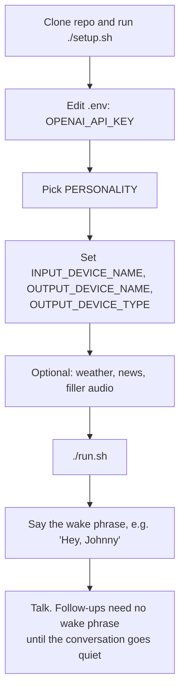
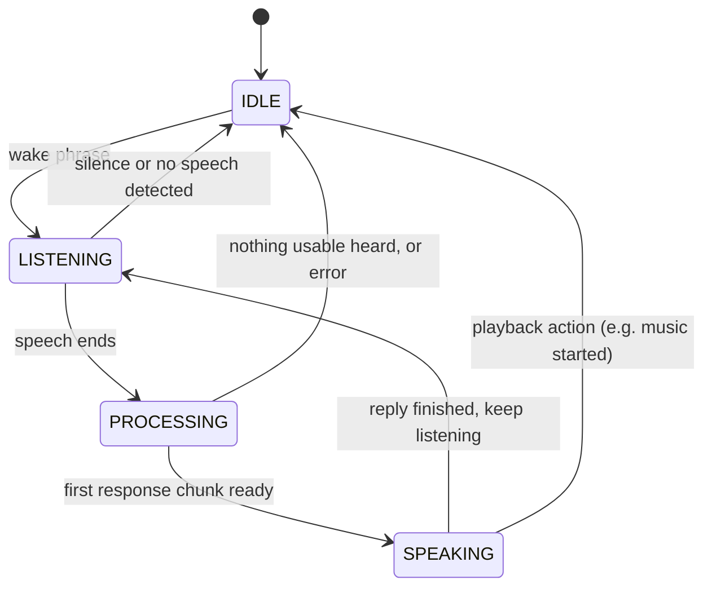

# Quick Start Guide

*"I make friends. They're toys. My friends are toys. I make them."*

Get your animatronic AI companion talking in 5 minutes!

**System Requirements:**
- Python 3.10.x (required for RVC voice conversion support)
- macOS, or Debian/Ubuntu Linux including NVIDIA Jetson (`setup.sh` uses Homebrew on macOS and `apt` on Linux; the `.env.example` audio device names are Mac examples). Jetson hosts also need [JETSON_DEPLOYMENT.md](JETSON_DEPLOYMENT.md).
- OpenAI API key



## Installation Methods

Choose one of the following installation methods:

### Option 1: Automated Installation (Recommended)

The easiest way to get started:

```bash
# Clone repository
git clone https://github.com/pjdoland/jf-sebastian.git
cd jf-sebastian

# Run automated setup
./setup.sh
```

The setup script, in order:
- Finds Python 3.10.x (required for RVC compatibility), offering to install it via pyenv, Homebrew, or apt if it is missing
- Creates the Python virtual environment in `venv/` (offers to recreate it if an existing one is not 3.10)
- Upgrades pip to latest version
- Installs all Python packages from `requirements.txt`
- Optionally installs RVC voice conversion dependencies (prompt defaults to No)
- Optionally installs Spotify playback support (`requirements-spotify.txt`; prompt defaults to No)
- Downloads OpenWakeWord preprocessing models
- Installs system dependencies: PortAudio and FFmpeg via Homebrew on macOS; PortAudio, FFmpeg, and ALSA headers via `apt` on Linux
- Creates required directories
- Creates `.env` configuration file from `.env.example` (an existing `.env` is kept and checked for `OPENAI_API_KEY` and `PERSONALITY`)
- Optionally generates filler audio for all personalities (prompt defaults to Yes; it calls OpenAI TTS, so on a first run, before your real `OPENAI_API_KEY` is in `.env`, no audio is produced and you generate it in step 6 instead)
- Checks for wake word models
- Lists available audio devices

**Then skip to step 2 below.**

### Option 2: Manual Installation

For more control over the installation process, follow the detailed step-by-step instructions in the [README Installation section](../README.md#installation).

---

## 1. Install Dependencies

If you used the automated installation above, this step is already complete. Otherwise, see [README Installation section](../README.md#installation) for manual setup.

## 2. Configure API Keys

Edit `.env` and add your OpenAI API key:

```bash
# Get from https://platform.openai.com/api-keys
OPENAI_API_KEY=sk-your-key-here
```

## 3. Choose Your Personality

Set which personality you want to use in `.env`:

```bash
# Options: 'johnny' (tiki bartender), 'mr_lincoln' (Abraham Lincoln), 'leopold' (conspiracy theorist),
#          'fred' (Mister Rogers), 'kitt' (Knight Rider AI), 'jarvis' (AI butler), 'teddy_ruxpin' (storytelling bear)
PERSONALITY=johnny
```

Each personality has:
- Unique voice and speaking style
- Custom wake word phrase (see [step 9](#9-start-talking))
- Personality-specific filler phrases
- Tailored conversational behavior

## 4. Configure Audio Devices

From the device list shown during setup, find your device names and update `.env`. Names are matched case-insensitively as substrings, so `Arsvita` matches "Arsvita Car Audio Bluetooth". Leave either one empty to use the system default device.

```bash
INPUT_DEVICE_NAME=MacBook Air Microphone
OUTPUT_DEVICE_NAME=Arsvita
```

To see the device list again (run `source venv/bin/activate` first; every `python` command in this guide assumes the virtual environment is active):

```bash
python -m jf_sebastian.modules.audio_output   # all devices
python -m jf_sebastian.modules.audio_input    # input devices only
```

Also tell the system what kind of hardware is on the other end of the output device:

```bash
# teddy_ruxpin (default): LEFT = voice, RIGHT = PPM motor control
# squawkers_mccaw: plain stereo voice, no PPM
# headless: plain stereo voice for computer speakers (no animatronic)
OUTPUT_DEVICE_TYPE=teddy_ruxpin
```

**Test Your Microphone:**

```bash
python scripts/test_microphone.py
```

## 5. Configure Weather Context (Optional)

Personalities can naturally answer questions like "What time is it?" or "What's the weather like?" if a weather provider is configured. Date/time is always available; weather is opt-in.

Pick **one** of the providers below by uncommenting the relevant lines in `.env`. If you leave `WEATHER_PROVIDER` unset and only set provider-specific vars, auto-selection picks the first one with everything it needs (priority: `homeassistant > wttr > manual`).

**Provider: wttr.in (default; free, no API key)**

```bash
WEATHER_PROVIDER=wttr
ZIPCODE=90210
```

**Provider: Home Assistant (local, no third-party egress)**

```bash
WEATHER_PROVIDER=homeassistant
HOME_ASSISTANT_URL=http://homeassistant.local:8123
HOME_ASSISTANT_TOKEN=your_long_lived_access_token   # HA UI → Profile → Security → Long-Lived Access Tokens
HOME_ASSISTANT_WEATHER_ENTITY=weather.home          # find via HA UI → Developer Tools → States, filter "weather."
```

For security, the system refuses to send the bearer token to a non-private host over plain HTTP. Use `https://` or a private/loopback/`*.local` hostname.

**Provider: Manual (offline / testing; zero network egress)**

```bash
WEATHER_PROVIDER=manual
MANUAL_WEATHER=Sunny and 72F
```

**Disable weather context entirely:**

```bash
WEATHER_PROVIDER=none
```

Weather is cached for 30 minutes regardless of provider. A failed fetch is retried after 60 seconds.

## 5b. News Headlines (On by Default)

Top headlines are injected into LLM context so personalities can naturally bring up "what's going on" in conversation. Out-of-the-box this uses NPR Topics: News with no config required.

**Upgrading and don't want news?** Add `NEWS_PROVIDER=none` to your existing `.env`. Existing installs upgrading to this version will start fetching headlines until that line is added.

**Available feeds:** set `NEWS_RSS_URL` to any RSS or Atom feed, for example:

| Feed | URL |
|------|-----|
| NPR Topics: News (default) | `https://feeds.npr.org/1001/rss.xml` |
| BBC News (World) | `http://feeds.bbci.co.uk/news/world/rss.xml` |
| AP Top News | `https://feeds.apnews.com/rss/apf-topnews` |
| Reuters World | `https://feeds.reuters.com/reuters/worldNews` |

Or set `NEWS_PROVIDER=hackernews` for tech news (no other config needed).

**Disable entirely:** `NEWS_PROVIDER=none`.

**Privacy note:** the news server (e.g., NPR) sees your IP and access cadence; OpenAI sees the headline text and can infer which feed you chose. If you want zero third-party news egress, use `NEWS_PROVIDER=manual` with `MANUAL_NEWS=…` instead, or `NEWS_PROVIDER=none` to omit the section entirely.

**For child-facing personalities** (e.g., `teddy_ruxpin`, `fred`): NPR Top News may include violence, politics, or other content unsuitable for children. Consider `NEWS_PROVIDER=none` or a kid-safe RSS feed when running with these personalities.

Cached for 30 minutes (`NEWS_CACHE_TTL_MINUTES`, minimum 60 seconds); top 5 headlines per turn (`NEWS_HEADLINE_LIMIT`).

## 6. Generate Filler Audio (Optional but Recommended)

**If you used the automated installation (`./setup.sh`), chose to generate filler audio, and your OpenAI API key was already in `.env` at that point, this step is already complete.**

**For manual installation or if you skipped this step:** Filler phrases are pre-recorded audio clips that play immediately when you speak, creating a natural conversational feel while the system processes your question in the background.

```bash
python scripts/generate_fillers.py
```

Each tracked personality defines 30 filler phrases. For every personality, the script writes one WAV per phrase for each registered output device type, into `personalities/<name>/filler_audio/<device_type>/filler_NN.wav`. Each file contains:
- Voice audio synthesized using the personality's configured voice, speed, and tone (and passed through RVC when the personality has it enabled and a model is present)
- PPM control signals for mouth/eye movement (`teddy_ruxpin` files only; the other device types get plain stereo voice)

This calls the OpenAI TTS API, so `OPENAI_API_KEY` must be set first.

**Why is this needed?** The filler audio must be pre-generated because:
- It provides instant feedback (plays within 0.5 seconds of you finishing speaking)
- Allows background processing of transcription and AI response (4-6 seconds)
- Makes conversations feel natural and responsive instead of having awkward silence

**When to regenerate:**
- After switching to a different personality
- After changing `tts_voice`, `tts_speed`, or `tts_style` in the personality YAML
- After editing the `filler_phrases` list

**Note:** This command generates fillers for all personalities and all device types. To generate for just one personality, or just one device type:
```bash
python scripts/generate_fillers.py --personality johnny
python scripts/generate_fillers.py --personality johnny --device teddy_ruxpin
```

## 7. Run the Application

For interactive use:
```bash
./run.sh
```

For unattended deployments (museum exhibits, eldercare companions, kids' rooms), wrap the app in the supervisor so it auto-restarts on crash and kills hung children:
```bash
HEARTBEAT_FILE=/tmp/jf_sebastian.heartbeat python scripts/supervisor.py
```

`HEARTBEAT_FILE` is what lets the supervisor detect a hung (not just crashed) child; the supervisor defaults it to `/tmp/jf_sebastian.heartbeat` and passes it to the app. Crash reports land in `./crash_reports/`.

For permanent installs, use the launchd plist (macOS) or systemd unit (Linux). See [README → Running Unattended](../README.md#running-unattended-recommended-for-permanent-installations).

Among the startup log lines you should see the banner and, once every module is initialized, the ready message:
```
J.F. Sebastian - Animatronic AI Conversation System
"I make friends. They're toys. My friends are toys."
...
System ready! Say 'Hey, Johnny' to start talking.
Press Ctrl+C to exit.
```

The ready line is built from the personality's display `name`, so for some characters it differs from the trained wake phrase (for example `fred` prints "Hey, Mister Rogers" but listens for "Hey, Fred"). Use the phrases in step 9.

## 8. Optional: Schedule Proactive Utterances

Drop a `scheduled_events.yaml` into your personality's folder to make the character speak on its own at specific times: morning greetings, bedtime stories, holiday surprises. Events only fire when the device is idle, so they never interrupt an in-progress conversation.

```yaml
# personalities/<your_personality>/scheduled_events.yaml
quiet_hours:
  start: "22:00"
  end: "07:00"
events:
  - name: morning_greeting
    when: "08:30"
    say: "Good morning! Ready for a great day?"

  - name: weekday_reminder
    when: "17:00 weekdays"
    prompt: "Remind me to wrap up work. Stay in character."
```

See `personalities/johnny/scheduled_events.yaml` for a full working example, and `personalities/README.md → Scheduled Events` for the schedule-syntax reference. Edits require a process restart. `SCHEDULER_ENABLED=false` turns the scheduler off globally, and `QUIET_HOURS_START` / `QUIET_HOURS_END` in `.env` override the YAML quiet hours.

## 9. Start Talking

**For Johnny (Tiki Bartender):**
1. Say: **"Hey, Johnny"**
2. Speak your message
3. Wait for Johnny to respond
4. Continue the conversation! After each reply the system listens again on its own, so follow-ups need no wake phrase. When a listening turn ends with no speech, it goes back to waiting for the wake phrase.

The other personalities work the same way. Each one ships its own wake word model (`personalities/<name>/hey_<name>.onnx`):

| `PERSONALITY` | Wake phrase |
|---|---|
| `johnny` | "Hey, Johnny" |
| `mr_lincoln` | "Hey, Mr. Lincoln" |
| `leopold` | "Hey, Leopold" |
| `fred` | "Hey, Fred" |
| `kitt` | "Hey, Kitt" |
| `jarvis` | "Hey, Jarvis" |
| `teddy_ruxpin` | "Hey, Teddy Ruxpin" |



## Troubleshooting

### Wake word not working?
- Speak clearly and slightly louder
- Check microphone permissions in System Settings
- Try lowering `WAKE_WORD_THRESHOLD` in `.env` (default 0.99, which is very strict; try 0.95 first, since lower values also trigger more easily on similar sounds)
- Verify your microphone device is correctly configured (`python scripts/test_microphone.py`)
- If the wake phrase works but your speech is ignored afterwards, that is the VAD stage: adjust `VAD_THRESHOLD` (0.0-1.0; lower = more sensitive)

### No audio output?
- Verify Bluetooth connection (if using wireless adapter)
- Check device name in `.env`
- Try leaving `OUTPUT_DEVICE_NAME` empty to use system default device
- Re-list devices: `python -m jf_sebastian.modules.audio_output`
- Confirm `OUTPUT_DEVICE_TYPE` matches your hardware (`teddy_ruxpin` puts the PPM control track in the right channel, which plain speakers play as noise; use `headless` for computer playback)

### No filler phrases playing?
- Run: `python scripts/generate_fillers.py --personality johnny`
- Check that `personalities/johnny/filler_audio/<OUTPUT_DEVICE_TYPE>/` exists and contains `filler_*.wav` files (fillers are per device type)
- Check that `ENABLE_FILLER_AUDIO` is not set to `false`
- Enable debug logging: `LOG_LEVEL=DEBUG` in `.env`

### API errors?
- Check internet connection
- Verify API key is correct
- Ensure OpenAI account has credits

### Audio device errors (OSError -9986)?
- Restart the application
- Check the device name in `.env` (matching is a case-insensitive partial match against the listed names)
- Try leaving the device name empty to fall back to the system default
- On macOS: Check System Settings > Privacy & Security > Microphone

## Advanced Configuration

### Adjust Response Timing
- `SILENCE_TIMEOUT`: Maximum length of one listening turn; when it elapses the recording is closed and evaluated, and an empty one returns the system to idle (default: 5.0 seconds)
- `SPEECH_END_SILENCE_SECONDS`: How much silence ends your turn (default: 1.0 seconds)
- `CONVERSATION_TIMEOUT`: Idle time after which conversation history is cleared (default: 120.0 seconds)

### Debug Mode
Enable detailed logging and save audio files:
```bash
DEBUG_MODE=true
SAVE_DEBUG_AUDIO=true
LOG_LEVEL=DEBUG
```

Recorded audio will be saved to `./debug_audio/`

## Next Steps

- Read [README.md](../README.md) for full documentation
- Review [ARCHITECTURE.md](ARCHITECTURE.md) for technical details
- Create custom personalities (see [CREATING_PERSONALITIES.md](CREATING_PERSONALITIES.md))
- Let a personality control music by voice (see [SPOTIFY_SETUP.md](SPOTIFY_SETUP.md); needs Spotify Premium, `pip install -r requirements-spotify.txt`, and a one-time `python scripts/spotify_auth.py`)
- Let a personality control Philips Hue lights by voice (see [HUE_SETUP.md](HUE_SETUP.md); needs a Hue Bridge on your LAN and a one-time `python scripts/hue_pair.py`)
- Add a custom RVC character voice: `./scripts/install_rvc.sh` (run inside the activated venv; Python 3.10 only), then configure it per personality (see [CREATING_PERSONALITIES.md](CREATING_PERSONALITIES.md))
- Deploying on an NVIDIA Jetson? See [JETSON_DEPLOYMENT.md](JETSON_DEPLOYMENT.md)
- Experiment with different GPT models in `.env` (`GPT_MODEL`)

---

*"The light that burns twice as bright burns half as long, and you have burned so very, very brightly."*
