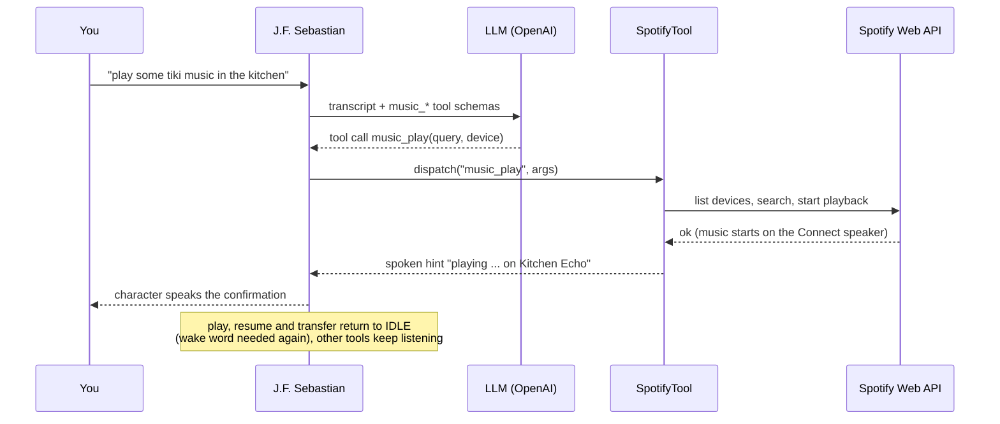
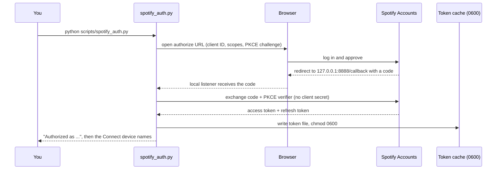
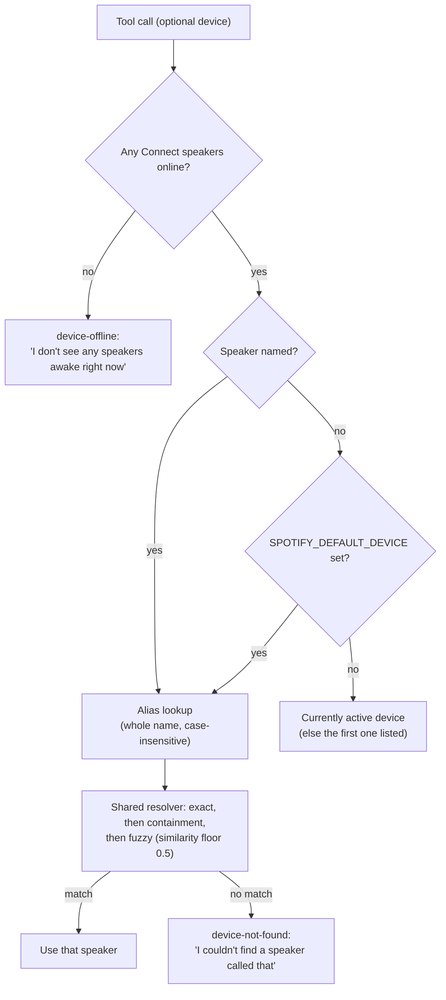

# Spotify Playback Control

Let a personality control Spotify by voice ("Johnny, play some tiki music in the
kitchen"). Optional and off by default.

## How it works
- The LLM is given playback **tools** (function calling). On a normal turn nothing
  changes; when you ask for music it emits a tool call, the app runs it against the
  Spotify Web API (via `spotipy`), and the character speaks a short confirmation.
  The confirmation is a templated phrase from the tool itself, so there is no
  second LLM round-trip.
- Playback targets a **Spotify Connect device** (a separate speaker), not the
  animatronic's own output. You can name a room/speaker per command.
- Requires **Spotify Premium**. The API commands an existing Connect device; it
  doesn't produce audio itself, so a speaker (Echo, Sonos, desktop Spotify, a
  `raspotify` Pi, phone) must be online.



## 1. Install the dependency
```bash
pip install -r requirements-spotify.txt
```
(`./setup.sh` offers the same install as an optional step and prints a short
version of the steps below.)

## 2. Create a Spotify app (free)
1. Go to https://developer.spotify.com/dashboard → **Create app**.
2. Add a **Redirect URI**: `http://127.0.0.1:8888/callback` (loopback, not `localhost`).
3. Copy the **Client ID**. (No client secret needed; we use PKCE.)

## 3. Configure (.env)
```bash
SPOTIFY_ENABLED=true
SPOTIFY_CLIENT_ID=your_client_id
# SPOTIFY_REDIRECT_URI=http://127.0.0.1:8888/callback   # default
# SPOTIFY_TOKEN_CACHE=~/.config/jf-sebastian/spotify-token.json   # default (kept 0600)
SPOTIFY_DEFAULT_DEVICE=Living Room          # speaker for "play X" with no room named
# SPOTIFY_DEVICE_ALIASES=kitchen=Kitchen Echo,den=Living Room
```
`SPOTIFY_ENABLED=true` without a `SPOTIFY_CLIENT_ID` is a startup configuration
error. If `SPOTIFY_DEFAULT_DEVICE` is unset, a command that names no speaker goes
to the currently active Spotify device.

With the master switch on, every personality can control playback by default.
To exclude a specific character, set this in its `personality.yaml`:
```yaml
spotify_enabled: false
```

## 4. Authorize once
On a machine **with a browser**:
```bash
python scripts/spotify_auth.py
```
This logs you in, caches a refresh token (chmod 0600), and **prints your available
Connect device names**; use those exact names for `SPOTIFY_DEFAULT_DEVICE` /
`SPOTIFY_DEVICE_ALIASES`. Re-list anytime with `python scripts/spotify_auth.py --devices`
(no browser is opened; it reuses the cached token).



## Headless devices (e.g. Jetson)
The browser login can't run on a headless box. Authorize on your Mac (step 4),
then **copy the token cache file** to the same path on the device:
```bash
scp ~/.config/jf-sebastian/spotify-token.json  jetson:~/.config/jf-sebastian/
```
Use the same `SPOTIFY_CLIENT_ID` and redirect URI on both. spotipy auto-refreshes
the token thereafter. If the refresh token is ever revoked (password change,
"remove access" in Spotify settings), re-run step 4 and re-copy the file.

## What you can say
- "Play *Quiet Village*" / "play some tiki music" / "play it in the kitchen"
- "pause" / "resume" / "skip" / "go back"
- "turn up the music" (controls the **music** volume, capped at 70; "speak up"
  controls the character's own voice)
- "move the music to the bedroom"
- "what's playing?" / "what speakers can you play on?"
- "what is this song?" / "who's the artist?" / "what album is this from?" (the
  currently-playing track is kept in context, so these need no playback command)

A specific request ("Quiet Village") plays the top matching **track**. A request
that sounds like a vibe or collection (it contains a word such as "music",
"playlist", "mix", "radio", "songs", "tunes", "vibes", "soundtrack", "station" or
"essentials") prefers a **playlist**, falling back to a track, then an artist.

## The tools
Nine tools, all in the `music_` namespace. `device` is a spoken speaker or room
name.

| Tool | Arguments | Notes |
|---|---|---|
| `music_play` | `query`, `device?` | Search, then play a track, playlist or artist |
| `music_pause` | `device?` | |
| `music_resume` | `device?` | |
| `music_skip` | `device?` | Next track |
| `music_previous` | `device?` | Previous track |
| `music_set_volume` | `level` (0-100), `device?` | Clamped to 0-70 |
| `music_transfer` | `device` (required) | Moves playback and keeps it playing |
| `music_now_playing` | none | |
| `music_list_devices` | none | Lists the Connect speakers currently online |

### Speaker resolution

The name ladder is the shared one in `jf_sebastian/modules/tool_provider.py`
(the same code Hue uses). An alias key must equal the whole spoken name
(case-insensitive); the alias map also applies to `SPOTIFY_DEFAULT_DEVICE`. A
named speaker that can't be matched is an error: it never silently falls back to
the active device.

## After music starts
`music_play`, `music_resume` and `music_transfer` tell the app that music is now
playing, so once the confirmation has been spoken the app returns to **IDLE**
instead of re-opening the mic for a follow-up. Otherwise the recorder would listen
over the music bed and VAD would fire on the song's vocals. Say the wake word
again to pause, skip, or ask anything else. The other tools keep the normal
follow-up listening window.

## Now-playing context
When Spotify is enabled, the currently-playing track (title, artist, album, and
whether it is playing or paused) is injected into the conversation context each
turn, so the personality can discuss it naturally without you asking it to look
anything up. It is fetched live (with a short 5-second cache to coalesce rapid
back-to-back turns) so it reflects the song actually playing; the quick lookup is
masked by the filler audio that plays during processing. Turn it off with
`SPOTIFY_NOW_PLAYING_CONTEXT=false` while keeping playback control.

## Errors
Every failure degrades into a short, neutral phrase the character voices in its
own style. Nothing raises into the conversation turn.

| `kind` | Spoken hint | Cause |
|---|---|---|
| `not-premium` | "the music needs a Premium account" | Spotify answered 403 |
| `device-offline` | "I don't see any speakers awake right now" | No Connect devices online, a 404, or `NO_ACTIVE_DEVICE` |
| `device-not-found` | "I couldn't find a speaker called that" | The named speaker matched nothing online |
| `no-match` | "I couldn't find that one" | The search returned nothing playable |
| `rate-limited` | "the music is busy, try again in a moment" | Spotify answered 429 |
| `auth-revoked` | "I've lost my connection to the music" | 401 or a revoked refresh token; "the music is not set up yet" when `SPOTIFY_CLIENT_ID` is unset |
| `bad-args` | "what would you like me to play?" | Empty query, or an unparseable volume ("what volume would you like?") |
| `network` | "I can't reach the music right now" | Anything else; "the music library is not installed" when `spotipy` is missing |

## Notes
- A target speaker that's asleep/offline won't appear; the character says so.
- Each Spotify call has a hard 5-second timeout and at most one retry, so a slow
  or rate-limited API can't stall a turn.
- Scopes are minimal: `user-read-playback-state user-modify-playback-state` (no
  account-mutating access; a test locks the exact set). The token cache is a
  credential; it's gitignored and kept out of any synced bundle by default.
