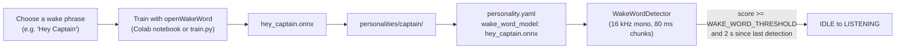

# Training Custom Wake Words with OpenWakeWord

This guide explains how to train custom wake word models for your personalities using OpenWakeWord.

## Why OpenWakeWord?

- **Free & Open Source**: No API keys or subscription fees
- **Easy Custom Training**: Train models for any phrase you want
- **Flexible**: Works with any wake phrase
- **No Vendor Lock-in**: Models are yours to keep and modify

## How the Model Is Used

A trained model is just one `.onnx` file that lives in the personality's folder. The personality's `personality.yaml` names it, and the wake word detector loads it at startup.



## Prerequisites

- A Google account (for the hosted Colab notebook), or a local Python environment if you want to run the training notebook or `train.py` yourself (a GPU helps a lot)
- A microphone for testing the finished model
- About an hour for the Colab route; longer for a larger, higher-quality local run

**You do not need to record yourself.** OpenWakeWord trains on synthetic speech: it generates thousands of text-to-speech clips of your phrase and mixes them with background audio. Your own voice is only needed for testing the result.

## Training Process

### 1. Choose a Training Route

OpenWakeWord ships an automated training utility that can be used two ways (see [Training New Models](https://github.com/dscripka/openWakeWord#training-new-models) in the upstream README):

- **Google Colab notebook (easiest):** the [hosted notebook](https://colab.research.google.com/drive/1q1oe2zOyZp7UsB3jJiQ1IFn8z5YfjwEb?usp=sharing) has a simple form interface and produces a model in under an hour. No development experience needed.
- **Detailed notebook or `train.py` (more control):** [`notebooks/automatic_model_training.ipynb`](https://github.com/dscripka/openWakeWord/blob/main/notebooks/automatic_model_training.ipynb) walks through the same pipeline with every knob exposed. It can produce higher quality models but expects more experience.

There is no `openwakeword[training]` pip extra. `pip install openwakeword` installs only the inference runtime (the package's extras are `test` and `full`). The notebooks install the training dependencies they need, which is another reason to start with Colab.

### 2. Enter Your Wake Phrase

Give the notebook the phrase you want (e.g., "hey johnny", "hey mr lincoln", or "hey leopold"). It generates the positive training clips for you with a text-to-speech model.

- Listen to the preview clip. If the pronunciation is off, spell the phrase phonetically until it sounds right.
- More generated samples and more training steps generally mean a better model (and a longer run).

### 3. Add Negative Phrases (Optional)

The training pipeline already uses large negative datasets (speech, noise, music) so the model learns what is *not* the wake word. If your phrase is easily confused with something else, list those phrases as custom negatives (`custom_negative_phrases` in the training config):

- "Hey John" (without the "ny")
- "Johnny" (without the "Hey")
- Other common phrases that might sound similar

### 4. Train the Model

In Colab, run the cells in order and download the resulting `.onnx` file at the end.

Running locally, the three stages are driven by a YAML training config (start from [`examples/custom_model.yml`](https://github.com/dscripka/openWakeWord/blob/main/examples/custom_model.yml) upstream, which sets `model_name`, `target_phrase`, `custom_negative_phrases`, `n_samples`, `steps`, and the data paths):

```bash
# From a checkout of https://github.com/dscripka/openWakeWord,
# after following the setup cells in automatic_model_training.ipynb

python openwakeword/train.py --training_config hey_johnny.yml --generate_clips
python openwakeword/train.py --training_config hey_johnny.yml --augment_clips
python openwakeword/train.py --training_config hey_johnny.yml --train_model
```

The trained model is written as `<model_name>.onnx` in the config's `output_dir`.

**This project needs the `.onnx` file.** The detector loads models with `inference_framework="onnx"`, so a `.tflite` export is not used.

### 5. Place Model in Personality Directory

Move your trained `.onnx` file directly into the personality's directory:

```bash
# For Johnny personality
mv hey_johnny.onnx /path/to/jf-sebastian/personalities/johnny/

# For Mr. Lincoln personality
mv hey_mr_lincoln.onnx /path/to/jf-sebastian/personalities/mr_lincoln/

# For Leopold personality
mv hey_leopold.onnx /path/to/jf-sebastian/personalities/leopold/

# For a new custom personality
mv hey_yourname.onnx /path/to/jf-sebastian/personalities/yourname/
```

### 6. Verify Configuration

Each personality names its wake word model in `personality.yaml`:

```yaml
wake_word_model: hey_yourname.onnx
```

The filename is resolved relative to the personality's own folder (`personalities/yourname/hey_yourname.onnx`). The `hey_<name>.onnx` naming is a convention, not a requirement: whatever filename you put in `wake_word_model` is what gets loaded.

The personality loader does not check that the file exists. A missing or misnamed model shows up when the application starts the wake word detector, which fails with an error in the log right after:

```
Loading wake word models: ['/path/to/jf-sebastian/personalities/yourname/hey_yourname.onnx']
```

On success you will see `Wake word detector started (sample_rate=16000Hz, chunk_size=1280, threshold=...)`.

OpenWakeWord also needs its shared preprocessing models (melspectrogram and embedding). `./setup.sh` downloads them; to do it by hand:

```bash
python3 -c "from openwakeword import utils; utils.download_models(['alexa'])"
```

## Using Pre-trained Models

OpenWakeWord comes with several pre-trained models you can use for testing:

- "hey_jarvis"
- "alexa"
- "hey_mycroft"
- "hey_rhasspy"

The wake word path is always resolved inside the personality folder, so a bare model name will not work. Download the model, copy its `.onnx` file into your personality folder, and point `wake_word_model` at it:

```bash
# Downloads into the installed package's resources/models/ directory
python3 -c "from openwakeword import utils; utils.download_models(['hey_jarvis'])"

# Copy the ONNX file next to your personality.yaml
cp "$(python3 -c "import openwakeword, os; print(os.path.join(os.path.dirname(openwakeword.__file__), 'resources', 'models', 'hey_jarvis_v0.1.onnx'))")" \
   personalities/yourname/
```

```yaml
wake_word_model: hey_jarvis_v0.1.onnx
```

## Tips for Good Models

1. **Check the pronunciation**: The model learns whatever the synthetic voice says, so get the preview clip sounding right first
2. **Natural phrasing**: Pick a phrase people can say naturally and consistently
3. **More data**: Raise the number of generated samples and training steps if detection is unreliable
4. **Adversarial negatives**: Add similar-sounding phrases as custom negatives if you get false triggers
5. **Test in the real room**: Try the model on the actual microphone, at the real distance, with every person who will use it
6. **Test Iteratively**: Start with a basic model, test it, note the failures, adjust, and retrain

## Troubleshooting

### Model not detecting wake word
- Watch the log for near misses. Any score of 0.5 or higher that falls short of the threshold is logged (at most once per second) as `Wake word near-miss: score=0.941 (threshold=0.99; short by 0.049)`. Scores just under the threshold mean you should lower it; no near-miss lines at all point to the microphone or audio path instead.
- Lower `WAKE_WORD_THRESHOLD` in `.env` (default 0.99; try 0.93 to catch borderline utterances)
- Retrain with more samples and more training steps
- Ensure you're speaking clearly and at a normal volume
- Check the microphone with `python scripts/test_microphone.py`

### Too many false positives
- Add more custom negative phrases during training
- Increase `WAKE_WORD_THRESHOLD`
- Make sure negative phrases include similar-sounding phrases

### Wake word ignored right after a detection
- Detections are debounced: a second detection within 2 seconds of the last one is ignored
- The wake word is only acted on in the IDLE state; while a conversation is in progress it is ignored

### Model file too large
- Use ONNX format (it is the only format this project loads)
- Consider quantization if supported

## Resources

- [OpenWakeWord GitHub](https://github.com/dscripka/openWakeWord)
- [OpenWakeWord Documentation](https://github.com/dscripka/openWakeWord/tree/main/docs)
- [Training New Models (upstream README)](https://github.com/dscripka/openWakeWord#training-new-models)
- [Automatic training notebook](https://github.com/dscripka/openWakeWord/blob/main/notebooks/automatic_model_training.ipynb)
- [Synthetic data generation](https://github.com/dscripka/openWakeWord/blob/main/docs/synthetic_data_generation.md)

## Notes

- Training requires many more dependencies than runtime (PyTorch, TensorFlow, a TTS sample generator). The training notebooks install them; this project's `requirements.txt` only installs the runtime.
- Model training can take from under an hour (Colab defaults) to several hours depending on sample count, training steps, and hardware
- You can use Google Colab for training if you don't have a powerful local machine
- Models are specific to the phrase - you need separate models for each wake word
- Each personality loads exactly one model (the file named by `wake_word_model`)
