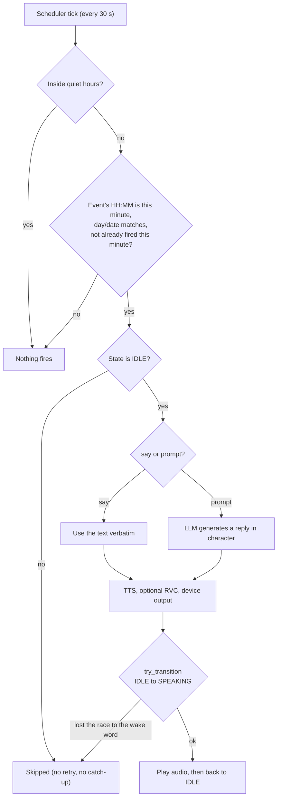
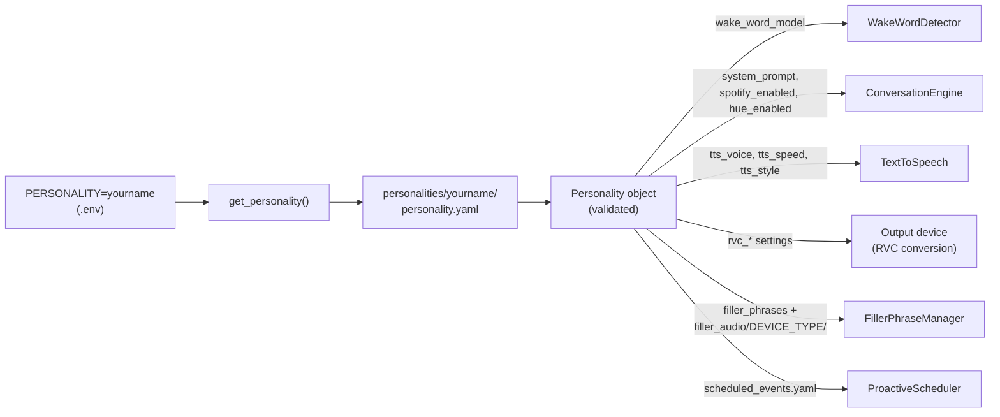

# Animatronic Personalities

This directory contains drop-in personality folders for the animatronic system. Each personality is completely self-contained - just add or remove folders to manage personalities!

Personalities are defined using simple YAML files - **no programming required**.

## Available Personalities

> **Note on RVC voices:** entries listed "with RVC" describe the intended, voice-converted character. The RVC `.pth`/`.index` models are **not distributed with this project** (they are gitignored); you must train or obtain your own and drop them in the personality folder. Without a model, the personality falls back to the raw OpenAI TTS voice shown.

### Johnny (Tiki Bartender)
- **Wake word**: "Hey, Johnny"
- **Voice**: Shimmer with RVC (input voice; his character comes from RVC conversion)
- **Character**: Laid-back beatnik bartender with deep knowledge of tiki culture, surf music, and tropical drinks
- **Filler phrases**: Bar activities like making orgeat, grabbing mint, checking rum barrels, etc.

### Mr. Lincoln (Abraham Lincoln)
- **Wake word**: "Hey, Mr. Lincoln"
- **Voice**: Echo (male, dignified)
- **Character**: 16th President of the United States - a homage to Disney's Great Moments with Mr. Lincoln
- **Filler phrases**: Consulting documents, reviewing correspondence, reflecting on the Constitution, etc.

### Leopold (Conspiracy Theorist)
- **Wake word**: "Hey, Leopold"
- **Voice**: Onyx with RVC (male, conspiratorial)
- **Character**: Eccentric truth-seeker with an insane backstory (Turkish prison, UFO abductions, intelligence contractor)
- **Filler phrases**: Checking bug detectors, scanning perimeter, reviewing surveillance footage, etc.

### Fred (Mister Rogers)
- **Wake word**: "Hey, Fred"
- **Voice**: Echo with RVC (gentle, warm)
- **Character**: Fred Rogers from Mister Rogers' Neighborhood - speaks with gentle warmth and simple wisdom
- **Filler phrases**: Taking time to think, talking about neighbors, being kind, etc.

### K.I.T.T. (Knight Industries Two Thousand)
- **Wake word**: "Hey, Kitt"
- **Voice**: Onyx with RVC (sophisticated AI)
- **Character**: Advanced AI from the Knight Rider Trans Am - intelligent with dry wit and occasional sarcasm
- **Filler phrases**: Scanning systems, analyzing data, running diagnostics, etc.

### Jarvis (Just A Rather Very Intelligent System)
- **Wake word**: "Hey, Jarvis"
- **Voice**: Fable with RVC (refined British butler)
- **Character**: Tony Stark's AI butler - unfailingly polite and precise, with dry wit and unflappable calm authority
- **Filler phrases**: Consulting records, running diagnostics, cross-referencing databases, etc.

### Teddy Ruxpin (Storytelling Bear)
- **Wake word**: "Hey, Teddy Ruxpin"
- **Voice**: Shimmer with RVC (warm, friendly)
- **Character**: The classic 1980s storytelling teddy bear from the magical land of Grundo
- **Filler phrases**: Recalling adventures with Grubby, thinking about crystals, remembering stories, etc.

## Switching Personalities

To switch personalities, update the `PERSONALITY` setting in your `.env` file:

```bash
# Use Johnny the Tiki Bartender
PERSONALITY=johnny

# Use Mr. Lincoln
PERSONALITY=mr_lincoln

# Use Leopold the Conspiracy Theorist
PERSONALITY=leopold

# Use Fred (Mister Rogers)
PERSONALITY=fred

# Use K.I.T.T. (Knight Rider AI)
PERSONALITY=kitt

# Use Jarvis (AI butler)
PERSONALITY=jarvis

# Use Teddy Ruxpin
PERSONALITY=teddy_ruxpin
```

## Creating a New Personality

**📖 Full Guide:** For a comprehensive step-by-step tutorial, see [docs/CREATING_PERSONALITIES.md](../docs/CREATING_PERSONALITIES.md)

**Quick Start:** Creating a personality is simple - just create a folder and a YAML file!

### Step 1: Copy an Existing Personality

```bash
# Copy an existing personality as a template
cp -r personalities/johnny personalities/yourname
```

### Step 2: Edit personality.yaml

Open `personalities/yourname/personality.yaml` and customize:

```yaml
# Your personality name
name: YourName

# OpenAI TTS voice (onyx, echo, fable, nova, shimmer, or alloy)
tts_voice: onyx

# TTS speed (0.25 to 4.0, default 1.0)
# Adjust to match character energy: slower for dignified, faster for manic
tts_speed: 1.0

# TTS style instruction (optional)
# Controls tone, emotional range, and speaking style
# Only sent when TTS_MODEL in .env is a gpt-4o model (e.g. gpt-4o-mini-tts)
tts_style: "Speak warmly and conversationally"

# Wake word model filename (in this same directory)
wake_word_model: hey_yourname.onnx

# Optional: RVC voice conversion for custom voice models
# rvc_enabled: true
# rvc_model: yourname_voice.pth
# rvc_index_file: yourname_voice.index  # Optional
# rvc_pitch_shift: 0  # Whole semitones, -12 to 12
# rvc_index_rate: 0.75  # Index influence, 0.0 to 1.0
# rvc_f0_method: pm  # Pitch detection: pm, harvest, crepe, dio, rmvpe

# System prompt defining the character
system_prompt: |
  You are YourName, describe the character here...

  Keep responses conversational and concise (2-3 sentences).

  Remember: you're a physical animatronic having a real conversation.

# Filler phrases (8-10 seconds each, 30 recommended)
filler_phrases:
  - "Your first filler phrase ending with a transition word... Now..."
  - "Your second filler phrase... So..."
  - "Your third filler phrase... Alright..."
  # Add 27 more for variety!
```

### Step 3: Train Custom Wake Word
- Follow the guide in `docs/TRAIN_WAKE_WORDS.md`
- Train an OpenWakeWord model for your wake phrase (e.g., "Hey YourName")
- Save the `.onnx` model file as `hey_yourname.onnx` (any filename works as long as it matches `wake_word_model` in your YAML)
- Place it in your personality's directory: `personalities/yourname/hey_yourname.onnx`

### Step 4: Generate Filler Audio

```bash
python scripts/generate_fillers.py --personality yourname

# Optional: only one output device type
python scripts/generate_fillers.py --personality yourname --device teddy_ruxpin
```

Re-run this whenever you change the filler phrases or any voice setting (`tts_voice`, `tts_speed`, `tts_style`, RVC). The audio is pre-rendered, so YAML changes do not reach the fillers until you regenerate.

### Step 5: Activate Your Personality

Edit `.env`:
```bash
PERSONALITY=yourname
```

**That's it!** Your personality is automatically discovered and ready to use. No registration or code changes needed!

## Personality Directory Structure

Each personality is fully self-contained in its own directory:
```
yourname/
├── personality.yaml               # Personality definition (YAML - easy to edit!)
├── hey_yourname.onnx              # Wake word model
├── scheduled_events.yaml          # Optional: proactive greetings/reminders
├── yourname.pth, yourname.index   # Optional: RVC voice model (not distributed, gitignored)
├── .env                           # Optional: settings overrides for this personality (gitignored)
└── filler_audio/                  # Device-specific pre-generated filler audio
    ├── teddy_ruxpin/              # Filler audio with PPM control signals
    │   ├── filler_01.wav
    │   ├── filler_02.wav
    │   └── ...
    ├── headless/                  # Filler audio for computer playback
    │   ├── filler_01.wav
    │   ├── filler_02.wav
    │   └── ...
    └── squawkers_mccaw/           # Filler audio for Squawkers McCaw
        ├── filler_01.wav
        ├── filler_02.wav
        └── ...
```

**Everything for a personality stays in its folder:**
- ✅ **Add a personality**: Just drop in a new folder
- ✅ **Remove a personality**: Just delete the folder
- ✅ **Share a personality**: Zip the folder and send it
- ✅ **No code changes**: Personalities are auto-discovered

The only external configuration needed is setting `PERSONALITY=yourname` in `.env`.

### Per-Personality `.env` Overrides

A personality folder may contain its own `.env`. When that personality is selected, the file is layered on top of the base configuration, so a character can carry its own tuning (for example a looser `WAKE_WORD_THRESHOLD` or a higher `VOICE_GAIN`). Precedence, highest first:

1. `personalities/{PERSONALITY}/.env`
2. `jf_sebastian/devices/{OUTPUT_DEVICE_TYPE}/.env`
3. `.env`

Overlays that were loaded are logged at startup (`Loaded env overlay: ...`). Do not set `PERSONALITY` or `OUTPUT_DEVICE_TYPE` inside an overlay: they are the keys used to pick the overlays, and are read from the base `.env` or the process environment.

## Available TTS Voices

OpenAI provides these voices (the value is passed to the API as-is, so any other voice your `TTS_MODEL` supports also works):
- **onyx**: Male, casual (used by Leopold and K.I.T.T.)
- **echo**: Male, dignified (used by Mr. Lincoln and Fred)
- **fable**: Male, expressive (used by Jarvis)
- **nova**: Female, friendly
- **shimmer**: Female, warm (input voice for Johnny and Teddy Ruxpin, both RVC-converted)
- **alloy**: Neutral

## Filler Phrases

Filler phrases play immediately after speech detection while the real response is being generated. They should:
- Be 8-10 seconds long
- End with a transition like "Now...", "So...", "Alright..."
- Reflect the character's activities and personality
- Give enough time for API processing (Whisper + GPT + TTS)

**Note:** When you run `python scripts/generate_fillers.py`, the system automatically generates device-specific versions of each filler phrase for all registered output devices (Teddy Ruxpin with PPM signals, Headless/Squawkers McCaw with simple stereo, etc.). Without `--personality` it processes every personality; `--device <type>` limits it to one device type. The appropriate version is loaded based on your `OUTPUT_DEVICE_TYPE` setting.

Files are named `filler_NN.wav`, where `NN` is the phrase's position in the `filler_phrases` list. At runtime one file is chosen at random per turn and its phrase text is passed to the LLM, so the real response can continue from where the filler left off. The generator overwrites files but never deletes them: if you shorten or reorder the list, delete the `filler_audio/` folder before regenerating. Set `ENABLE_FILLER_AUDIO=false` in `.env` to turn filler playback off entirely.

## Scheduled Events (optional)

Drop a `scheduled_events.yaml` in any personality folder to make the
character speak proactively at specific times: morning greetings, bedtime
stories, holiday surprises. Events only fire when the device is IDLE, so
they never interrupt an in-progress conversation.

Schedule syntax (intentionally tiny; see `personalities/johnny/scheduled_events.yaml`
for a working example):
```yaml
quiet_hours:
  start: "22:00"
  end: "07:00"
events:
  - name: morning_greeting
    when: "08:30"            # daily
    say: "Mornin'!"
  - name: weekday_reminder
    when: "17:00 weekdays"   # mon-fri (also: "weekends", or "mon,wed,fri")
    prompt: "Remind me to wrap up work in one short sentence. Stay in character."
  - name: christmas_morning
    when: "08:00 2026-12-25" # one-shot date
    say: "Merry Christmas!"
```

Each event needs a `name`, a `when`, and exactly one of `say:` (verbatim TTS,
fastest) or `prompt:` (fed to the LLM as if the user said it, so the wording
varies each time). An event with both, neither, or an unparseable `when` is
skipped with a warning in the log; the rest of the file still loads. Set
`SCHEDULER_ENABLED=false` in `.env` to globally disable. **Edits require a
process restart.**



**Quiet hours.** The optional `quiet_hours` block suppresses events whose time
falls inside the window. The window is half-open (`start` is quiet, `end` is
not), may wrap midnight (`22:00` to `07:00`), and is disabled when `start`
equals `end`. An event scheduled inside the window never fires; the loader
warns about it at startup. Setting `QUIET_HOURS_START` and/or `QUIET_HOURS_END`
in `.env` replaces the YAML block as a pair: if either env var is set, both
values come from the environment and the YAML `quiet_hours` is ignored (so set
both, otherwise quiet hours end up disabled).

**Good to know:**
- Times are naive local time, matched to the minute. There is no catch-up: an
  event that is skipped (not IDLE, quiet hours, machine asleep, app not running)
  is simply missed until its next occurrence.
- A one-shot date in the past is loaded but will never fire (warned at startup).
- `prompt:` events go through the conversation engine and are added to the
  conversation history alongside user turns.
- After a scheduled utterance the device returns to IDLE; it does not open the
  microphone for a reply.

## Technical Details

### YAML Format

Personalities are defined in `personality.yaml` files with these fields:

**Required fields:**
- **`name`**: Character display name (used in the startup log, e.g. "Personality: Johnny")
- **`tts_voice`**: OpenAI TTS voice ID (onyx, echo, fable, nova, shimmer, or alloy). Not validated at load time; it is passed straight to the TTS API.
- **`wake_word_model`**: Filename of the .onnx wake word model, relative to the personality's folder
- **`system_prompt`**: Multi-line text defining the character's personality
- **`filler_phrases`**: List of 8-10 second phrases for low-latency response

**Optional TTS settings:**
- **`tts_speed`**: Speech speed from 0.25 to 4.0 (default: 1.0). Adjust to match character energy - slower for dignified characters (0.9), faster for manic ones (1.1)
- **`tts_style`**: Style instruction to control tone, emotional range, intonation, and speaking style (e.g., "Speak warmly and casually" or "Use a dignified, authoritative tone"). Only sent to the API when `TTS_MODEL` in `.env` is a gpt-4o model such as `gpt-4o-mini-tts`; with `tts-1`/`tts-1-hd` it is ignored.

Any other top-level key (for example the `full_name` line in `jarvis`, `kitt`, and `teddy_ruxpin`) is ignored by the loader.

**Optional RVC (voice conversion) settings:**
- **`rvc_enabled`**: Tri-state. `true` = on, `false` = off (authoritative, even if a model file is present), **omitted** = auto (on only if a model file resolves). So a personality whose folder contains a matching `.pth` turns RVC on by itself.
- **`rvc_model`**: RVC model filename (.pth). Optional: if omitted, the loader looks for `<foldername>.pth` in the personality directory (e.g. `fred/fred.pth`). An explicit value is looked up in the personality directory first, then in the global `RVC_MODEL_DIR` (default `./rvc_models/`). If nothing resolves, RVC is skipped and the raw TTS audio is used.
- **`rvc_index_file`**: Optional index file for improved quality. Same convention: if omitted, looks for `<foldername>.index`. Index files are only looked up in the personality directory.
- **`rvc_pitch_shift`**: Pitch adjustment in whole semitones (must be an integer), -12 to +12 (default: 0)
- **`rvc_index_rate`**: Index influence, 0.0 to 1.0 (default: 0.5)
- **`rvc_f0_method`**: Pitch detection method - pm, harvest, crepe, dio, or rmvpe (default: harvest; use pm on macOS, rmvpe on Linux/Windows for best quality)
- **`rvc_filter_radius`**: Median filtering radius, 0-7 (default: 3)
- **`rvc_rms_mix_rate`**: Volume envelope mixing, 0.0-1.0 (default: 0.25)
- **`rvc_protect`**: Protect voiceless consonants, 0.0-0.5 (default: 0.33)

`rvc_pitch_shift`, `rvc_index_rate`, and `rvc_f0_method` are validated only when RVC is active for the personality; the ranges on the last three fields are guidance and are not enforced. `RVC_ENABLED=false` in `.env` turns RVC off for every personality regardless of these settings.

**Note:** RVC transforms TTS output with custom trained voice models for unique character voices beyond OpenAI TTS alone. See [docs/CREATING_PERSONALITIES.md](../docs/CREATING_PERSONALITIES.md) for detailed RVC setup guide.

**Optional Spotify settings:**
- **`spotify_enabled`**: Let this personality control Spotify playback by voice (**default: true**). Set it to `false` to exclude this character. The music tools are only offered to the model when this isn't false **and** `SPOTIFY_ENABLED=true` in `.env`. Completing the one-time login is what lets those tools actually reach Spotify (without it, a music command just returns a spoken "not set up" reply). See [docs/SPOTIFY_SETUP.md](../docs/SPOTIFY_SETUP.md).

**Optional Hue settings:**
- **`hue_enabled`**: Let this personality control Philips Hue lights by voice (**default: true**). Set it to `false` to exclude this character. The light tools are only offered to the model when this isn't false **and** `HUE_ENABLED=true` in `.env`. Pairing with the Bridge (`python scripts/hue_pair.py`) is what lets those tools actually reach the lights; without it a light command just returns a spoken "not set up yet" reply, and pairing later takes effect without a restart. See [docs/HUE_SETUP.md](../docs/HUE_SETUP.md).

### Auto-Discovery

The system automatically scans `personalities/` for subdirectories containing `personality.yaml` files. No manual registration needed! The lowercased folder name is the personality's key (the value for `PERSONALITY`, matched case-insensitively). Folders whose names start with `_` or `.` are skipped. Only the selected personality is loaded and validated; a broken YAML in another folder does not affect startup.

### How a Personality Is Used at Runtime



### Validation

When a personality loads, the system validates:
- YAML syntax is correct
- All required fields are present (`missing required fields: ...`)
- `filler_phrases` is a list
- `tts_speed` is between 0.25 and 4.0
- When RVC is active: `rvc_pitch_shift` is an integer from -12 to 12, `rvc_index_rate` is between 0.0 and 1.0, and `rvc_f0_method` is one of harvest, crepe, pm, dio, rmvpe

Any failure is reported at startup as `Failed to load personality '<name>': <reason>`.

Not checked by the loader: whether the wake word model file exists (a missing file fails when the wake word detector starts), whether `tts_voice` is a real voice (fails at the first TTS call), and whether filler audio has been generated (the app logs a warning and runs without fillers).
