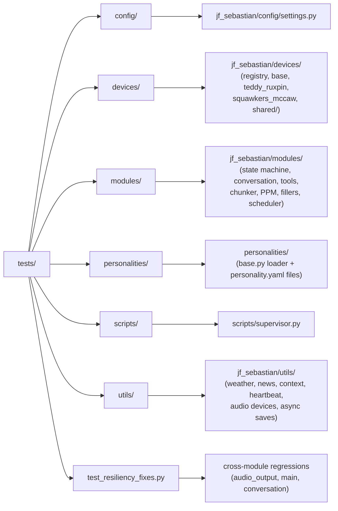

# J.F. Sebastian Test Suite

Comprehensive unit tests for the J.F. Sebastian animatronic AI conversation system.

## Test Structure

```
tests/
├── conftest.py                     # Shared pytest fixtures (PyAudio, OpenAI, settings, ...)
├── test_resiliency_fixes.py        # Regression tests for past audio-pipeline races
├── config/
│   └── test_settings.py            # Settings loading + validation
├── devices/
│   ├── test_factory.py             # Device registry and factory tests
│   ├── test_audio_processor.py     # MP3→PCM conversion (FFmpeg)
│   ├── test_sentiment_analyzer.py  # VADER sentiment for eye control
│   ├── test_teddy_ruxpin.py        # Teddy Ruxpin device (with PPM)
│   ├── test_squawkers_mccaw.py     # Squawkers McCaw device (subclass of headless)
│   └── test_visual_hooks.py        # Optional visual seam on OutputDevice (no-op hooks)
├── modules/
│   ├── test_state_machine.py       # State machine + try_transition CAS
│   ├── test_conversation.py        # ConversationEngine streaming + context injection
│   ├── test_conversation_tools.py  # Tool calling in the streaming ConversationEngine
│   ├── test_tool_provider.py       # Shared ToolProvider base (schemas, errors, name resolution)
│   ├── test_spotify_tool.py        # Spotify playback tool (spotipy mocked)
│   ├── test_hue_tool.py            # Philips Hue light tool (Bridge HTTP mocked)
│   ├── test_sentence_chunker.py    # Streaming SentenceChunker (word-based chunking)
│   ├── test_ppm_generator.py       # PPM signal generation
│   ├── test_filler_phrases.py      # Filler phrase management
│   └── test_scheduler.py           # ProactiveScheduler + schedule parser
├── personalities/
│   ├── test_base.py                # Personality dataclass + YAML loader
│   └── test_personalities.py       # Auto-discovery + per-personality validation
├── scripts/
│   ├── test_supervisor.py          # Supervisor config / backoff / crash-report
│   └── test_supervisor_integration.py  # End-to-end subprocess restart + watchdog
└── utils/
    ├── conftest.py                 # Shared settings_overrides fixture
    ├── test_async_file_utils.py    # Background-writer save queue
    ├── test_audio_device_utils.py  # PyAudio device-name lookup
    ├── test_weather.py             # Weather providers (wttr / HA / manual) + factory
    ├── test_news.py                # News providers (RSS / HN / manual) + factory
    ├── test_context_provider.py    # Date/time + weather + news context builder
    └── test_heartbeat.py           # Heartbeat thread + heartbeat_age helper
```

## Running Tests

### Install Test Dependencies

```bash
# Activate virtual environment
source venv/bin/activate

# Install test dependencies
pip install pytest pytest-mock pytest-cov pytest-asyncio
```

These are already listed in `requirements.txt`, so a normal `./setup.sh` or `pip install -r requirements.txt` install has them. `pytest.ini` sets `testpaths = tests` and adds `-v --strict-markers --tb=short --disable-warnings` to every run, so a bare `pytest` from the repo root is verbose by default and rejects any marker that is not registered.



### Run All Tests

```bash
pytest
```

### Run Specific Test Files

```bash
# Test PPM generator
pytest tests/modules/test_ppm_generator.py

# Test personalities
pytest tests/personalities/test_personalities.py

# Test conversation engine
pytest tests/modules/test_conversation.py
```

### Run Tests with Coverage

```bash
# Generate coverage report
pytest --cov=jf_sebastian --cov-report=html --cov-report=term-missing

# View HTML report
open htmlcov/index.html
```

### Run Tests by Marker

```bash
# Run only tests marked as unit tests
pytest -m unit

# Skip slow tests
pytest -m "not slow"

# Run only audio tests
pytest -m audio
```

Marker coverage is partial today. Only `unit` is applied, and only in `test_hue_tool.py`, `test_tool_provider.py`, and `test_conversation_tools.py`, so `pytest -m unit` runs just those files. No test currently carries `slow`, `integration`, `audio`, or `hardware`: `pytest -m audio` selects nothing and `pytest -m "not slow"` runs the whole suite. To run one area, select by path instead (for example `pytest tests/utils/`).

### Verbose Output

```bash
# Show detailed test output
pytest -v

# Show print statements
pytest -s

# Show detailed failures
pytest -vv
```

## Test Coverage

The test suite covers:

### Output Devices
- **Device Factory** (test_factory.py)
  - Device registration and listing
  - Device creation by type
  - Case-insensitive device names
  - Invalid device error handling
  - Interface validation

- **Audio Processor** (test_audio_processor.py)
  - MP3 to PCM conversion
  - Custom sample rates
  - FFmpeg error handling
  - Default settings usage

- **Sentiment Analyzer** (test_sentiment_analyzer.py)
  - Positive/negative/neutral sentiment detection
  - Edge cases (empty strings, special characters)
  - Score range validation

- **Teddy Ruxpin Device** (test_teddy_ruxpin.py)
  - Device initialization and properties
  - Settings validation
  - PPM signal generation
  - Stereo output creation
  - Gain application
  - Error handling

- **Squawkers McCaw Device** (test_squawkers_mccaw.py)
  - Device initialization
  - Simple stereo output
  - Channel duplication
  - No PPM requirement validation

- **Visual Seam** (test_visual_hooks.py)
  - `requires_visual` defaults to `False`
  - The `visual_*` hooks exist on `OutputDevice` and are safe no-ops on audio-only devices

### Core Functionality
- **PPM Generation** (test_ppm_generator.py)
  - Signal generation with channel values
  - Audio to channel value conversion
  - Syllable-based mouth movements
  - Eye control and sentiment effects
  - Timing accuracy

- **Filler Phrase Management** (test_filler_phrases.py)
  - Filler file loading
  - Random filler selection
  - File/phrase count validation
  - Directory handling

- **Conversation Engine** (test_conversation.py, test_conversation_tools.py, test_sentence_chunker.py)
  - Streaming responses and real-world context injection
  - Word-based sentence chunking (`SentenceChunker`)
  - Tool calling: streamed tool-call dispatch, spoken confirmations, `suppress_followup`, clean history
  - `reasoning_effort` handling for GPT-5 vs GPT-4 models
  - Rejection of malformed tool providers without breaking normal turns

- **LLM Tool Providers** (test_tool_provider.py, test_spotify_tool.py, test_hue_tool.py)
  - Shared `ToolProvider` base: `fold`, `resolve_by_name`, `tool_schema`, `ToolResult`, dispatch and containment guards
  - Spotify: device resolution, play/search selection, controls, now-playing context, error taxonomy, scope invariants (spotipy fully mocked)
  - Hue: target resolution, colour parsing, bulb capability, brightness, on/off, scenes, credential and transport errors, inventory caching (Bridge HTTP fully mocked)

- **State Machine and Scheduler** (test_state_machine.py, test_scheduler.py)
  - State transitions and the `try_transition` compare-and-swap
  - Schedule parsing, quiet hours, event validation, YAML loading, `ProactiveScheduler`

- **Audio Device Utilities** (test_audio_device_utils.py)
  - Device lookup by exact and partial name match
  - Returns `None` when no device matches (callers fall back to the system default)

### System Integration
- **Resiliency** (test_resiliency_fixes.py)
  - Streaming-error cleanup of conversation state
  - `AudioPlayer` playing-flag cleanup on stream and cleanup errors, PyAudio re-init
  - Recovery when the wake-word detector is stuck paused
  - Filler-before-chunks and sequential chunk ordering
- **Supervisor / Watchdog** (test_supervisor.py, test_supervisor_integration.py)
  - Config parsing, restart backoff, crash reports and pruning, heartbeat age
  - End-to-end: restart after a crash, watchdog kill of a hung child

- **Personality System** (test_personalities.py)
  - Personality loading by name
  - Property validation (name, system_prompt, voice, etc.)
  - Filler phrase validation
  - Wake word path validation
  - Personality differentiation

- **Utilities** (test_audio_device_utils.py)
  - Device name to index resolution
  - Case-insensitive matching
  - Partial name matching
  - Device type filtering
  - Error handling

- **Context, Weather, News, Heartbeat, Async Saves** (test_context_provider.py, test_weather.py, test_news.py, test_heartbeat.py, test_async_file_utils.py)
  - Weather providers (wttr, Home Assistant, manual) and the provider factory
  - News providers (RSS, Hacker News, manual) and the provider factory
  - Date/time, weather, and news context assembly
  - Heartbeat file touch thread and `heartbeat_age`
  - Background-writer save queue (runs on a worker, survives a failing save, drops on overflow)

## Test Fixtures

Common fixtures are defined in `conftest.py`:

- `sample_audio`: Returns `(audio, sample_rate)`: a 2-second 440 Hz sine wave at 16 kHz
- `mock_pyaudio`: Mock PyAudio instance with three fake devices (one input, two outputs)
- `mock_openai_client`: Mock OpenAI API client (Whisper, chat completion, TTS)
- `mock_porcupine`: Mock wake word detector (legacy name from the Porcupine era; the app itself uses OpenWakeWord)
- `temp_audio_dir`: Temporary directory for test files
- `sample_ppm_channel_values`: Sample PPM channel data (100 frames x 8 channels)
- `mock_personality`: Mock personality instance
- `mock_settings`: Mock settings configuration

`tests/utils/conftest.py` adds one more for the utils tests:

- `settings_overrides`: Resets weather and news settings to safe defaults (news disabled, so nothing reaches the network) and returns a setter for per-test overrides

## Writing New Tests

### Example Test Structure

```python
import pytest
from unittest.mock import Mock, patch
from jf_sebastian.modules.your_module import YourClass

def test_basic_functionality():
    """Test basic functionality of YourClass."""
    obj = YourClass()
    result = obj.do_something()
    assert result is not None

@patch('jf_sebastian.modules.your_module.external_dependency')
def test_with_mock(mock_dependency):
    """Test with mocked external dependency."""
    mock_dependency.return_value = "mocked_value"
    obj = YourClass()
    result = obj.use_dependency()
    assert result == "mocked_value"
    mock_dependency.assert_called_once()

def test_error_handling():
    """Test error handling."""
    obj = YourClass()
    with pytest.raises(ValueError):
        obj.invalid_operation()
```

### Using Fixtures

```python
def test_with_fixture(sample_audio, mock_pyaudio):
    """Test using shared fixtures."""
    audio, sample_rate = sample_audio
    assert len(audio) > 0
    assert sample_rate == 16000
```

## Continuous Integration

These tests are designed to run in CI/CD pipelines without requiring:
- Physical audio hardware
- OpenAI API keys (mocked)
- OpenWakeWord models (mocked)
- Network connectivity
- Spotify or Philips Hue accounts and hardware (spotipy and the Bridge HTTP API are mocked)

All external dependencies are mocked for fast, reliable testing. The one exception to "pure mocks" is `tests/scripts/test_supervisor_integration.py`, which spawns real (tiny, local) Python subprocesses to exercise restart and watchdog behavior.

## Troubleshooting

### Import Errors

If you get import errors, ensure the project root is in PYTHONPATH:

```bash
export PYTHONPATH="${PYTHONPATH}:${PWD}"
pytest
```

### Audio Device Tests Failing

Audio device tests use mocks by default. If testing with real hardware:

```bash
# Ensure audio devices are available
python scripts/test_microphone.py
python -m jf_sebastian.modules.audio_output
```

### Slow Tests

Some tests (especially PPM generation with long audio, and the supervisor integration tests that wait on real subprocesses) can be slow. No test is tagged `slow` yet, so deselect by path or keyword instead:

```bash
pytest --ignore=tests/scripts/test_supervisor_integration.py
pytest -k "not ppm"
```

## Contributing

When adding new functionality:

1. Write tests first (TDD approach)
2. Ensure all tests pass: `pytest`
3. Check coverage: `pytest --cov=jf_sebastian`
4. Aim for >80% coverage on new code
5. Document complex test scenarios

## Test Markers

Available markers (defined in pytest.ini; `--strict-markers` is on, so any new marker must be registered there first):

- `@pytest.mark.slow` - Slow tests (deselect with `-m "not slow"`)
- `@pytest.mark.integration` - Integration tests
- `@pytest.mark.unit` - Unit tests
- `@pytest.mark.audio` - Tests involving audio I/O
- `@pytest.mark.hardware` - Tests requiring physical hardware
